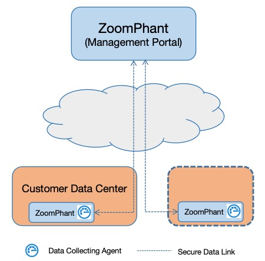
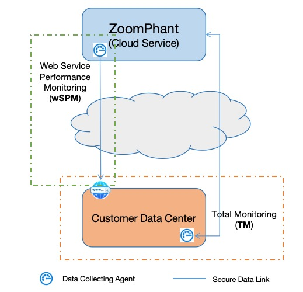

# How ZoomPhant Works
{: .header}

---
Like any complete monitoring solutions, ZoomPhant will performing all the tasks required for monitoring on behalf of customers:
* Collecting data from various sources, both structured data like metrics and seme-strutured data like logs / traces or events
* Storing data in time series database. The Community version is backed by prometheus compatible timeseries database so the data are saved in standard formats.
* Processing & Presenting data. ZoomPhant has feature rich widgets for displaying various types of data.
* Alerting & Notifications. ZoomPhant has its proprietary engine to process the time series data in a realtime way and allow customers to set notifications based on stages using various methods like email, SMS, Voice or webhook
* Configurations management. ZoomPhant has well organized ways for user to manage their monitored  objects.
* Plugins. ZoomPhant provides full range of plugins for monitoring various infrastructures and softwares / services. ZoomPhant supports using Prometheus plugins directly and will also has its plugin markets for customers to exchange valuable proprietary plugins.

Depends on how you plan to use ZoomPhant, following diagrams will given you a very high-level idea about how ZoomPhant works

## Using Proprietary Deployment (Deploying in Customer DataCenters)

We recommend customers to use proprietary deployment and this is the only choice available for community version.

In such deployments all ZoomPhant functions will be available in customer data center, this allow customers to own their data and reduce unnecessary bandwidth.

For paid customers, they can register to ZoomPhant Cloud for advanced functions like system upgrading, SMS/Voice notifications, plugin managements etc.

## Using Cloud Service

ZoomPhant will also offer traditional SaaS cloud service.  Users can just register and start using ZoomPhant service by just installing data collecting agents.

Customers need to install one or more data collecting agent in their data center to help collect desired monitoring data to achieve Total Monitoring (TM), and ZoomPhant Cloud service will offer advanced monitoring like Web Service Performance Monitoring (wSPM) for customers to monitor their important business service websites.