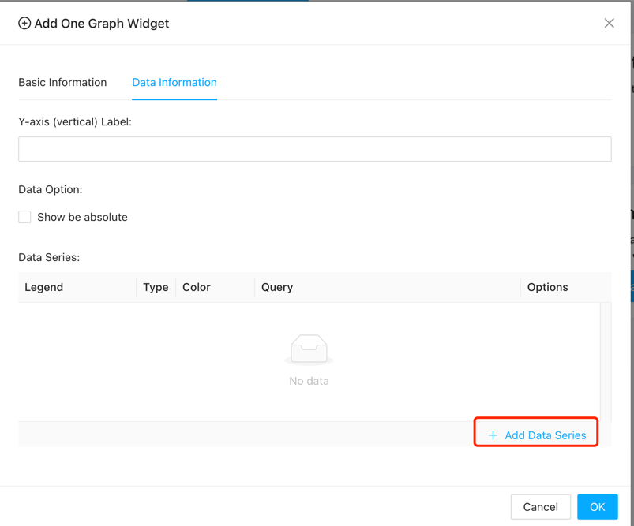

# Dashboards

{: .no_toc .header }

----

# The Role of Dashboards in Monitoring Systems

Dashboards play a pivotal role in monitoring systems, providing users with a visual interface to effectively monitor, analyze, and manage their IT infrastructure. In Zoomphant, dashboards are categorized into three levels: global, service level, and independent level, each serving specific purposes tailored to the user's needs.

## The Importance of Dashboards in Monitoring Systems

1. **Overview of System Health:**
    - Dashboards offer a comprehensive overview of the system's health and performance metrics, allowing users to quickly identify trends, anomalies, and potential issues across their entire infrastructure.

2. **Real-time Monitoring:**
    - Dashboards provide real-time visibility into key performance indicators (KPIs), enabling users to monitor critical metrics and respond promptly to changes or incidents as they occur.

3. **Data Visualization:**
    - Dashboards utilize data visualization techniques to present complex information in an easy-to-understand format, enabling users to gain insights at a glance and make informed decisions.

4. **Customization and Flexibility:**
    - Dashboards can be customized to meet the specific needs of users and organizations, allowing them to tailor the layout, content, and metrics displayed based on their preferences and priorities.

## Types of Dashboards in Zoomphant

1. **Global Dashboard:**
    - The global dashboard provides a centralized view of the entire system on a single page, allowing users to monitor and manage multiple services and components across their infrastructure from one location.
    - Click Dashboard > Manage > Add to create a new global dashboard.
   
    - In a custom dashboard, you can add widgets to the dashboard by clicking on the "+ Widget" icon in the top left corner of the screen.
   

2. **Service Level Dashboard:**
    - Service level dashboards are specific to individual services or components within the infrastructure. Once created, a service level dashboard is accessible across all instances of the same service, providing consistent monitoring and analysis capabilities.
    - Click Dashboard > Add in a service page to create a dashboard.
    
    - If the toggle is set to "Service", it would be a service level dashboard.
      
    - You can not only see the dashboard on this service page, but also see the dashboard on other same type services.
   

3. **Independent Level Dashboard:**
    - Independent level dashboards are unique to the service or component they are created for and are not shared with other instances of the same service. They offer focused monitoring and analysis tailored to the specific requirements of the service.
    - Click Dashboard > Add in a service page to create a dashboard.
    - If the toggle is set to "Current", it would be an independent level dashboard.
   
    - You can only see the dashboard on this service page.
   
    

## Understanding Widgets in Zoomphant Dashboards

Widgets are the building blocks of dashboards in Zoomphant, allowing users to visualize and analyze monitoring data in various formats. Zoomphant offers a wide range of widgets, including:
When you are in a custom dashboard, you can add widgets to the dashboard by clicking on the "Add Widget" icon.

All the widgets contain two configuration tabs:
- **Basic Information:** 
  - Display: The name of the widget.
  - Global Time Range: The time range for the widget would follow the global time range.
  - Query Step: The time interval between each data point. 
  - Grouping: You need to set grouping in the dashboard. 
  - Description: The description of the widget.

- **Data Information:** Different widgets have different data information. Almost all widgets need the "Add Data Series".
  - **Graph Widget:** Displays time-series data in line, area, or bar charts, allowing users to track trends and patterns over time.
    - You can set the Y-axis label.Or just click on the "Add Data Series" button.
    
    - When adding data series, normally you just need to set the metric. If you are already familiar with our data query syntax, you can also use some advanced features.
    
    - The widget seems like this.
    
  - **Pie Widget:** Represents data in a circular graph, illustrating the distribution of values as proportions of a whole.
    - You can set how many slices you want. Or just click on the "Add Data Series" button.
    
    - The widget seems like this.
    
  - **Statistic Widget:** Displays key performance metrics such as average response time, error rate, or throughput in a numerical format.
    - You can add at most 4 data series for the statistic widget.
    
    - There are 3 queries in one data series configuration. 
      - The basic query is the same as the other series configuration.
    
      - And there are Sum Query and Background Query. For the Sum Query, it would show the Total in the widget. And for the Background Query, it would base on the result to set the background color.
      
    - The widget seems like this.
    
    
  - **Text Widget:** Allows users to add custom text or annotations to the dashboard to provide additional context or information.
    - Multiple texts and styles can be set here, and the display of each configuration is determined based on the comparison of the query result and the threshold
    
    - The widget seems like this.
    
  - **Monitor Table Widget:** Presents tabular data, such as server status, resource utilization, or service availability, in a structured format.
    - The widget seems like this.
    
  - **Log Viewer Widget:** Enables users to view and analyze log data from monitored services or components, facilitating troubleshooting and debugging.
    - The widget seems like this.
    

## Conclusion

Dashboards are essential components of monitoring systems, providing users with a centralized, real-time view of their IT infrastructure's health and performance. In Zoomphant, dashboards are customizable and flexible, offering global, service level, and independent level views tailored to the user's needs. By leveraging a variety of widgets, Zoomphant enables users to visualize and analyze monitoring data effectively, empowering them to make informed decisions and ensure the reliability and availability of their systems.
