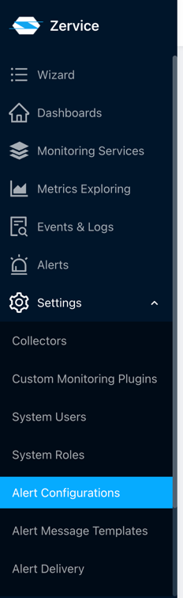
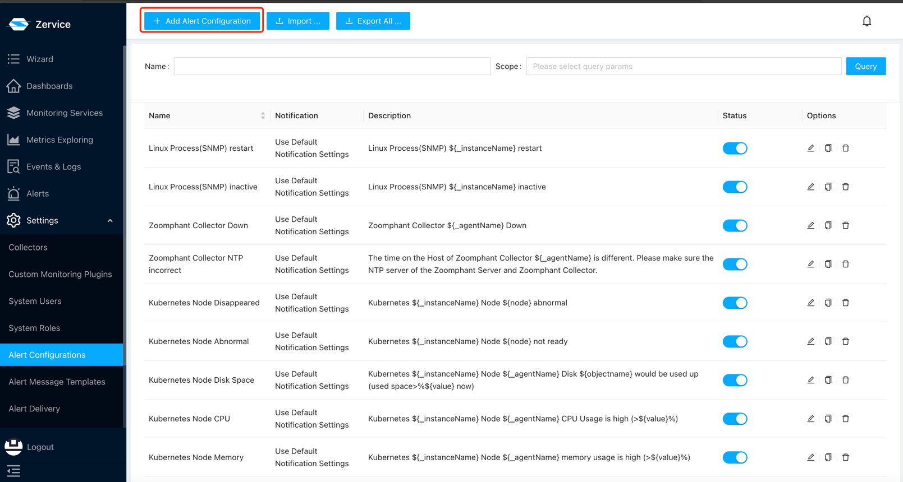
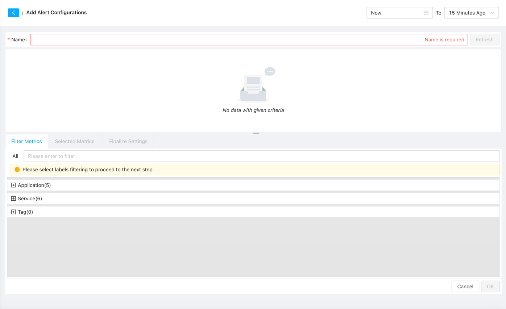
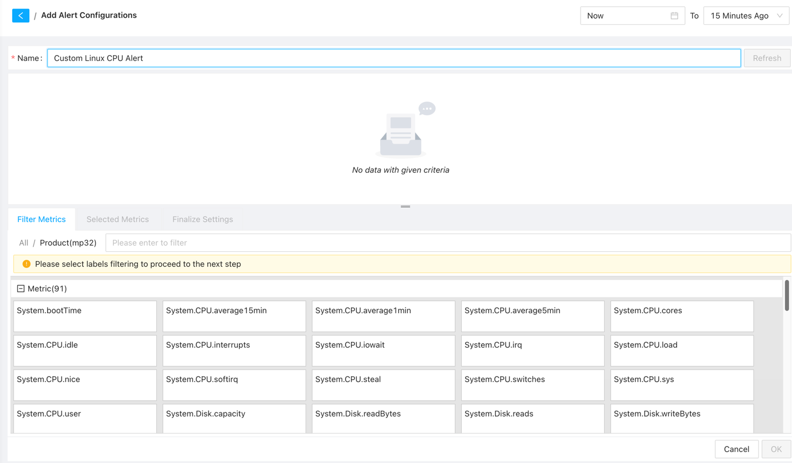
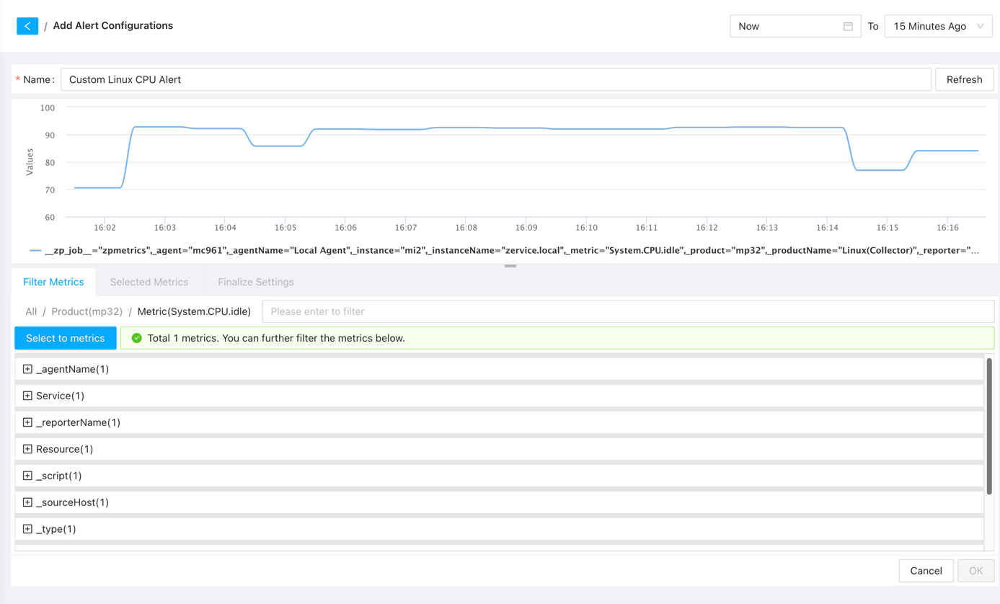
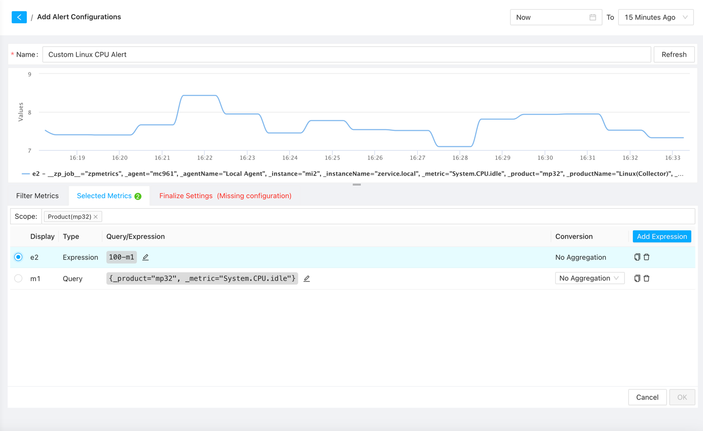
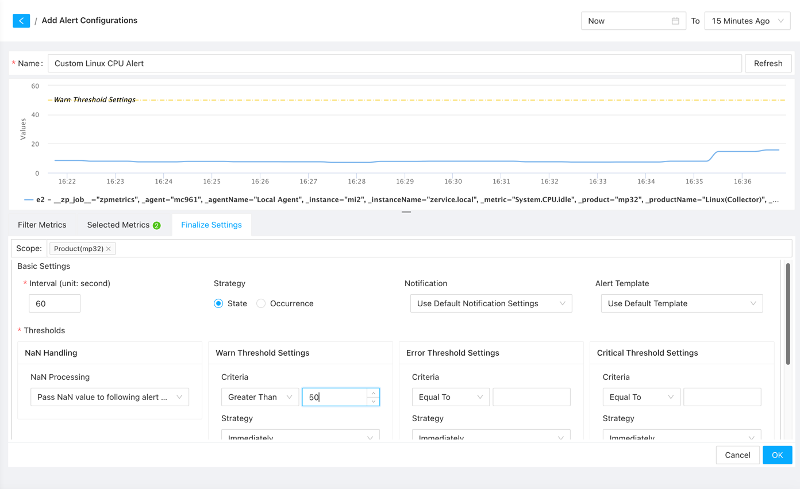
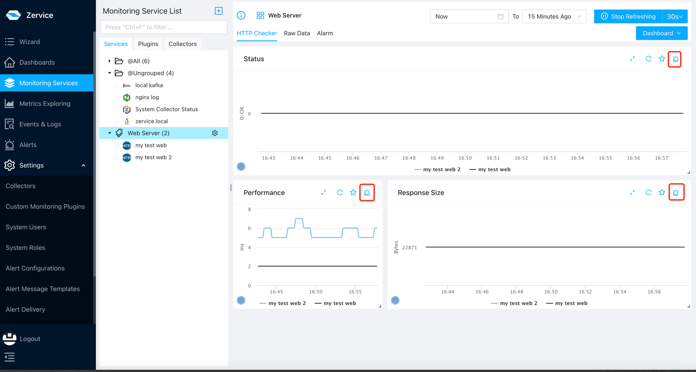
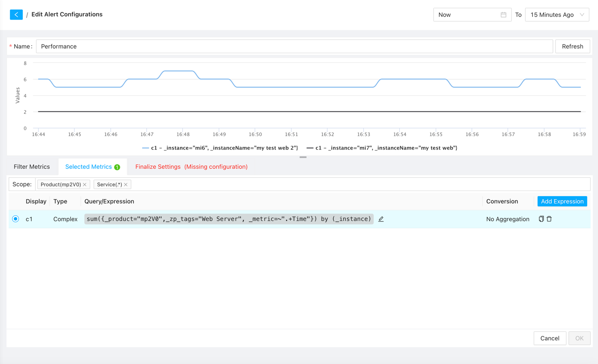
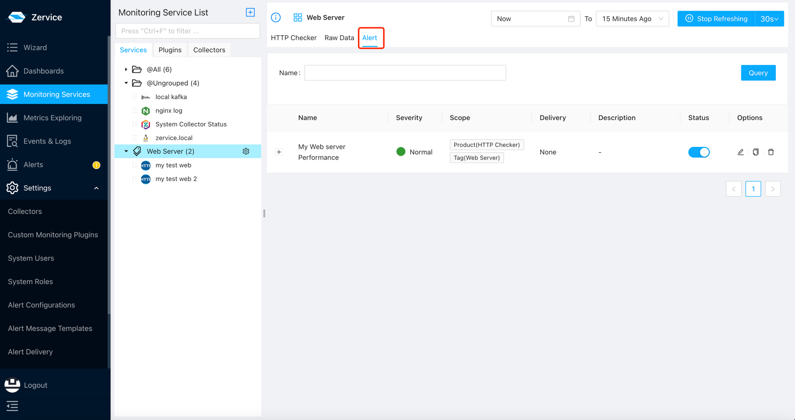

# Alert Settings

{: .no_toc .header }

----

## Alert Configuration

To utilize the alerting feature, you need to configure alert rules first. Our system comes with default alert rules, covering common scenarios. Additionally, you can create custom alert rules according to your specific requirements. There are two main ways to create alert configurations: the general method and the quick method.

### General Method

Navigate to the Alert Configurations page by clicking on Settings -> Alert Configurations in the sidebar.

Next, click on the "Add Alert Configuration" button at the top-left corner to enter the alert configuration creation page.

On the alert configuration creation page, you need to configure the following:
- **Alert Name**: Each alert name must be unique within the system. It is recommended to use descriptive names for easier management and identification during alert occurrences.
- **Alert Metrics**: Select the metrics that trigger the alert. We offer three common categories:
   - Application: Alerts for devices of the same type, such as triggering an alert when CPU usage exceeds 80% for all Linux servers.
   - Service: Alerts specific to individual services, such as triggering an alert when CPU usage exceeds 70% for a specific Linux server.
   - Tag: Alerts for a custom group of devices. You can group devices on the service page and then trigger alerts for the group, such as triggering an alert when CPU usage exceeds 50% for all Linux servers in the "db" group.
     

After selecting the alert metrics, the system will automatically load all metrics for devices in the selected category. You can use the search box to filter and select the desired metrics for alert configuration.

Once the desired metrics are selected, the system will list all metrics that meet the conditions, allowing you to review and set appropriate threshold values for alerting. You can also add additional filtering conditions and modify metric selections if necessary.

After confirming the metrics, click the "Select to metrics" button to proceed. Here, you can add more metrics and perform calculations. Click the "Add Expression" button to input calculation formulas and select the metric as the trigger for the alert.

Once the data is confirmed, click the "Finalize Settings" button to proceed to the next step. Here are some key configurations:
- **Notification**: Select a notification chain to send alert notifications. Without a notification chain, the system will not send any notifications, and you can only view alerts by logging into the system.
- **Threshold**: Set appropriate threshold values for the desired alert level. You can also specify the duration after which an alert should be triggered and whether to alert for missing data. Note that if there are overlapping intervals for different alert levels, the higher-level alert will be triggered.
- **Description**: Provide a description for the alert, including relevant information to help identify the cause of the alert. It is recommended to include essential information such as alert name, alert level, trigger value, and affected objects. Our system templates include basic information, but you can add more details to facilitate quick identification and resolution.
  

After configuring the alert settings, click the "OK" button to save the alert rule.

### Quick Method

First, navigate to the service page and select Tag, Application, or Service to view the dashboard for devices. You will notice alert icons on these widgets.

Click on the alert icon to enter the alert configuration page, where the system has already pre-selected the widget's metrics. You can directly click the "Finalize Settings" button to configure alert thresholds and notifications.

After configuring the alert settings, click the "OK" button to save the alert rule.

Both methods of creating alert configurations can be managed on the Alert Configurations page and viewed on the Alert page for each service. If you do not see the alert in the corresponding service, check if the alert configuration scope is set correctly.

