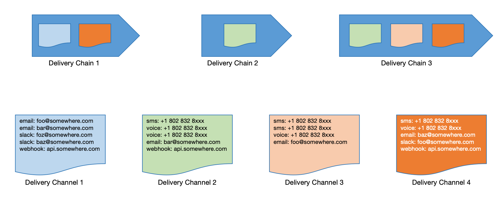
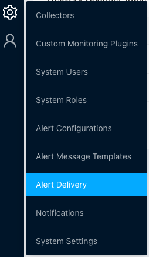
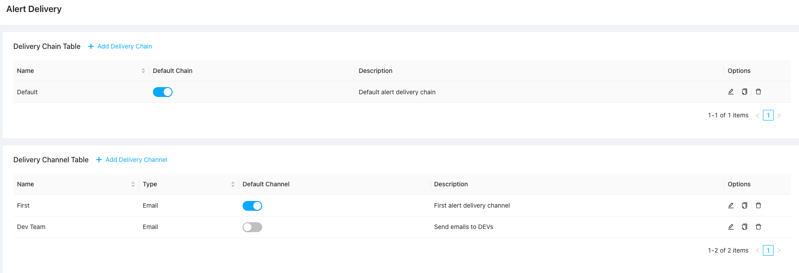
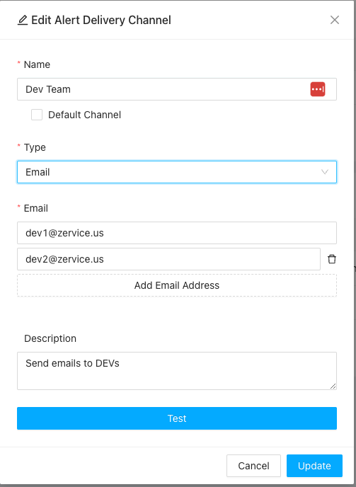
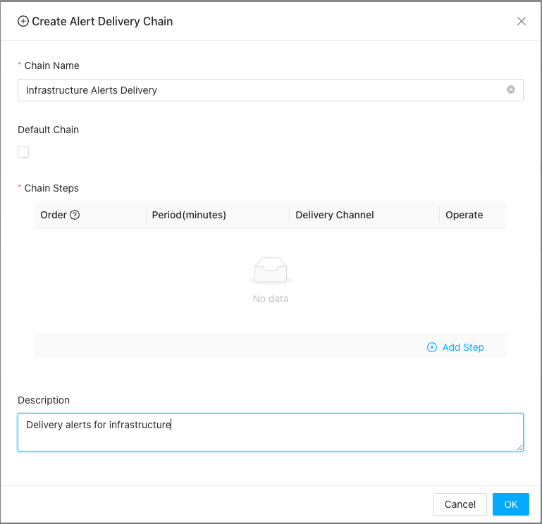
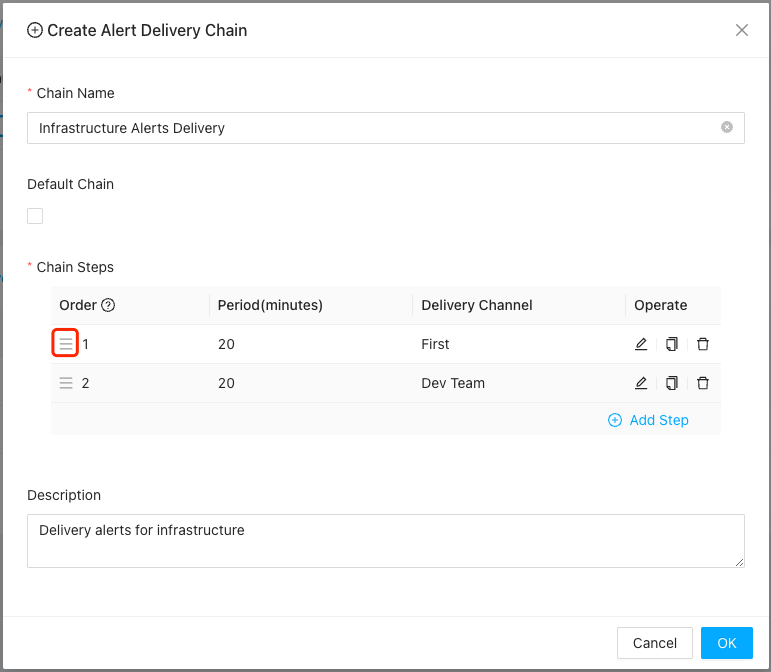
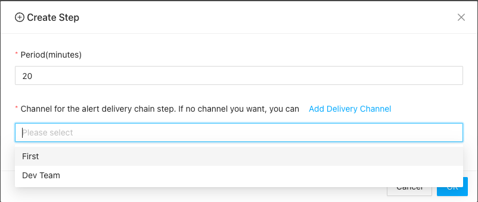

# Alert Delivery

{: .no_toc .header }

----

In ZoomPhant, alerts are delivered using an **alert delivery chain**. The chain consists of one or more stages, with each stage be called an **alert delivery channel**. An alert delivery channel can appear in multiple in mulitple alert delivery channels. Following diagram can give you a rough idea about alert delivery chains and alert delivery channels.

Here user defines few alert delivery channels, with each channel contains one or more recipients. The alert delivery channels can be used by one or more alert delivery chains.

### Create Alert Delivery Channel

Alert Delivery Channel is the basic building blocks for alert delivery chains. It is used to group the recipients together so customers can re-use the group of recipients in different alert deliverychains. 

To create a delivery channel, first click **Settings** | **Alert Delivery** to go to alert delivery page:

In this page, you can manage all your alert delivery chains and channels:

Click **Add Delivery Channel** and you'll be shown the **Add Alert Delivery Channel** dialog:  

You need to provide following information
* Name of the channel, the name will be used in creating Alert Delivery Chains.
* Optionally you can set the channel to default channel. In System only one channel could be set to as default channel, where in certain situations the system can use the default channel to send notifications.
* Type: type of the channel. In one channel, you can just create same type of receipients, it could be
  * Email: using email address as recipients
  * SMS: using phone number to receive SMS messages
  * Voice: using phone number to receive voice notifications
  * Webhook: Using custom web hook to receive notifications
    * We have customized few frequently using web hooks like Slack, Wechat, etc. for convenience
* Recipients: depends on above type, it could be email address list, phone numbers or webhook addresses
* Description: A short description of the channel

After you have input necessary information, you can click the **Test** to make a test to make sure the receipients could receive a test message.

Once created, the alert delivery channels will be available in creating or managing your alert delivery chains.

### Create Alert Delivery Chain

When system generating alerts, it will using alert delivery chains to send the notifications. Please refer to  [Create Alerting](./alert) to understand how alert delivery chains are used in alert settings.

To create an alert delivery chain, click the **Add Delivery Chain** in **Alert Delivery** page and a dialog will be popped up as follows:

Before creating the stages or steps, you shall provide following information

1. Chain name: names for you to using the alert delivery chain in other parts of the system
2. Default Chain: you can set the chain to default so when creating alert nofications, you need simply choosing "Using default", which will be automatically mapped to this chain. But in system only one default chain could be set.
3. Descriptions: a short description about the purpose of the chain

Once those information ready, you can create your stages or steps by click **Add Step** to create a new step or drag drop to chain the order of steps.

#### Change Order Of Existing Steps

You can drag this icon in Order column to change the orders of steps:

#### Creating New Step

You can create new step and append it as the last stage by click the **Add Step** button:

Here in each step, you can choose one or more channels, and the **period** field is used to decide how long it will take to escalate the notification from previous step to current step.

Once alert delivery chains are created, you can now head to create alerting rules etc. to use the created alert delivery chains.