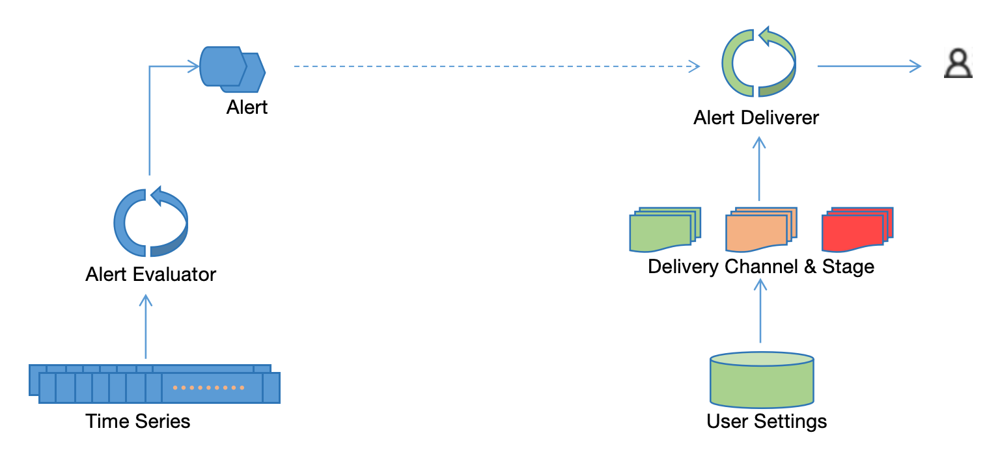

# Alerting & Notifications
{: .no_toc .header }

----
One important function of a monitoring system is to identify exceptional or abnormal conditions. When such something unexpected happens, the monitoring system shall generate alerts and get users notified. 

In this section, we will let you know how ZoomPhant allows users to define alerts and get users be updated for generated alerts.

## Alerting & Delivery Process

Below diagram describes how ZoomPhant generates alerts and delivers notifications to users

As shown in above diagram, ZoomPhant will first evaluate alerts against time series and then, for generated alerts, deliver the alerts to end users using delivery channel and stage settings.

### Alert Evaluation

ZoomPhant will have **alert evaluators** evaluating the timeseries in a real-time way to identify exceptions or abnormals according to **Alerting Rules** defined by users in their alerting settings. Once an exception is identified, it will generate a stateful **alert**, and the alerts will then be queued for delivery.

Please refer to [Alerting Settings](./alert) for more on how to define alerting rules.

### Alert Delivery

Alert delivery in ZoomPhant is a staged process using a concept called **Alert Delivery Chain**, which contains stages of **Alert Channels**. In each channel one or more recipients would be defined to receive notifications via email, Webhook, SMS or voice.

When an alert is generated, the first stage will be activated and alerts will be sent to recipients defined in the channels of first stage, and it will then escalate gradually along the stages if no actions is detected by recipients in current channel.

Please refer to  [Alert Delivery](./delivery) for more on how to manage your alert channels and alert delivery chains as well how the alert delivery chains are escalated.
