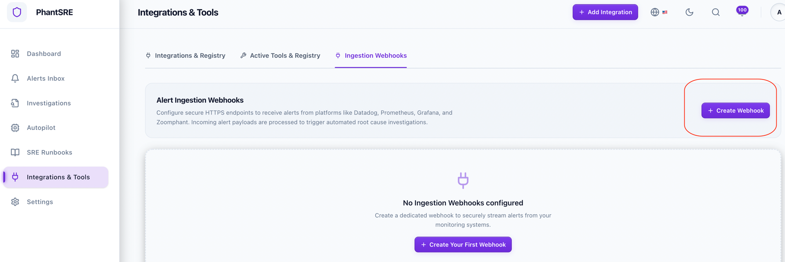
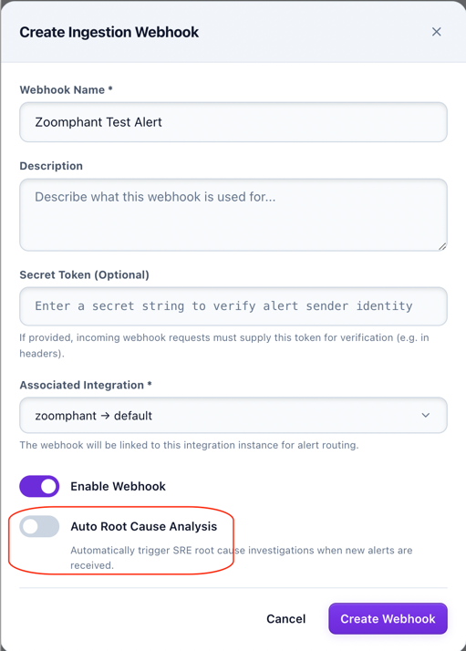

# PhantSRE Alert Delivery

{: .no_toc .header }

----

This doc describes how to connect PhantSRE and Zoomphant.

### Step 1: Create the webhook at the PhantSRE
Click create webhook:


and check whether you need Root Cause Analysis (RCA) automatically (<font color="red">This requires much more AI tokens consumption</font>):



and then you get some url like: (note the hostname maybe different)
```shell
https://sre.zervice.us/sre/api/v1/webhooks/local/245ecb94-0131-xxxx
```


### Step 2: Create Alert Delivery
Please refer to [Alert Delivery](../delivery/#create-alert-delivery-channel) to create the alert delivery and choose type <font color="red">"Webhook"</font> using the provided webhook url.
