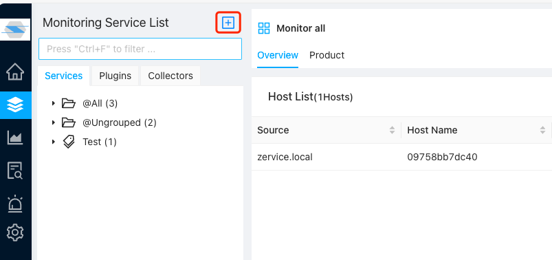
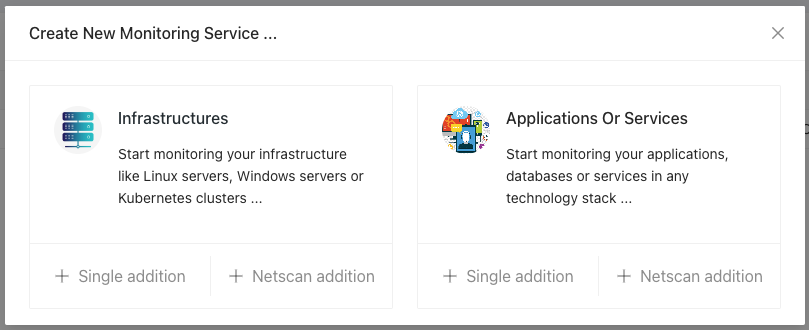
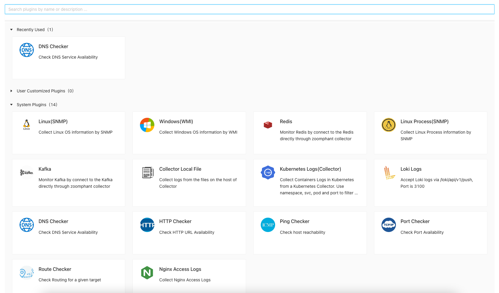
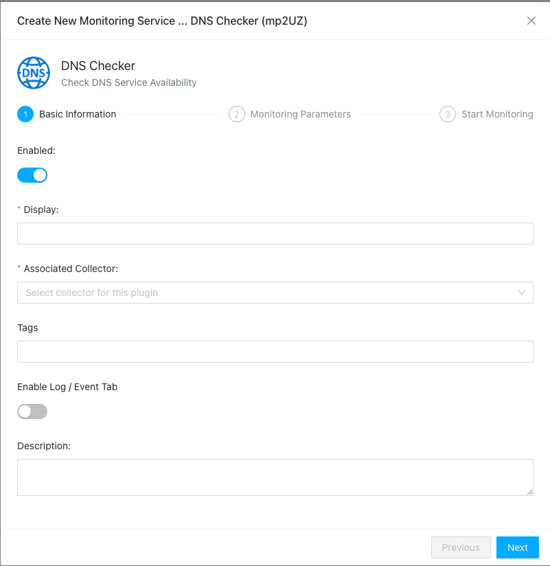
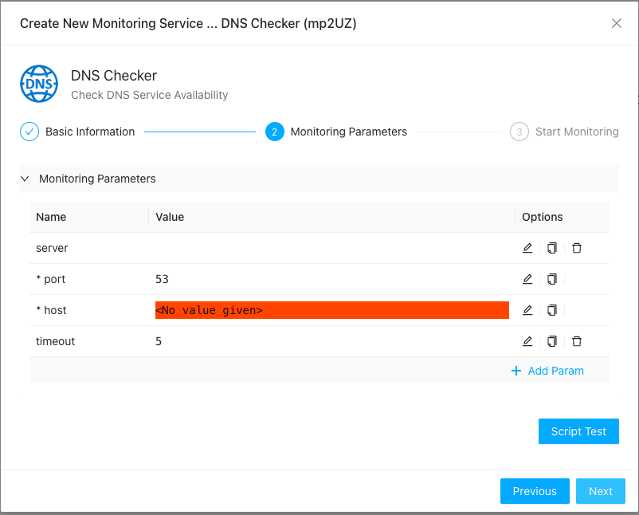
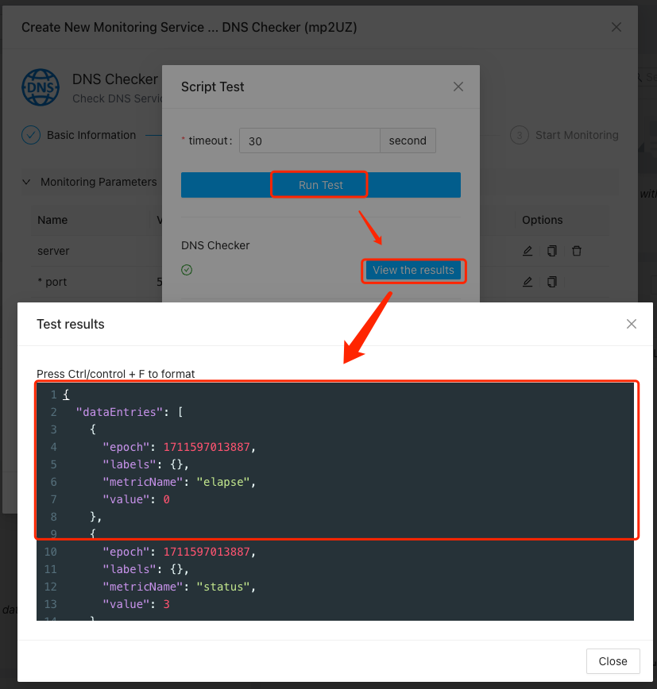
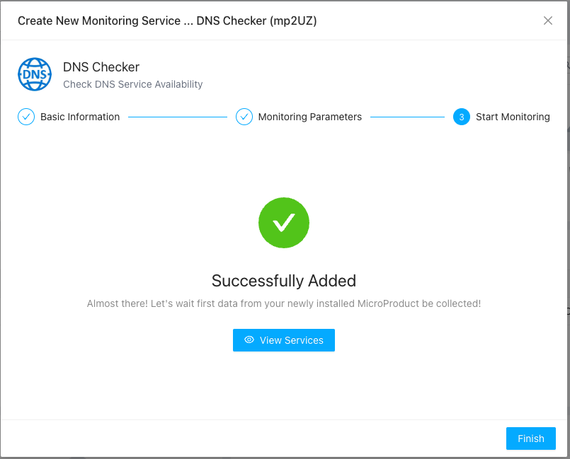

# Monitoring Service
{: .no_toc .header }

----
In ZoomPhant, a monitoring task you created will be called a **Monitoring Service**. You create a Monitoring Service from a plugin created by yourself or provided by ZoomPhant or 3rd parties.

## Start Adding Monitoring Service ##

To add a monitoring service, you can first choose the plugins. Click the **add** button on top right of the **Monitoring Service List** pannel so you can start adding a service:

The first step is to choose what kind of monitoring service you want to add:

1. Infrastructure Monitoring Service: this is a special monitoring service that it would require you to create a **data collecting agent** along adding this service. The data collecting agent is used to collect data for this service and other monitoring services that depends on this infrastructure.
2. Application Or Service: this is the most common monitoring service to monitor a specific object like a remote host, a database server or a website, etc.

Once you decided the kind of monitoring services, you will start to add the monitoring services by choosing to add just one or add a batch of similar services (like monitoring a group of serviers or bunch of database servers). We'll have more on batch adding monitoring service later, but for now, let's suppose we would try to add a single monitoring service for an application or service, so just click the "**Single addition**" under **Applications** type.

## Choosing Monitoring Plugin

Once you clicked the "Single Addition" button, you'll be asked to choose a **Monitoring Plugin** in the **plugin selector**. You can create your own monitoring plugin or using plugins released by ZoomPhant or 3rd parties. Allong with the ZoomPhant package released, we included the most commonly used plugins for your choose:

The plugin selector will list all the plugins available, including those you created and the plugins released along with ZoomPhant and other 3rd parties.

On top of the selector, you can do filtering by input the keyword to search for plugins you want, or you can decide the plugin from

* Recently Used List: Usu. in a business, you'll just use few of all the plugins, you can find those you commonly used to avoid searching in a long list
* User Customized Plugins: You may created your own or instantiated a plugin for a plugin template. Those will be shown here so you can try to find them quickly
* System Plugins: those are the plugins created and managed by ZoomPhant

Once you decide the plugin (here, suppose we want to choose the DNS Checker to monitor a domain), just click it and a wizard will shown up to add the monitor service.

## Providing Monitoring Service Information

The first page of the wizard would be asking you to provide basic information as shown below

Here you shall provide information like

* Display: the name for the Monitor Service
* Associated Collector: which data collecting agent you shall use to collect data for this monitor service
* Tags: one or more tags you want to group your monitor service
* Description: a short optional description of your monitor service

Click "Next" once you fill in those information

## Provide Parameters and Testing Monitor Service

In most cases, a plugin would define one or more parameters for you to input to create a monitor service. Those parameters usu. are the remote address, username / password to access certain data, etc.

Parameters could be optional or mandatory, and if it is mandatory and no default value provided, you'll have to fill in before you can continue, as shown in below diagram (the **host** parameter)

Once you have input the parameters and if you want to make sure the data collecting could work as expected, you can click the "**Script Test**" button to bring the "Script Test" dialog to do some tests before you can continue. 

In the "Script Test" dialog, you first set a timeout value (default to 30 seconds) and then click the "**Run Test**" button, the system will start to do the test and presents a "**View the results**" button once it finishes, if you click this button the raw data will be presented to you so you can know what kind of data is collected and if the data is you expected.

If anything goes wrong, an error message will be presented instead of the "**View the results**" button.

Click Next so you can complete adding the monitoring service.

## Complete Adding Monitor Service

Once you reach here, your monitor service has been successfully added. You can choose to close the wizard by click the "**Finish**" button to jump to the page to start checking the data for your service by clicking "**View Services**" button in the middle of the wizard.

