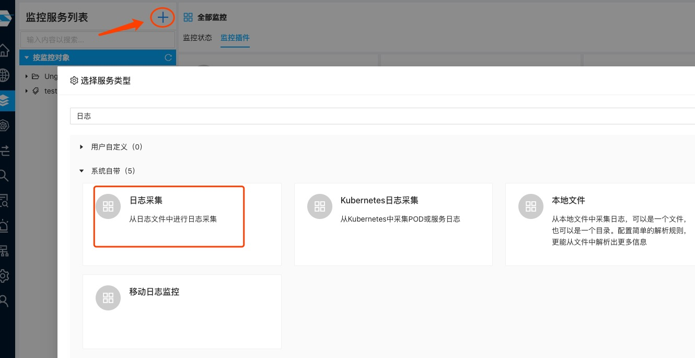
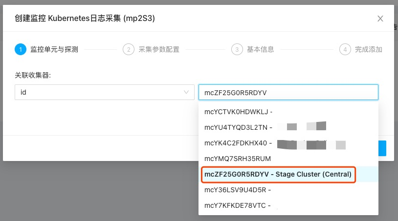
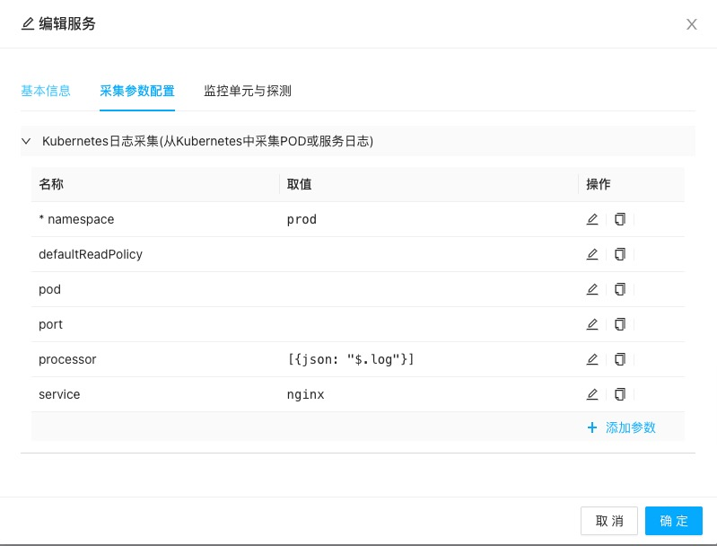

择维士提供了灵活多样的日志采集插件，用户只需要选择符合自己需要的插件即可快速开始日志监控。

## 本地日志采集

本地日志（或通过NFS映射后的基于日志文件的日志）可以通过”日志采集“插件完成。

在服务管理页面，点击添加按钮并输入”日志采集“即可看到该插件：

选择该插件后，进入添加监控服务向导，在参数中输入要监控文件的路径，并选择一个监控模式，决定是否需要加载已经存在于日志文件中的历史日志，即可开始监控日志：

**注意** 我们的文件监控可以对一个路径或满足路径条件的文件进行监控，解决如自动按日期进行log rotation的场景。我们后续会对此进行专门的描述。

## Kubernetes集群日志采集

择维士数象云同样支持对Kubernetes集群的日志进行采集。采集集群日志需要确保
1. 已安装集群采集器
2. 已提前知道要采集日志的服务或Pod相关信息。

首先从服务管理页面选择”Kubernetes日志采集“插件：

在采集器选择页面，确保选择一个集群采集器。一般集群采集器会带有"Central"字样，代表它是一组Kubernetes集群采集器的管理采集器：

在随后的参数设置中，需要按你的需要进行设置，以下截图是我们添加的一个Kubernetes服务的日志监控参数：

.

此处
* **namespace**：必填参数，所监控的服务或pod所在的名字空间
* **service**：可选参数，但和下面的pod参数二者必填一个，此处应该为所选服务的名称。
* **pod**：可选参数，与上面的service参数二者必填一个，为一个全的pod名或正则表达式，选中一批POD。
* **port**:可选参数，一个POD上可能运行多个Container，此时通过提供服务的端口号可仅对匹配的容器日志进行采集

## 关于日志处理

在采集日志时，择维士数象云采集器可对日志进行丰富多样的处理，如
* 去掉部分日志内容：比如一些日志库会额外生成一些前缀或其他内容，此时可以通过相关处理函数去掉无效部分
* 日志转换：比如对Kubernetes日志，其原始格式为Json格式，此时我们可以通过相关处理函数提取处经过Json格式封装的真实日志部分
* 转换和标签提取：可对日志内容做进一步处理，生成自定义或重要的标签（如判断日志的严重级别，提取日志的真实发生事件等等）

我们将在后续文档中对这部分高级功能进行描述。