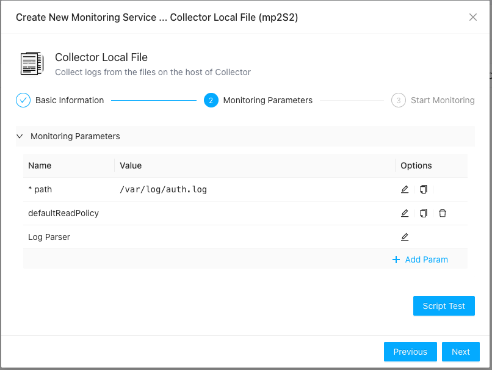
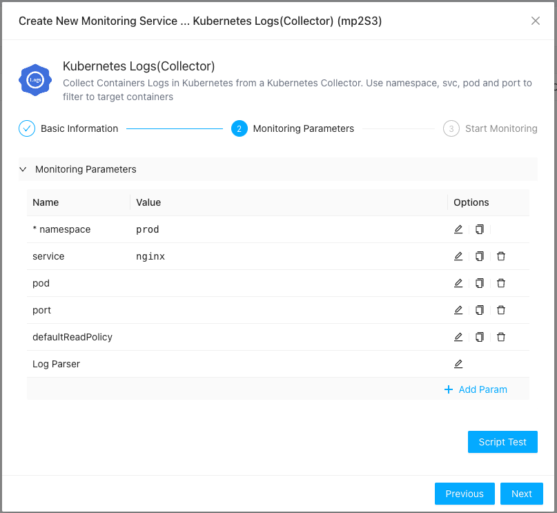

ZoomPhant provides various ways to collect log data

## Collecting Local Logs

Local logs are logs that can be accessed by collector locally (on local disk or NFS mapped drive). To collect such logs, just select "**Collector Local File**" from  [Add Service](../01_service) and provides necessary parameters (the path to the log file) as follows:

Here

* path: this is the required param identify the log files to read. Collector will automatically handle situation like file rotation, etc.
* defaultReadPolicy: how to start to read the file, could be **start** or **end**, meaning reading log file from start or end. Default to **end**.
* Log Parser: this is an advanced option, used for customer to decide how to parsing the log lines to extract information like timestamp, severity, etc. We will provide separate documentation for this in the future.

## Collecting Kubernets Logs

Collecting Kubernetes logs is hard as the PODS might migrating from node to node and create containers once for a while etc. ZoomPhant helps user to solve such problem by providing dedicated Kubernetes Logs collection, before you can start to collect Kubernetes logs, you shall
1. Have the Kubernetes cluster installed ZoomPhant collector, refer to  [Install Collector](../02_collector) 
2. Know where your log comes from

Once above information ready, you just select "**Kubernetes Logs(Collector)**" from  [Add Service](../01_service) and provides necessary parameters as follows:

**Note: before providing the collecting parameters, make sure you have select the Kuberentes collector in previous step**

Here, the 

* **namespace**: this is required, the namespace of the POD that generating the logs
* **service**: This is optional, the service name you want to collect logs for. If given you can ignore below **pod** parameter
* **pod**: This is optional. If above **service** is not given, you must provide the name of the pod or a RE2 expression to filter the POD for log collecting
* **port**: This is optional. A POD may have more than one containers, if you want to collect logs for certain container openning the given port, you can use this parameter

## About Log Parser

ZoomPhant support very powerful log processing functions with Log Parser, such as:
* Ignore certain part of the log, e.g. some logs has common prefix that are redundant
* Converting logs: e.g. for Kubernetes or docker logs, it is in JSON format, we can convert the JSON logs to more readable text lines
* Label extraction: User can customize the log processing to set important label like level or severity or event timestamp when the log is generated, etc.

We will have additional documents for this paramether in the future.