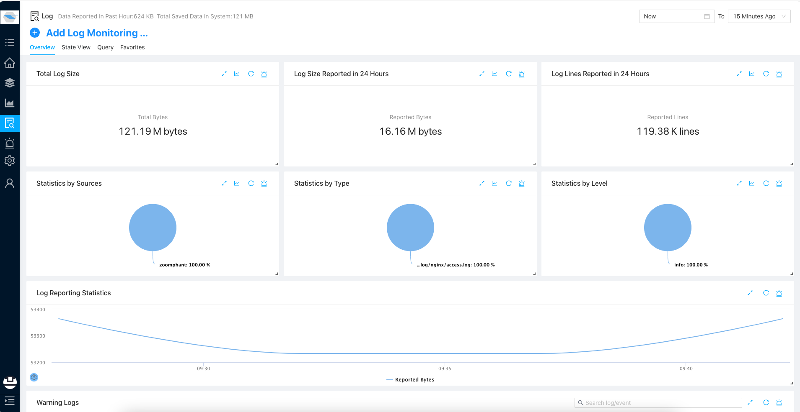
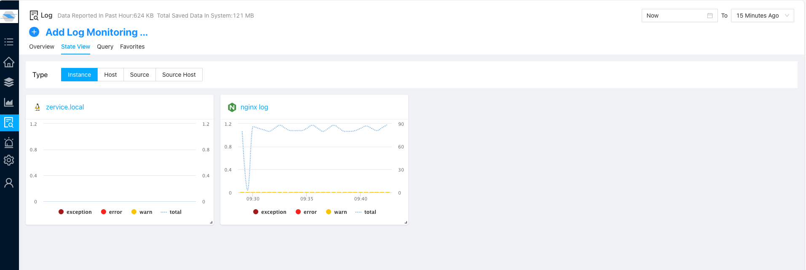
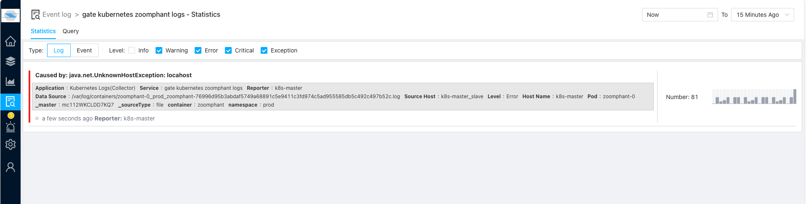
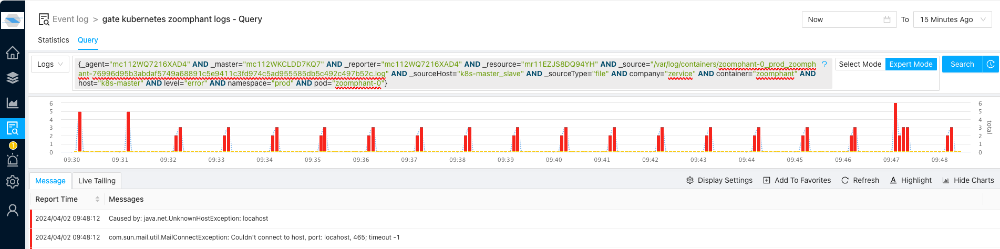
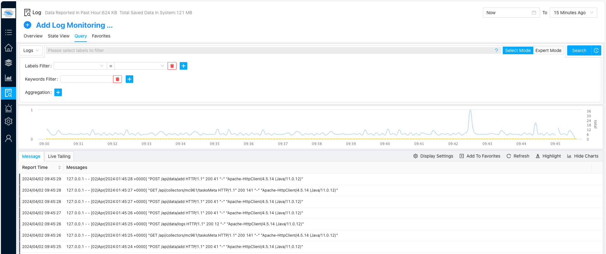

ZoomPhant can monitor your logs!!! It means you can now put your logs and metrics together in one monitoring solution by using ZoomPhant .

To use log monitoring, you don't need to do any extra setting, just find one of the log monitoring plugins and start  [collecting your log](./add). Within few seconds you can view your log data in your monitoring service dashboard or visiting the centrallized Log & Event browsing page, as shown below

 

In the **Overview** tab of Log & Event browsing page, you can see overall status of your log ingestion, and you can also find more details of your log monitoring services in the **State View** tab:

In above tab, you can view a state view of each of your log sources, if you click one of them you may be able to see a more detailed states about the events

You can click one of the shown events or simply click "**Query**" to start querying and processing logs from that source:

If you want to query logs for all sources, simply click the **Query** tab in the **Log & Event** page,:

To query and process the logs, you'll need to refer to our simple log processing language

