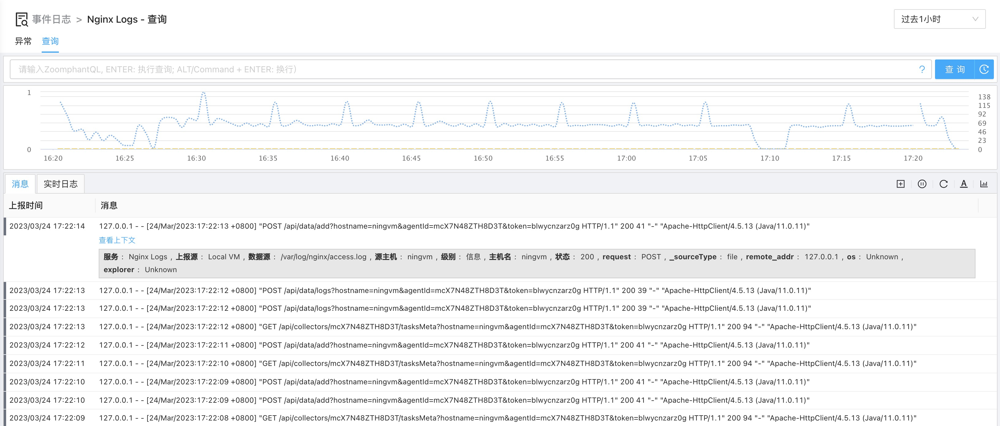
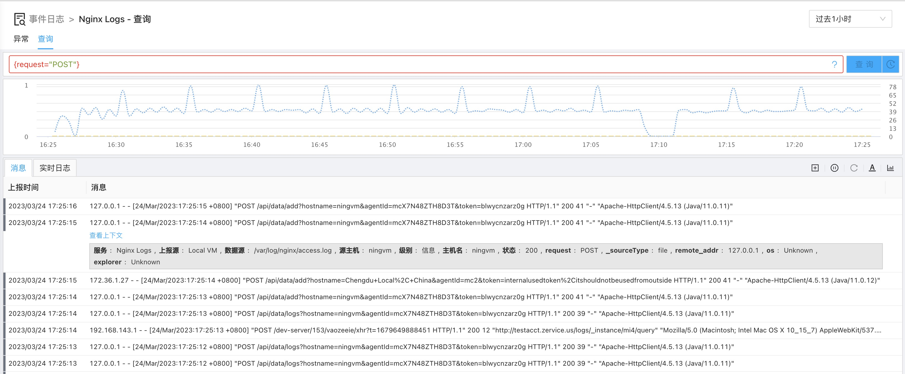
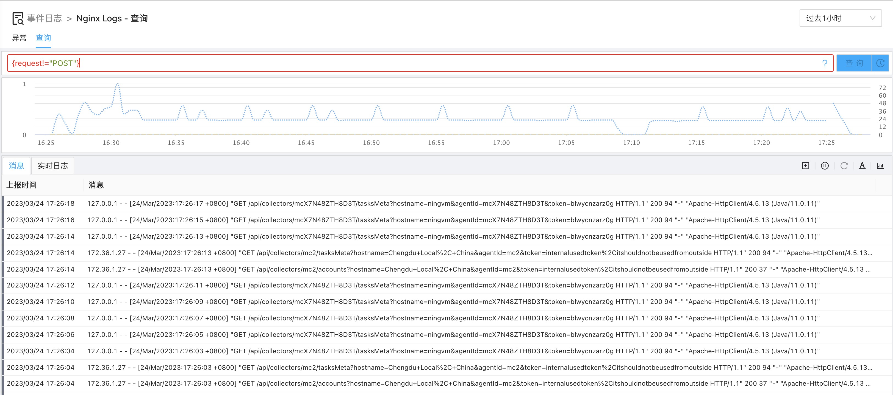
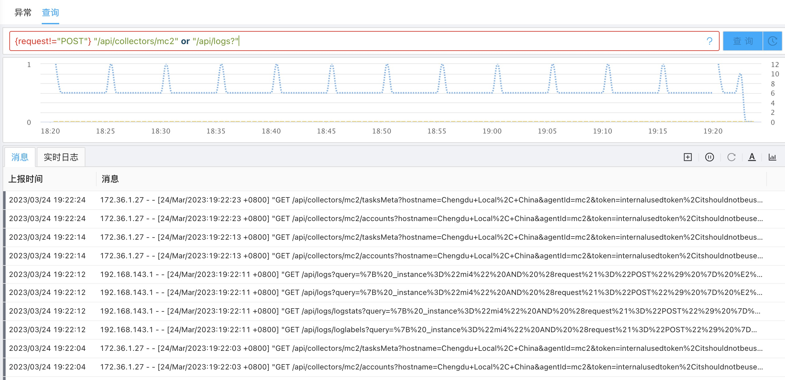
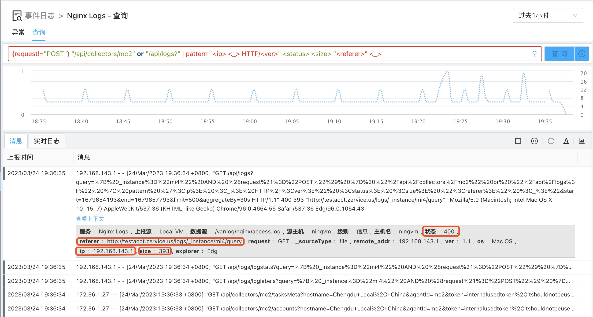
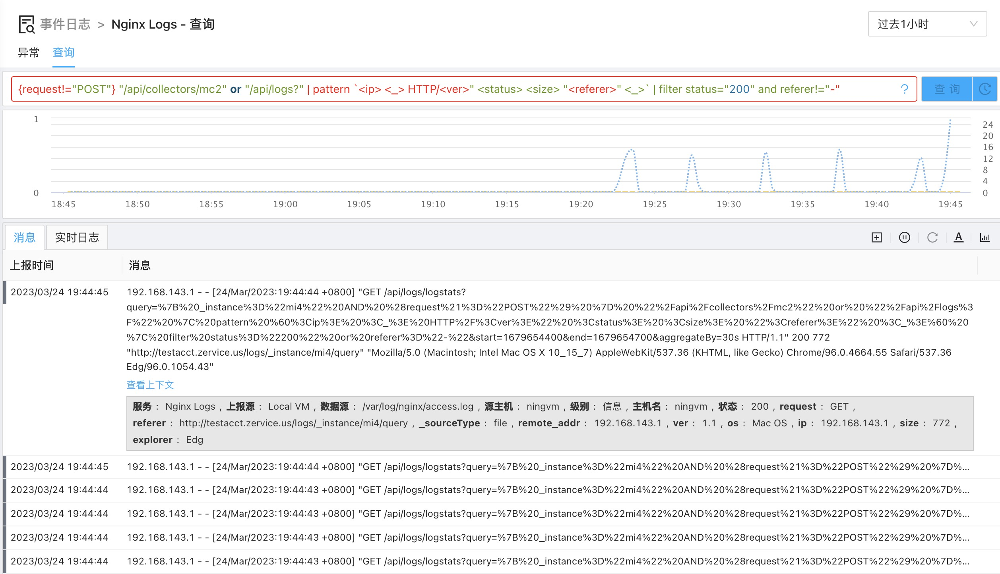
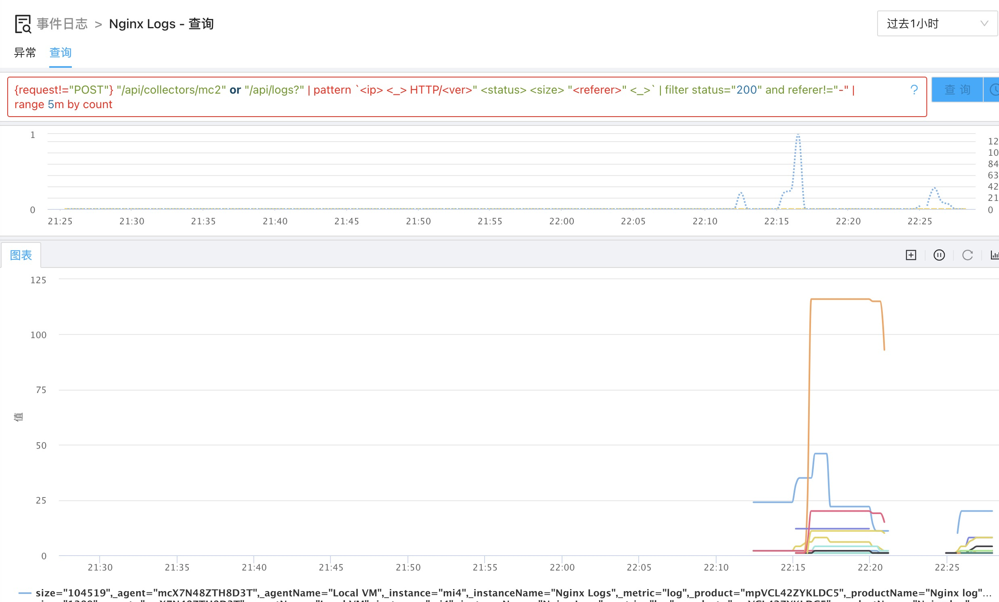
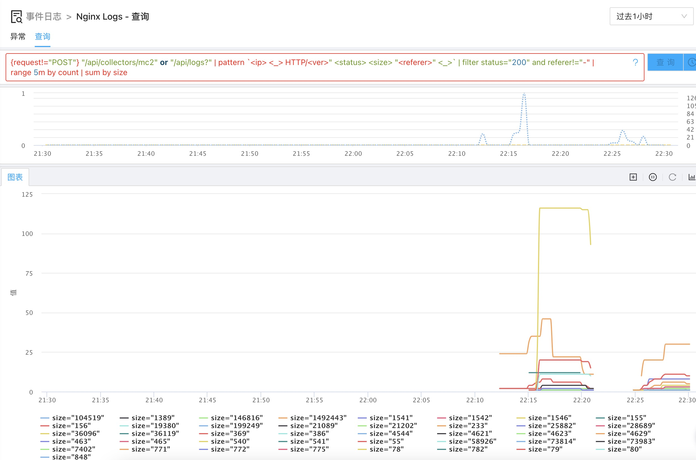
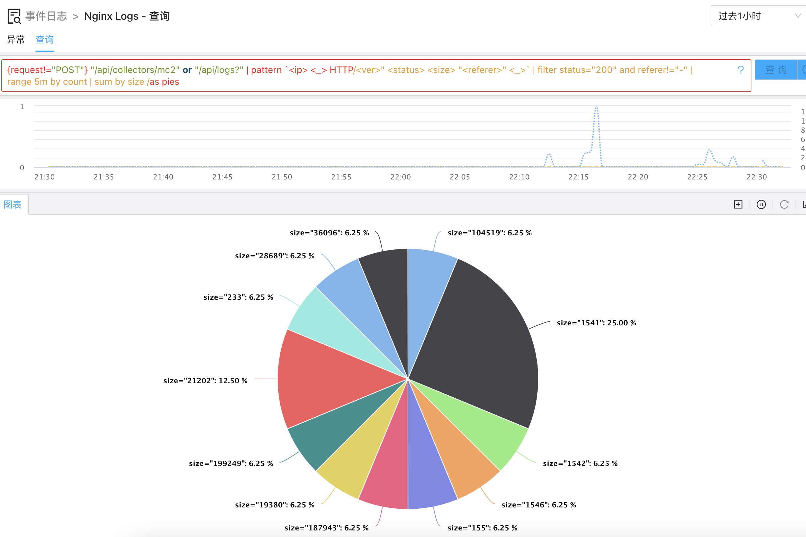

为方便用户快速理解并使用择维士数象云日志查询语法，我们将用一个具体的例子来展示如何使用这些语法。

在这个例子中，我们将对如下格式的nginx日志进行各种过滤、分析。

    log_format combined '$remote_addr - $remote_user [$time_local] '
                '"$request" $status $body_bytes_sent '
                '"$http_referer" "$http_user_agent"';

我们准备的日志集合在没有做任何处理前，展示如下图所示：

## 日志基本过滤

用标签过滤方式只查看POST 请求，使用查询语言如下：

    {request="POST"}

效果如下

同上，但过滤掉POST请求，使用查询语言如下：

    {request!="POST"}

效果如下

继续使用关键字进行更进一步的过滤

    {request!="POST"} "/api/collectors/mc2" or "/api/logs?"

效果如下

## 使用日志处理函数

使用基本的过滤后，我们一般已经将日志量限制在一个比较小的范围（具备特定标签或满足特定关键字组合）；此时进一步处理我们可以使用处理函数来

1. 对日志进行解析变换
2. 进一步对日志进行过滤筛选

### 提取更多的标签

这儿，我们将上面已经过滤出来的日志进行提取，获得更多的标签或字段方便处理。我们将提取出以下字段：

1. ip：发送请求的IP 地址
2. status：请求处理的状态码，如200,403等
3. size：回复的大小字节数
4. referer：发送请求的referer信息（网页地址）

我们用**pattern**处理函数来完成这个操作:

    {request!="POST"} "/api/collectors/mc2" or "/api/logs?" | pattern `<ip> <_> HTTP/<ver>" <status> <size> "<referer>" <_>`

注意此处，因为我们再pattern后面的参数中要用到引号，因此我们使用back tick（·）来作为字符串的引号。此时效果如下：

此处要注意的是，我们前端试图将一些知名标签转换为汉字，因此看到的“status”标签实际显示为”状态“。

我们将进一步过滤，确保我们后面只会处理状态为200的请求且referer不为空（”-“）的请求：

    {request!="POST"} "/api/collectors/mc2" or "/api/logs?" | pattern `<ip> <_> HTTP/<ver>" <status> <size> "<referer>" <_>` | filter status="200" and referer!="-"

此时效果如下：

### 数据归集与展示

我们想统计下上面过滤出来的日志按5分钟为一个间隔，每个间隔的产生的请求数

    {request!="POST"} "/api/collectors/mc2" or "/api/logs?" | pattern `<ip> <_> HTTP/<ver>" <status> <size> "<referer>" <_>` | filter status="200" and referer!="-" | range 5m by count

效果如下：

我们可以统计下按大小的请求总和

    {request!="POST"} "/api/collectors/mc2" or "/api/logs?" | pattern `<ip> <_> HTTP/<ver>" <status> <size> "<referer>" <_>` | filter status="200" and referer!="-" | range 5m by count | sum by size

效果如下：

如果用饼图来查看此类数据效果会更好一些：

    {request!="POST"} "/api/collectors/mc2" or "/api/logs?" | pattern `<ip> <_> HTTP/<ver>" <status> <size> "<referer>" <_>` | filter status="200" and referer!="-" | range 5m by count | sum by size /as pies

如图所示：

