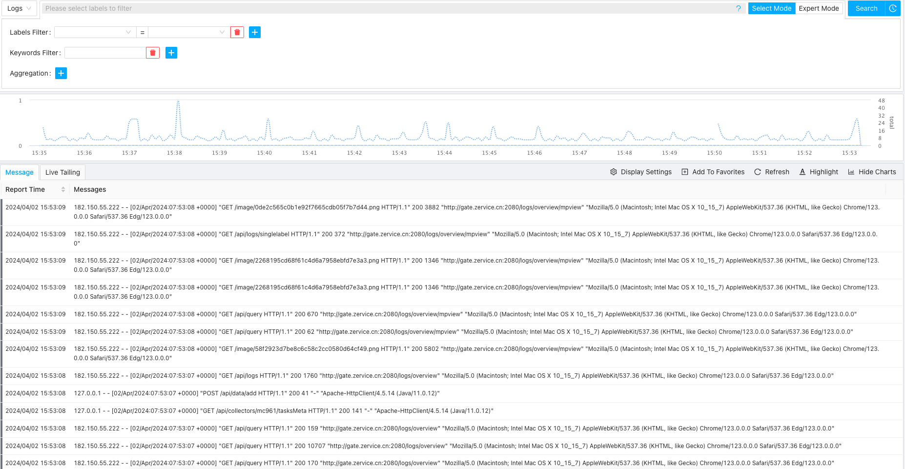
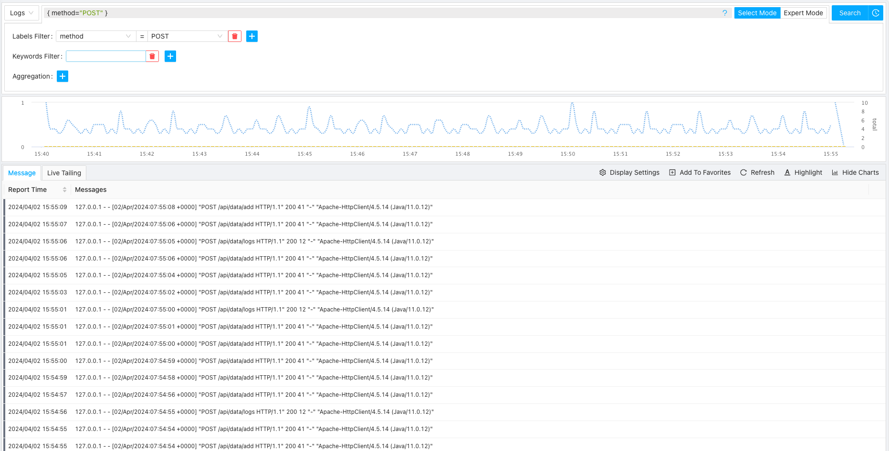
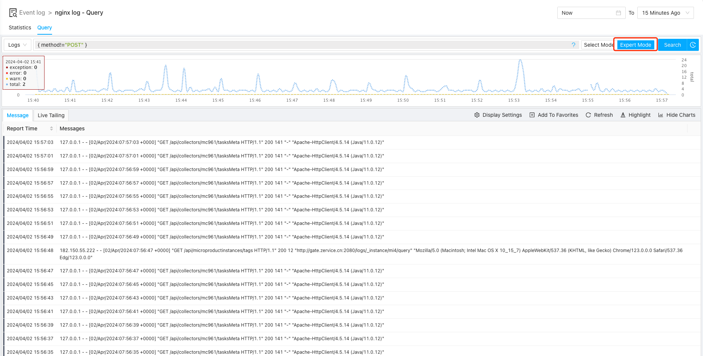
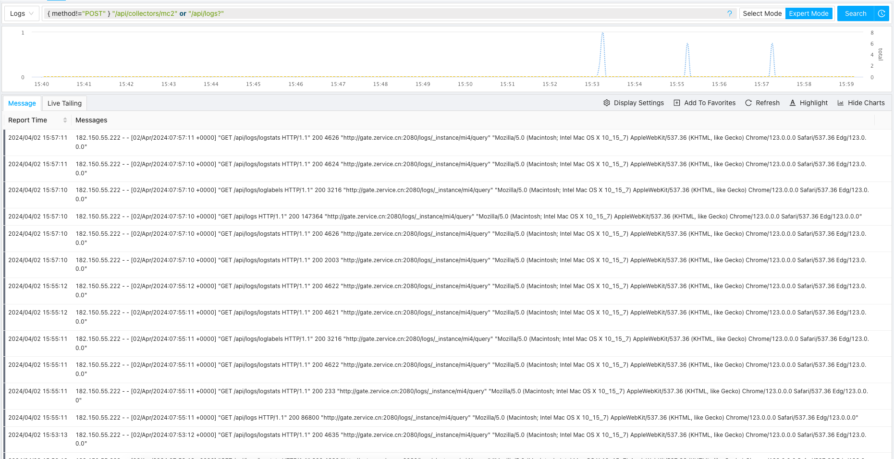
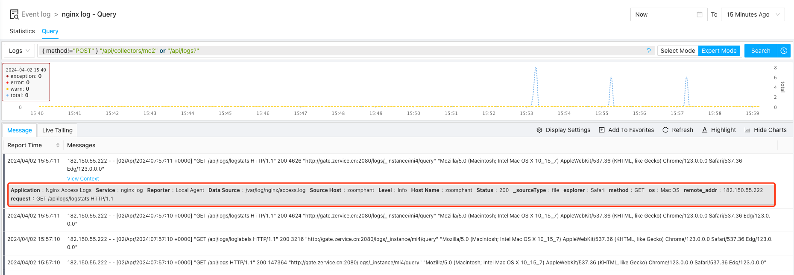
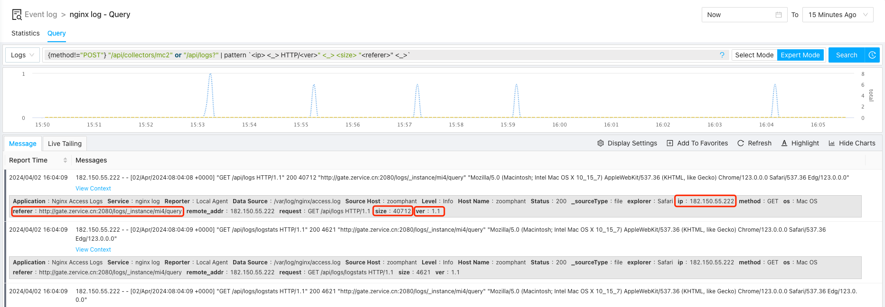
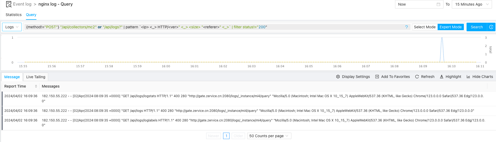
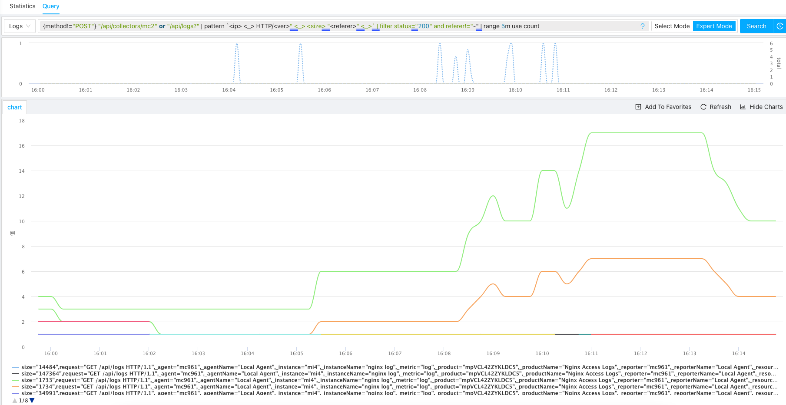
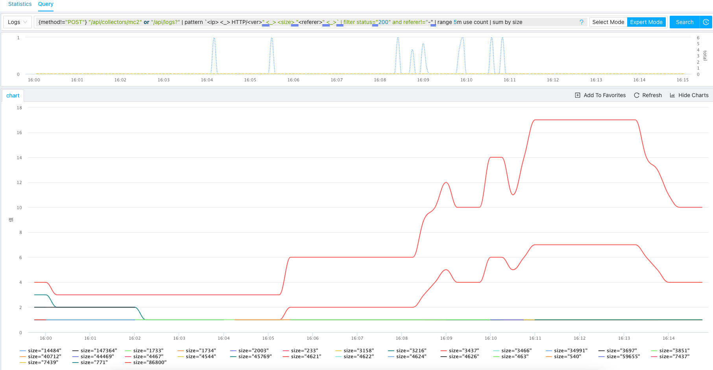
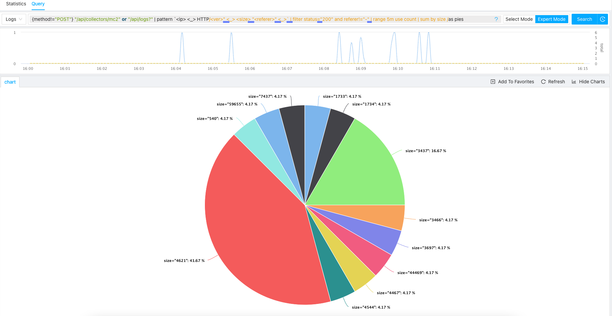

To help you understand the ZoomPhant Log Query Language, we using a concrete example to help you processing and understanding your logs. In our example, we will try to process the nginx logs generated with following format (refer to your nginx configuration):

    log_format combined '$remote_addr - $remote_user [$time_local] '
                '"$request" $status $body_bytes_sent '
                '"$http_referer" "$http_user_agent"';

Before we have performed any processing, the raw logs we have collected is something like follows:

## Filtering Logs

Suppose we just want to process the POST requests, let's filter the logs using following statement

    {method="POST"}

By applying the filter, we can see something like follows

If we want to filter non-POST requests, we can using a filter statement like follows

    {method!="POST"}

**Note: here we shall switch to expert mode for this as selection mode only for more basic usage**

Continue with above example, let's just try to filter logs for some special apis:

    {method!="POST"} "/api/collectors/mc2" or "/api/logs?"

We now have following:

## Using Log Processing Functions

With above filtering, we now limit our logs to a much smaller set, and we can further processing our logs to

1. Extract more important information dynamically
2. Further filtering / processing the processed logs

### Extracting More Labels

In the raw nginx log, there are no labels like ip, referer, etc.:

But those labels might be very useful to understand Nginx logs, we can try to extract them from the logs lines as

1. ip: the IP address sending the request
1. ver: HTTP request version
2. size: the size in bytes of the responses from the server
4. referer: the page sending the request (i.e. referer of the request)

We can use **pattern** function to get this done:

    {method!="POST"} "/api/collectors/mc2" or "/api/logs?" | pattern `<ip> <_> HTTP/<ver>" <_> <size> "<referer>" <_>`

**Note: we are using ticked string here to be able to use double quotes in the pattern argument**

Suppose we want to find requests that are not processed successfully (status != 200), we can expand our query statement with another filter stage as follows:

    {method!="POST"} "/api/collectors/mc2" or "/api/logs?" | pattern `<ip> <_> HTTP/<ver>" <_> <size> "<referer>" <_>` | filter status!="200"

We now have:

### Vectorizing Logs and Display

Now suppose we want to see the pattern of the successful requests in a 5 minute step, we can do this using following query statement:

    {method!="POST"} "/api/collectors/mc2" or "/api/logs?" | pattern `<ip> <_> HTTP/<ver>" <_> <size> "<referer>" <_>` | filter status="200" and referer!="-" | range 5m use count

We now have our output displayed in lines as follows:

We can try to get a stats by response size by sumiming against size using following statement

    {method!="POST"} "/api/collectors/mc2" or "/api/logs?" | pattern `<ip> <_> HTTP/<ver>" <_> <size> "<referer>" <_>` | filter status="200" and referer!="-" | range 5m use count | sum by size

We now have:

If we want to take a look at current distribution by size, it would be better to view the data in pies, so let's add pies display options as follows:

    {method!="POST"} "/api/collectors/mc2" or "/api/logs?" | pattern `<ip> <_> HTTP/<ver>" <_> <size> "<referer>" <_>` | filter status="200" and referer!="-" | range 5m use count | sum by size /as pies

Now we would have data be shown in pies as following:

