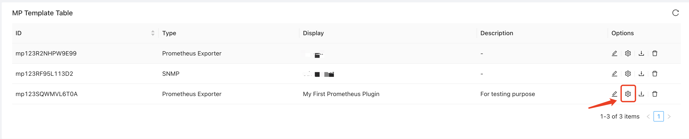
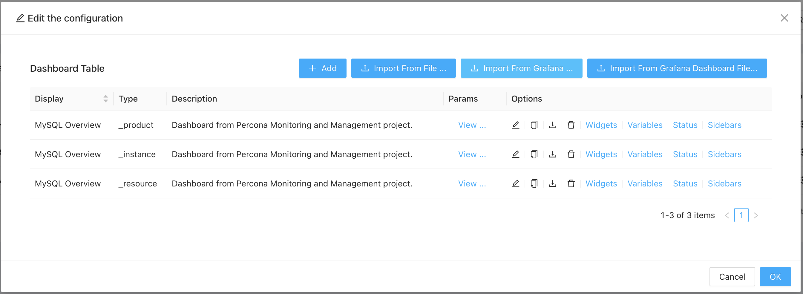

After creating the custom prometheus plugin, you have get the capability to scrape any promtheus endpoint. However how to interpret and presenting the data to users? We would need to important the Grafana dashboards to ZoomPhant Custom Monitoring Plugin.

First we need to find the correct Grafana dashboard for the custom prometheus plugin (that's why you may need to create more than one custom prometheus monitoring plugin using the same system pre-defined prometheus monitoring plugin template).

With the Grafna dashboard identified, goto "Settings | Custom Monitoring Plugins" page again, click the **Settings** icon for the plugin you want to import dashboards for:

In the dialog popped-up, if you have downloaded the Grafana dashboard definition file, select "**Import From Grafana Dashboard File**" button, or you just click the "**Import From Grafana**" button.

In either way,  you shall browse to the dashboard file or paste in the Grafana dashboard ID (e.g. 7362 for a Mysqld Overview dashboards as givben by https://grafana.com/grafana/dashboards/7362-mysql-overview/):

Wait few seconds, you shall see the dashboard has been imported and ready for use:

Click OK and now you have a complete and ready for use custom Prometheus monitoring plugin with Grafana dashboard imported!