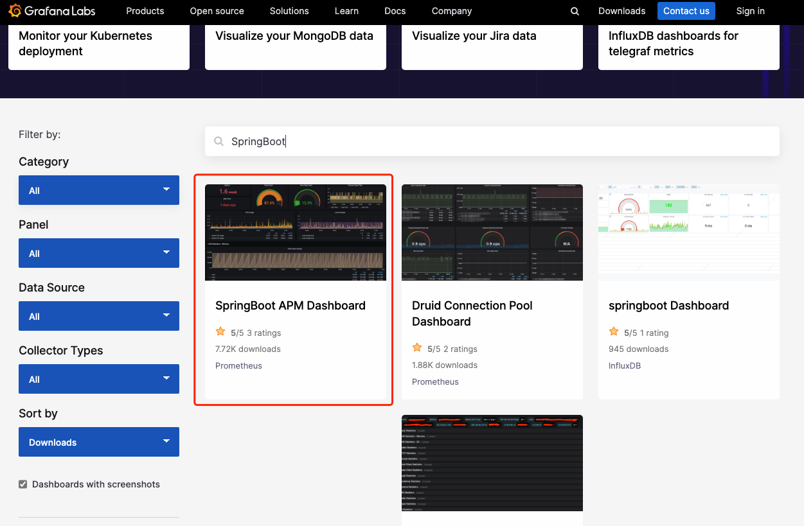
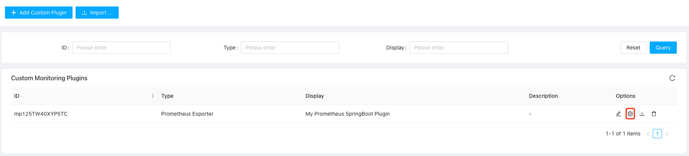
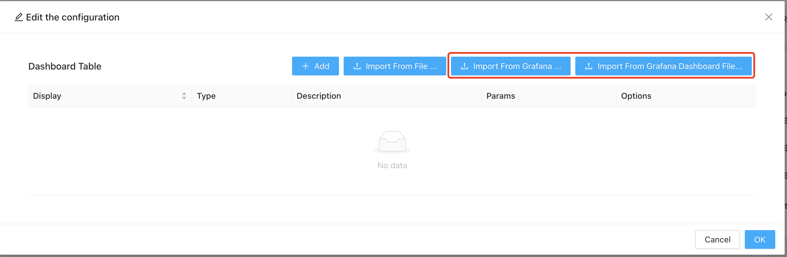
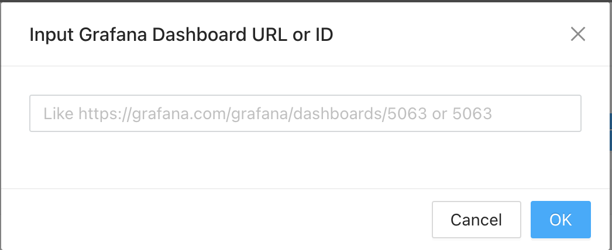
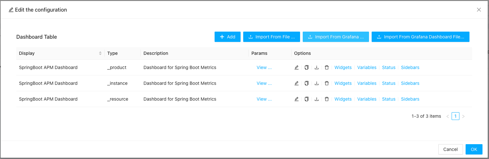

Grafana is the most widely used opensource data presenting software and it has very greate support for Prometheus plugins by providing support to presenting the data collected by a Prometheus exporter.

In this section will show you how to import a Grafana dashboard for your created custom plugin based on one of the template plugins.

### Finding Grafana Dashboard

First you need to find the correct Grafana dashboard for the custom plugin you have created. That's the purpose of custom plugins to create from the same template: The template only defines the way for collecting data, but a custom monitoring plugin is more than just collecting data, it also defines how to presenting data!

In our example, let's assume we have create a custom plugin for SpringBoot applications [create a custom plugin for SpringBoot applications](../prom/index.md) , by searching on Grafana for SpringBoot, we find the matching dashboard:

Click the matching dashboard and we can have the information we want to import in below step:

### Import Grafana Dashboard

Now goto "Settings | Custom Monitoring Plugins" page again, find the custom plugin we have created:

Click the **Settings** icon and we shall see a dialog popped up:

In the dialog popped-up, if you have downloaded the Grafana dashboard definition file, select "**Import From Grafana Dashboard File**" button and choose the file you want to import, otherwise you shall click the "**Import From Grafana**" button and see the import dialog shown up:

Here,  you shall paste in the Grafana dashboard ID (e.g. ***12900*** for above created SpringBoot dashboard) or the full url (e.g. https://grafana.com/grafana/dashboards/12900-springboot-apm-dashboard/ in our above example):

Wait few seconds, you shall see the dashboard has been imported and ready for use:

Click OK and if you navigate to a service created from this custom plugins, you shall see the dashboards you have imported with the data collected!