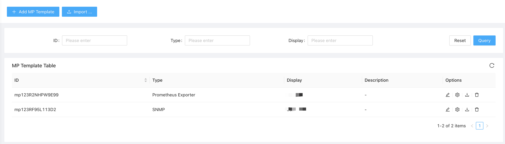
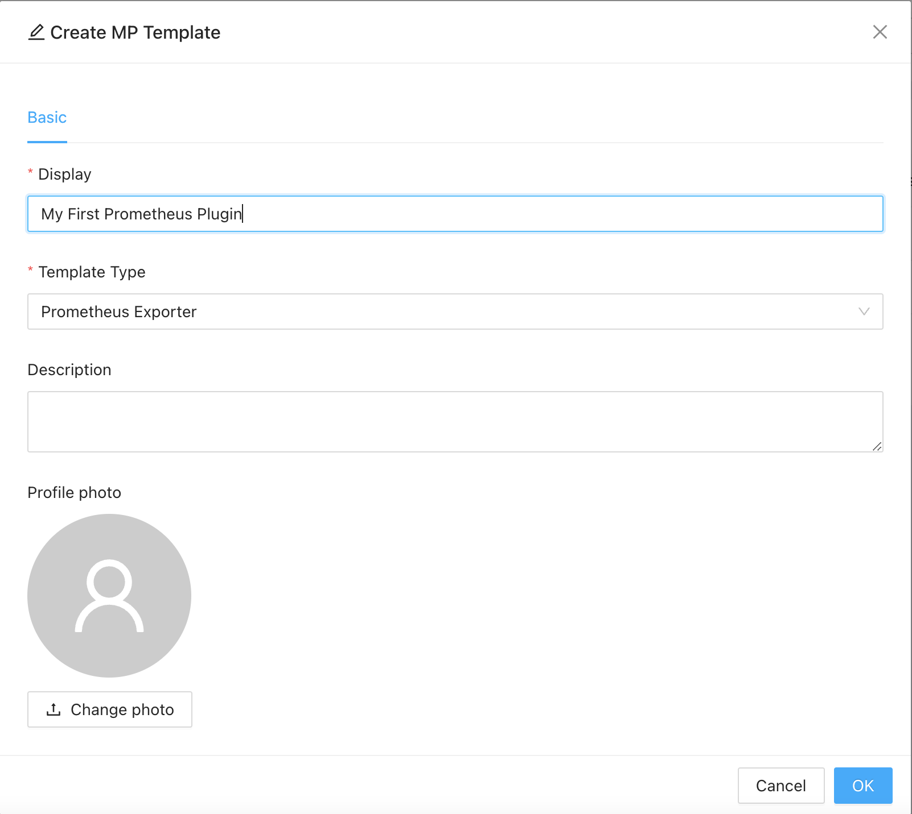

Prometheus is the most widely used open-source monitoring tool, however it is not a complete monitoring solution by itself (cubersome data collecting, alerting & configuration management as well as need other tool like Grafana, etc.). Also maintaining a working prometheus along with Prometheus scrapers is not an easy task for most of the customers. 

ZoomPhant provides Template Prometheus Monitoring Plugin for user to create a **Custom Prometheus Plugin** in ZoomPhant in a super easy way. It is fully compatible with Prometheus to allow users to re-use their existing Prometheus plugins and Grafana dashboards without managing the Prometheus and Grafana instances. 

This document will guide users to migrate their existing Prometheus / Grafana monitoring plugins to ZoomPhant Custom Monitoring Plugins in just two simple steps:

1. Create a Prometheus scraper compatible monitoring plugin
2. Import matching Grafana dashboards

## Create Custom Prometheus Plugin

We have predefined Prometheus monitoring plugin template, which will help you to create your custom Promtheus montioring plugin in just one second. To create a Prometheus Plugin, navigate to "Settings | Custom Monitoring Plugins":

After navigating to the page, you will see a list of user created custom monitoring plugins:

Click the "**Add MP Template**" button on the top left corner, the **Create MP Template** dialog will be brought up. Here you shall give your plugin a name and select the Template Type to **Prometheus Exporter**.

You can optionally upload a picture for identifying your custom plugin and then click OK to finish creation.

Once created, you've already your custom monitoring plugin. It has an internal pre-defined Prometheus scraper, which will scrape the URL you can provide later when you create a monitoring service using this custom plugin.

## Use Custom Prometheus Plugin

Using custom prometheus plugin is very simple. When  [creating service](../service/) , just select your custom prometheus plugin and fill in the only required parameter, the 
