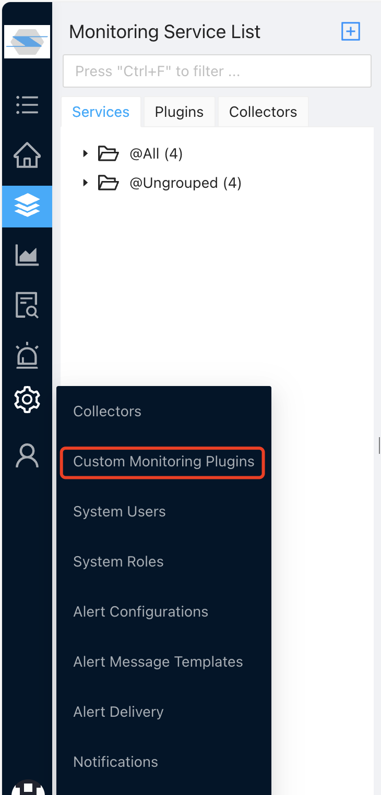

Prometheus is by far the most widely used open-source monitoring tool. With its rich plugins, combined with Grafana and other tools, many users would try to build their monitoring solution based on Prometheus.

But there are problems to use Promtheus since *itself is not a complete monitoring solution*, not to say the pains of building and maintaining many of the open source components. ZoomPhant provides **Prometheus Template Plugins** to help user to overcome those shortcomings: instead of maintaining separate Prometheus and Grafana instances, user simply create a custom monitoring plugin based on the template and import matching Grafana dashboards, and their monitoring works will work like a charm! And this means *user can totally migrate their existing monitoring solution based on Prometheus and other open source components to ZoomPhant without any pain*!

This document will guide users to use the rich Prometheus plugins and  migrate their existing monitoring plugins to ZoomPhant in just two simple steps:

1. Create custom monitoring plugin using  Prometheus Template Plugin
2. Import matching Grafana dashboards

## Create Custom Prometheus Monitoring Plugin

The Prometheus Template plugin will try to scrape an Prometheus exporter endpoint and collector all the data exposed. From this template, you can create your first custom Prometheus monitoring plugin easily.

First, navigate to "Settings | Custom Monitoring Plugins" as shown below:

Here you can manage all your custom plugins created from one of the template plugins as well as create new ones.

Click the "**Add Custom Plugin**" button on the top left corner, the **Create Custom Plugin** dialog will be brought up. Here you shall give your plugin a name and select the Template Type to **Prometheus Exporter**.

*Note: Since Kubernetes has special ways to manage an endpoint, you may choose **Kubernetes Prometheus Exporter** instead of **Prometheus Exporter**. For difference please refer to the following section.*

You can optionally upload a picture for identifying your custom plugin and then click OK to finish creation.

Now, you've already your custom monitoring plugin. You can try to add a monitoring service using the custom plugin you just created.

## Create Monitoring Services with Custom Prometheus Plugin

Using custom prometheus plugin is very simple. When  [creating service](../service/) , just select your custom prometheus plugin:

And in the paremeter setting step, you'll need to provide the exporter's endpoint:

Here you just need to provide the url to access the Prometheus exporter endpoint, but in case you are in Kubernetes environment (and thus you have chosen "**Kubernetes Prometheus Exporter**" when creating the custom plugin), you shall see a different set of parameters:

Here depends on how you expose your scraper, you shall provides

* Scrape URI: the endpoint URI (not full url with host and port)
* Scrape Port: the port #
* Using HTTPS: if you are using HTTPs or not
* Namespace: the namespace your exporter is running
* Resource Type: if you are exposing your exporter as a **service**, set to service, otherwise set to **pod**
* Resource Name: name of the service or a RE2 regex to filter the exporter POD by name

Once you have finished adding the service, your data will be coming soon.

### Viewing Data

By default, a custom plugin will have no dashboards be defined, you shall define the dashboards by your self or you can import a matching Grafana dashboard for a Prometheus custom plugin.

Please refer to [Import Grafana Dashboard](../grafana/)  for more details.
