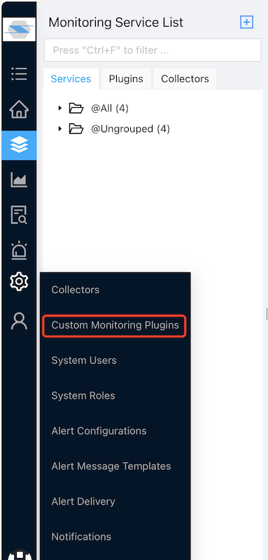
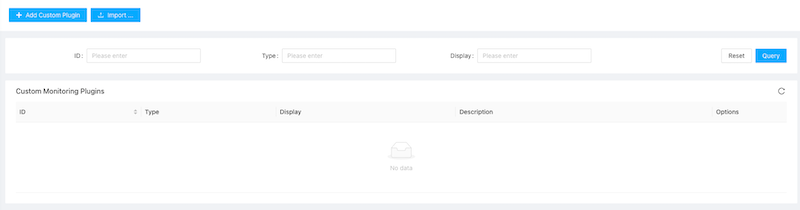
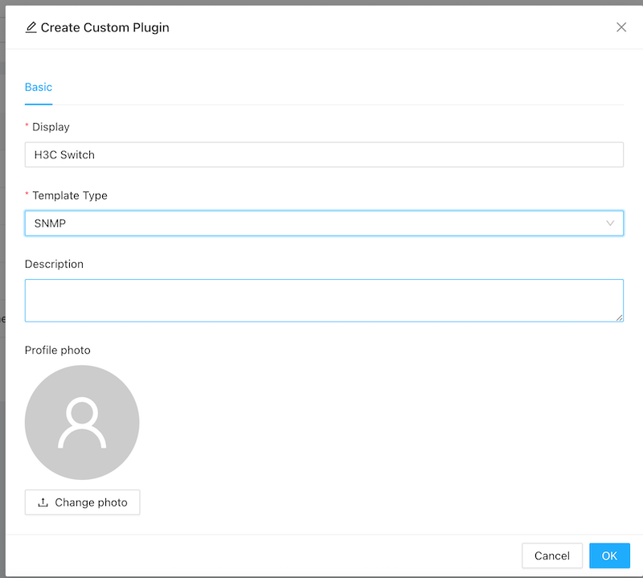
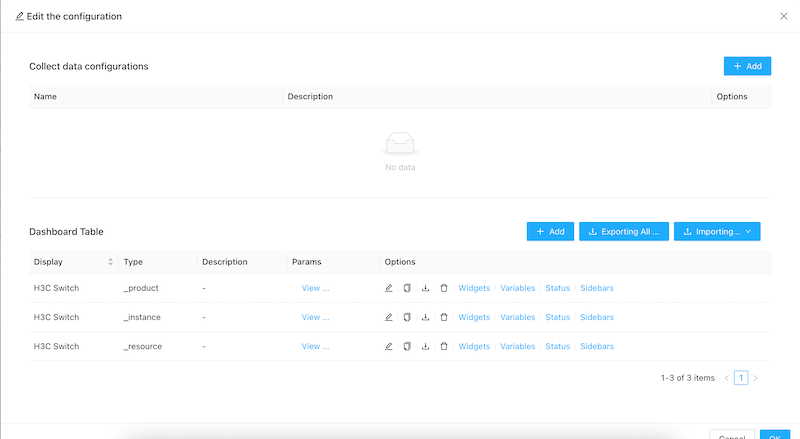
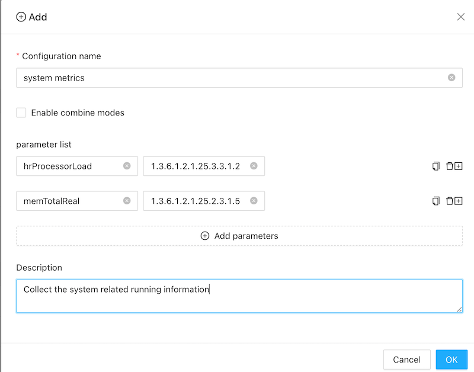
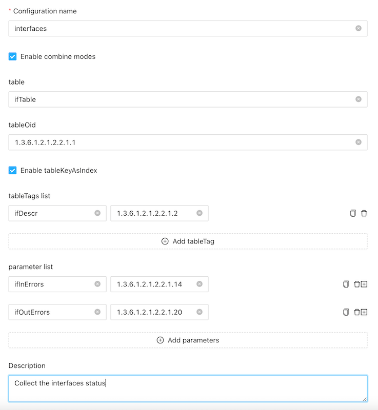
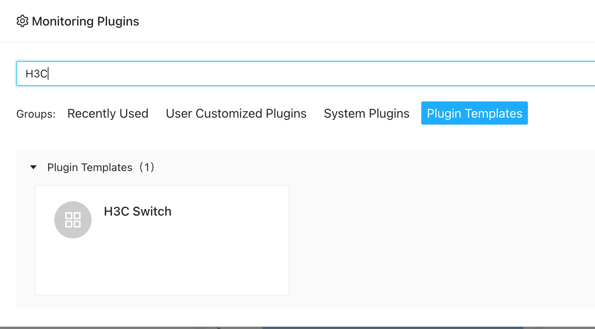
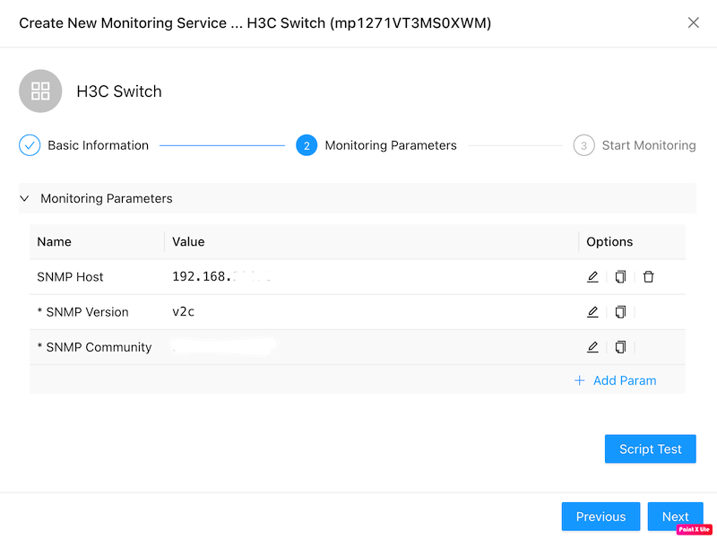

# Monitor SNMP devices using custom templates
With zoomphant, you can monitor any snmp v1/v2c/v3 devices with customized snmp templates.

## Create Custom SNMP Monitoring Plugin

The SNMP Template plugin will do snmpget/snmpwalk to an snmp agent to scrape data. From this template, you can create your first custom SNMP monitoring plugin easily.

First, navigate to "Settings | Custom Monitoring Plugins" as shown below:




Here you can manage all your custom plugins created from one of the template plugins as well as create new ones.




Click the "**Add Custom Plugin**" button on the top left corner, the **Create Custom Plugin** dialog will be brought up. Here you shall give your plugin a name and select the Template Type to **SNMP**.



## Configure data collections

Step 1: Click the settings button for the snmp template, and now we need to configure the data collected.



Step 2: click the add button, and input the related information:



- **Configuration name**: give a readable information

- **Enable combine modes**: when it's enable, you can access a table in SNMP. See below example.

- **Parameter list**: you can add the metrics to do snmp get directly. in above example, it added two metrics:

  ```
  hrProcessorLoad  - 1.3.6.1.2.1.25.3.3.1.2 (OID)
  memTotalReal - 1.3.6.1.2.1.25.2.3.1.5 (OID)
  ```

For different devices, it provides different OIDs. Please contact your device provider for more details.

### Combine Mode

This is used to do snmp walk of a table. eg you have some interfaces and want to get metrics for each interface:



For above configuration:

- table: a readable name.

- tableOid: the oid which will be walked. for the walk result, it will generate a map. For above example, when we do the snmpwalk all the interfaces in a linux vm: The oid is: **1.3.6.1.2.1.2.2.1.1**. 

  ```
  [root ~]# snmpwalk -v 2c -c public 192.168.3.1 1.3.6.1.2.1.2.2.1.1
  IF-MIB::ifIndex.1 = INTEGER: 1
  IF-MIB::ifIndex.2 = INTEGER: 2
  IF-MIB::ifIndex.3 = INTEGER: 3
  IF-MIB::ifIndex.4 = INTEGER: 4
  IF-MIB::ifIndex.5 = INTEGER: 5
  IF-MIB::ifIndex.6 = INTEGER: 6
  IF-MIB::ifIndex.7 = INTEGER: 7
  IF-MIB::ifIndex.8 = INTEGER: 8
  IF-MIB::ifIndex.9 = INTEGER: 9
  IF-MIB::ifIndex.10 = INTEGER: 10
  IF-MIB::ifIndex.11 = INTEGER: 11
  IF-MIB::ifIndex.12 = INTEGER: 12
  IF-MIB::ifIndex.13 = INTEGER: 13
  IF-MIB::ifIndex.14 = INTEGER: 14
  IF-MIB::ifIndex.131 = INTEGER: 131
  IF-MIB::ifIndex.132 = INTEGER: 132
  IF-MIB::ifIndex.133 = INTEGER: 133
  IF-MIB::ifIndex.134 = INTEGER: 134
  IF-MIB::ifIndex.135 = INTEGER: 135
  ```

  

- Enable tableKeyAsIndex: if enable, we will use the key eg: `ifIndex.6` as the key `6` to compose the oid to query the metrics. If disable, we will use the value `INTEGER: 6` to query the metrics. Some oids may generate different key and values. eg:

  ```
  [root ~]# snmpwalk -v 2c -c public 192.168.3.1 1.3.6.1.2.1.2.2.1.2
  IF-MIB::ifDescr.1 = STRING: GigabitEthernet1/0/0
  IF-MIB::ifDescr.2 = STRING: GigabitEthernet1/0/1
  IF-MIB::ifDescr.3 = STRING: GigabitEthernet1/0/2
  IF-MIB::ifDescr.4 = STRING: GigabitEthernet1/0/3
  IF-MIB::ifDescr.5 = STRING: GigabitEthernet1/0/4
  IF-MIB::ifDescr.6 = STRING: GigabitEthernet1/0/5
  IF-MIB::ifDescr.7 = STRING: GigabitEthernet1/0/6
  IF-MIB::ifDescr.8 = STRING: GigabitEthernet1/0/7
  IF-MIB::ifDescr.9 = STRING: GigabitEthernet1/0/8
  IF-MIB::ifDescr.10 = STRING: GigabitEthernet1/0/9
  IF-MIB::ifDescr.11 = STRING: GigabitEthernet1/0/10
  IF-MIB::ifDescr.12 = STRING: GigabitEthernet1/0/11
  IF-MIB::ifDescr.13 = STRING: Cellular1/0/0
  IF-MIB::ifDescr.14 = STRING: Cellular1/0/1
  IF-MIB::ifDescr.131 = STRING: NULL0
  IF-MIB::ifDescr.132 = STRING: InLoopBack0
  IF-MIB::ifDescr.133 = STRING: Register-Tunnel0
  IF-MIB::ifDescr.134 = STRING: SSLVPN-AC2
  IF-MIB::ifDescr.135 = STRING: SSLVPN-AC1
  ```

  Here you can see, the key is still `ifDescr.6` as the key `6` while the value is a STRING `GigabitEthernet1/0/5`.

- Table tags list: you can use this to differ different table records. Here we use  `1.3.6.1.2.1.2.2.1.2` to generate a tag `ifDescr` (the interface description).
- Parameter list: here we will collect the `ifInErrors`(1.3.6.1.2.1.2.2.1.14) and `ifOutErrors` (1.3.6.1.2.1.2.2.1.20).

## Add snmp monitoring service

Using custom snmp plugin is very simple. When  [creating service](../../01_service/) , just select your custom snmp plugin:



and please enter the correct credentials:



* For snmp v1/v2c, please set the community. For snmp v3, more credentials required.

Now, you can add a dashboard to see metrics interested in. please refer to [dashboards](../../../concepts/dashboards/) to create a dashboard.

