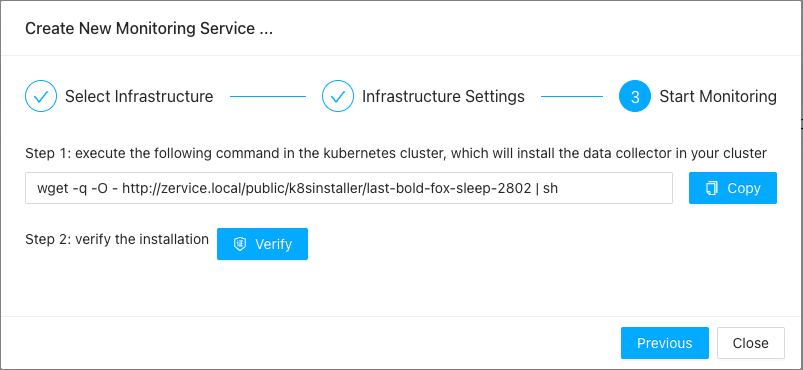
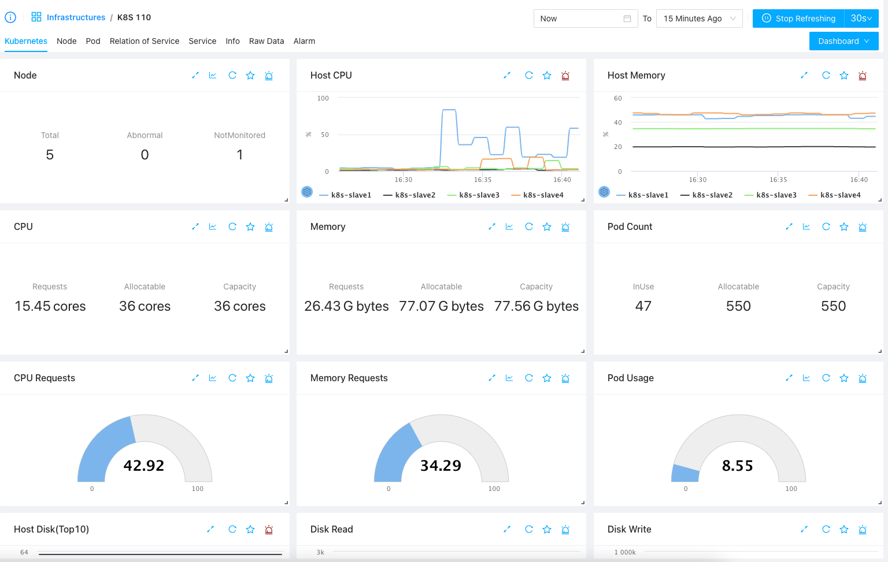
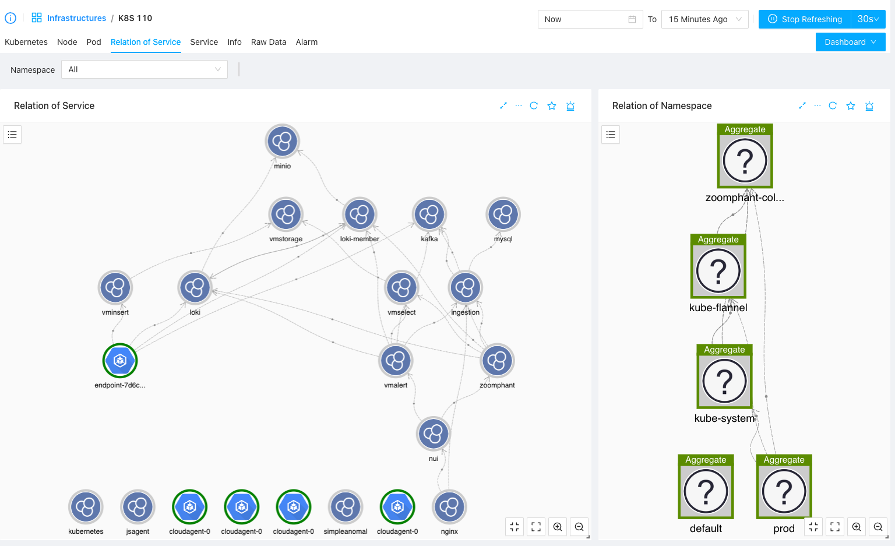

# Kubernetes Monitoring
{: .no_toc .header }

----
Kubernetes is widely used nowadays and there's no good monitoring tool for Kuberenetes in the past, and now we have ZoomPhant! Just install a ZoomPhant Kubernetes collector and your Kubernetes cluster is under control.

## Install Kubernetes Collector

Follow the instructions in  [Install Collectors](../collector/index.md) and choose Kubernetes as underlying infrastructure, you will be then creating a Kubernetes collector and corresponding monitoring service.

### Providing Kubernetes Cluster Information

When creating a Kubernetes collector, you need to provide some basic information of the cluster in step 2 of the wizard:

Here, you'll need to provide the name of the cluster, which will aslo be used to identify the collector. Besides that you'll need to provide the docker and log stuff, which if you shall always keep the default if you don't know what your are doing.

With above information provided, the final step will give instructions on how to install the Kubernetes collector.

### Installing Kubernetes Collector

Installing Kubernetes collector is simple, just copy one command and execute it, and you'll get your Kubernetes collector running up.

Here, Kubernetes collector will be installed as a daemon set, **you shall run above command in one of the console with kubectl available**. above command will try to download the YAML file and apply to your cluster. The YAML file will try to create a namespace called **zoomphant-collector**, where all the collector PODS will be created in.

You can verify the installation by clicking the **Verify** button as shown above and after that you shall be able to view the data coming through your Kubernetes collector!

## Understanding Kubernetes Data

Kubernetes is complicated so you shall not be surprised to see the data collected by a Kubernetes collector without adding additional monitoring services. If you go the corresponding service you shall see default dashboards like below

Here you can see

* **Kubernetes** tab, which contains important information of the whole cluster, like the overall status, resource usage and Cluster events, etc.
* **Node** tab, which will give the list of nodes, from which you can see more detailed information of each node
* **Pod** tab, which will give the list of pods, from which you can view more detailed information from PODs' point of views
* **Service** tab, which will give the list of services in the cluster and you can click for more detailed information for each service
* **Relation of Service**: a diagram of all the services running in the cluster will be shown so you can have an overall understanding of what's running in the cluster

## Nodes, Pods and Services

We providing navigatable list for nodes, pods and services in a Kubernetes cluster. By switching to corresponding tab, you can list the items and click them to get into a sub-level of dashboards for the chosing object:

### Node List & Per-node Dashboard

Switch to Node tab, you can find the node list in the node tab as a widget (you can drag and drop to move it to top or bottom of the dashboard):

Click one of the row, you will be bring to a dashboard for the node

### Pod List and Per-Pod Dashboards

As nodes, you can navigate to Pod tab to see the list and you can filter pods by namespaces as shown below:

Click one of the POD you will be bring to the POD specific dashboard.

### Service List & Per-Service Dashboard

Service is a very important concept in Kubernetes. Visiting the Service tab, you can find all the services in cluster and you can add extra monitoring service for the services.

## Relation of Service ##

It is worth special notice of the service relationships, you can identify the data exchanging between services and / or namespaces and you can make your customized grouping / filtering here. Start exploring today!

