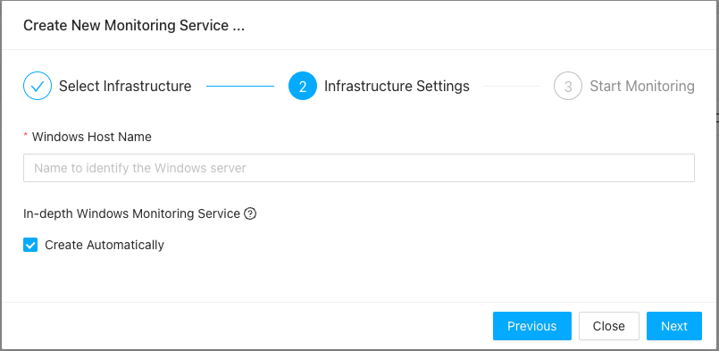
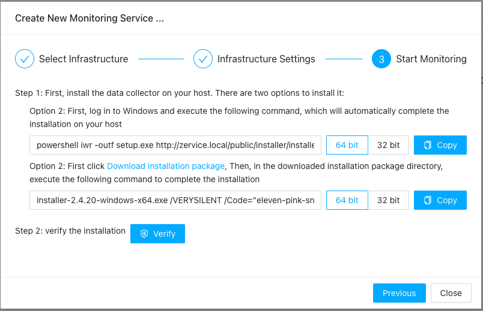

# Windows Monitoring
{: .no_toc .header }

----
Lots of enterprises are still heavily relying on Windows servers for their business, as an all-in-one monitoring solution, ZoomPhant would support Windows monitoring from the start!

The first step to do Windows monitoring is to setup one or more Windows data collecting agent. Those agent are can perform both general data collecting tasks as well as supporting many Windows specific collecting tasks using Windows specific mechanisms like WMI, PDH, etc.

## Install Windows Collector

Follow the instructions in  [Install Collectors](../collector/index.md) and choose Windows as underlying infrastructure, you'll be able to install a Windows collector.

In the second step, you need to give basic information of the the Windows system you will need to install the collector on:

And in step three, you'll be required to open a Windows command window to execute the command that are shown:

If you are using powershell, you could modify the command accordingly before you execute the command

## Understanding Windows Monitoring Data

Go to the infrastructure monitoring service you just added, you shall be able to see dashboards like follows

Here you can have one place to see the overall status of the windows server, And if you want view the process status on your system, you can switch to the **Process** tab to view a list of running processes:

And also the network status of the system in **Nework** tab:

