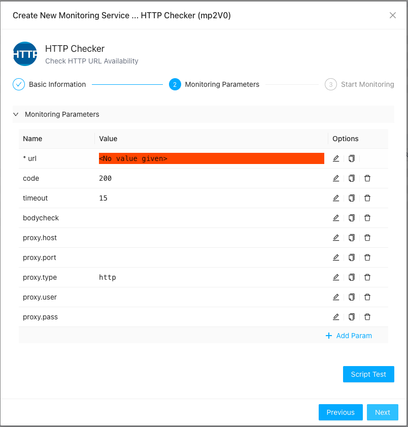
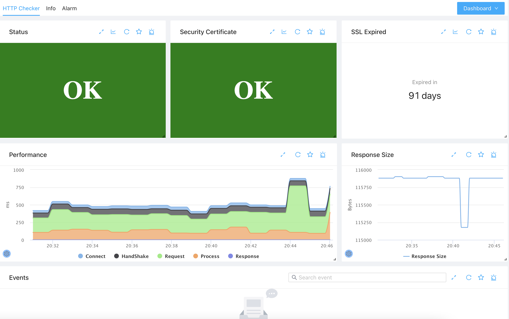

# HTTP Monitoring
{: .no_toc .header }

----
HTTP is one of the most widely used protocol. By supporting HTTP monitoring, ZoomPhant enable you to monitor a web server in just few seconds.

## Creating HTTP Monitoring

To create a HTTP monitoring, you just follow the instruction in  [Add Monitor Service](../service/) to select the **HTTP Checker** plugin and provides following parameters




Here：

* url: the only required parameter required for HTTP Checker to work. It will try to perform a HTTP GET check against this given URL
* code: the expected HTTP response code, default to 200 (OK)
* timeout: the expire time in seconds, default to 15 seconds
* bodycheck: for advanced user only. A JSON object describe how to check the HTTP responses, it allows you to match the returned HTTP response using different syntax like check against JSON path or XML path, etc. The JSON object shall contains following field
  * format: how to interpret the JSON object, the value could be "json" or "xml"
  * path: depends on format, it could be a JSON path or XML path
  * value: the value to check against. We will take the value as string
  * op: what kind of check you want to check, like "equal", "notEqual", "contain", "notContain", "exist", "notExist", "match", "notMatch".
an example: (which will check the json value `$.result.data` will equal to `test`) 
```json
{
  "format": "json",
  "path": "$.result.data",
  "value": "test",
  "op": "equal"
}
 ```
* proxy.host / proxy.port: the proxy server to use if you need to access the url after a proxy
* proxy.user / proxy.pass: the proxy user name and password if required
* proxy.type: type of proxy to use, by default it's a HTTP proxy.
* method: optional. set the http method. GET or POST. default is GET.
* body: optional. set the http post body. default is empty if method is POST.  
* metrics: for advanced user only. A JSON array which can be used to extract metrics from the http body or http header. each
object has below format:
  * name : the name of the metric. The final metric name will be added a prefix: "metric."
  * extractorSource : which part will be used to extract metric. values: header/responsebody. 
  * extractorMethod : how to extract the metric. values: values: xml/json/regex.
  * extractorParams : the params. for xml, it's xml path. for json, it's json path. for regex, it's the regex expression.
an example: (this will report a metric `metric.productNumber` with the value of `$.data.productNum`)
```json
[
  {
    "name": "productNumber",
    "extractorSource" : "responsebody",
    "extractorMethod": "json",
    "extractorParams": ["$.data.productNum"]
  }
]
```  

## Understanding the HTTP Checker Data

Once you have added the monitoring service, you can navigate to it and see the collected data as follows




First you can see the overall status in **Status** widget for the monitored URL. If everything is OK, you can see the green OK, otherwise, depending on the severity of the problem, you would see an orange or red error messages.

If the URL monitored is a HTTPS link, you'll also see the certificate status in **Security Certificate** widget. Like the overall status, if everything is OK a green OK is displayed, otherwise an error message is displayed in orange or red color.

For HTTPS link, besides the certificate status, the certificate expiration is also shown up in the **SSL Expired** widget, you can set alerts to remind you before your certificate expires.

You will aslo be able to see the url link access performance in **Performance** and **Response Size** widgets. It is worth noticing that the accessing performance is fine-measured and can be decoupled to several sub-metrics:

1. **Connect**: this is the time taken to connect to the host servicing the url
2. **Handshake**: if this is a HTTPS url, the time taken for establishing SSL connections
3. **Request**: the time taken to send the request to server
4. **Process**: the time taken for the server to send back first byte of data after fully receiving the request
5. **Response**: the time taken for the server to send back all the data
