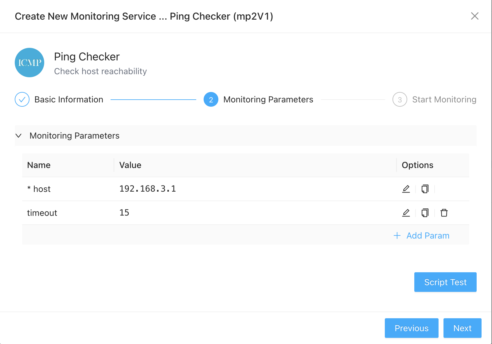
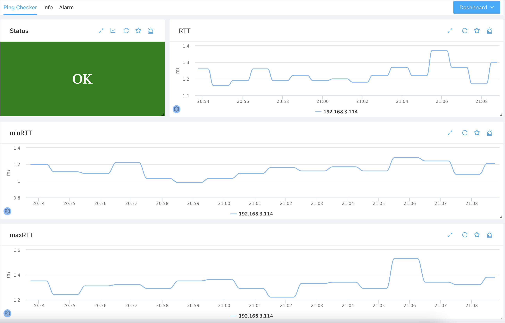
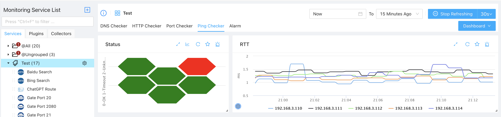

# Ping Monitoring
{: .no_toc .header }

----
Ping is another widely used protocol for operators to check if a remote device is active and roughly how the access performance that remote device is. ZoomPhant provides and easy way for you to monitor a remote device using **Ping Checker** plugin.

## Creating Ping Monitoring

To start monitor a remote device for aliveness and access performance, you can choose the **Ping Checker** plugin as shown in  [Add Monitor Service](../service/index.md) and provide following necessary parameters to create a monitoring service:

* host: the IP or DNS of the device you want to monitor, this is mandatory
* timeout: the timeout in seconds to perform ping monitoring

With the parameters provided and the monitoring service been created, you can wait few seconds and see the diagrams for the monitored device.

## Understanding Ping Data

Ping monitoring data are presented in straigtforward ways as shown below:

1. The **Status** widget will show the overall status of the ping monitoring service
2. The **RTT** is the average Route-Trip-Time for ping packets sent during one check, the lower the better and usu. for health devices in an intranet, this shall just few milliseconds.
3. The **minRTT** and **maxRTT** are the minimum and maximum RTTs of the packets sent in one check.

## Monitoring Mulitple Devices

We recommend to create one ping monitoring service for each service (although we support to check multiple devices in one monitoring service) and we can then view the overall status of all monitored devices at the group level by click the **Ping Checker** tab as follows:

As shown in above diagram, we can easily identify the devices in problems as well as viewing the overall RTT trends for all active devices.
