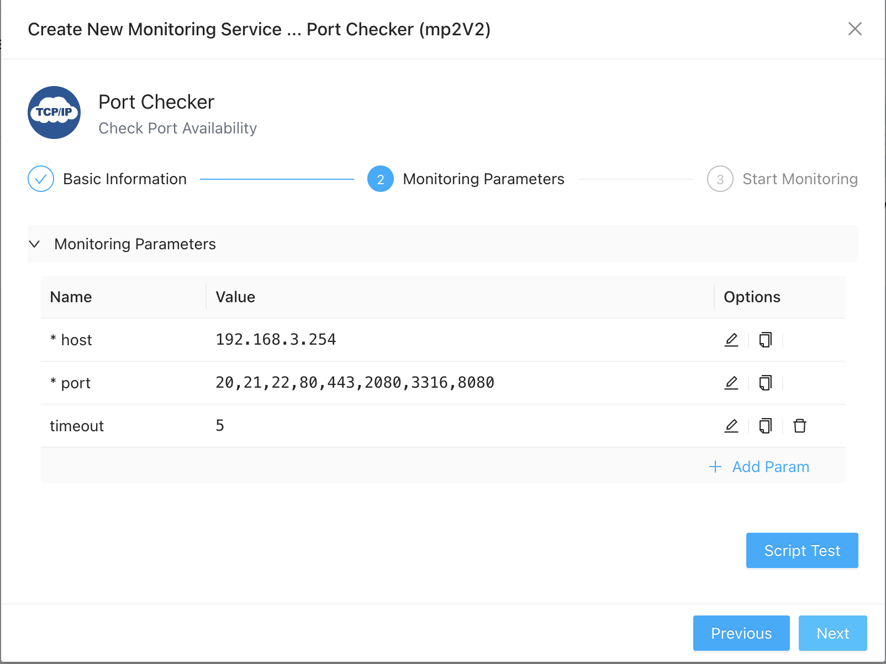

# Port Monitoring
{: .no_toc .header }

----
One common problem for monitoring a device is to find out the activeness of the services running on that device (e.g. the FTP service, the SMTP service, etc.), one effective way is to monitor if the ports providing those services are opened and could be connected to. For this purpose, ZoomPhant provides the **Port Checker** plugin.

## Creating Port Monitoring Service

Follow the[Add Monitor Service](../service/index.md) and select the **Port Checker** plugin, you can quickly create monitoring tasks for ports opened on a device by providing necessary parameters.

Here, you need to provide following parameters

1. host: the IP or DNS of the device to check against
2. port: the port numbers you want to monitor, separated by comma if you have multiple ports to monitor
3. timeout: the time in seconds to timeout a connect check

Once you have finished creating the monitor service, you'll be able to see the port status in just few seconds.

## Understanding Port Checking Data

Navigating to the Port monitoring service, you'll see data presented in widgets as follows:

The **Status** widget gives you a quick view of current active ports and inactive ports, if you move mouse pointer one of the items, you can see more detailed information like "<ip>:<port> <status>" on it, where green items has status 0 and red items has status 1.

The **Connect** widget shows you the times taken to connect to each of the active port allong the time, from which you may be able to find intresting patterns like during the heavy load hours the time may increase sharply and then gradually drops back to much lower values, etc.
