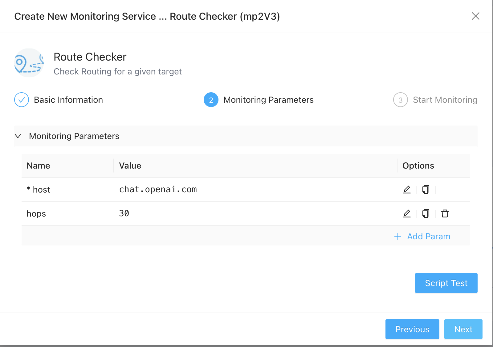
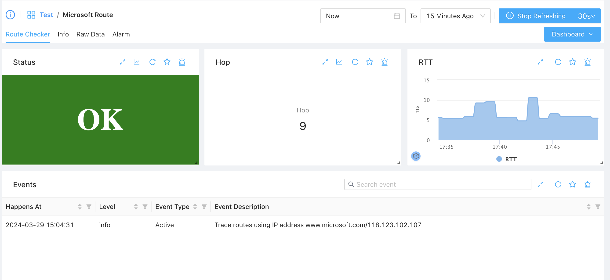

# Route Monitoring
{: .no_toc .header }

----
For many network operators, tracers might be one of their most favorite tools. ZoomPhant provide Route Checker for easier monitoring the routes in the internet and make such professional function straightforward to ordinary people.

## Creating Route Monitoring

To monitor routes to a domain, it is straigtht forward to follow the steps in  [Add Monitor Service](../service/) by choosing **Route Checker** plugin and fill in following parameters

* host: the IP or DNS of the device you want to monitor routes to
* hops: the maximum hops to check. If more hops required to reach that host, the task fails.

Once created, wait few seconds and you can check the routes information shown as follows.

## Understanding Route Data

After data coming, when you navigate to the monitoring service you have created, you can see data as follows

* **Status**: this is the overall status. If the target IP or DNS could be reached, you'll see the green OK, otherwise, it will try to show  messages like
  * Intranet: we have been able to receive responses from several hops, but all the hops are having an intranet IP (i.e. not public IP)
  * Internet: we have been able to receive responses from several hops and at least one hop has a public Internet IP
  * Invalid Domain: the domain could not be resolved
* **Hop**: Number of hops taken to reach the target. If the target could not be reached, this would be zero.
* **RTT**: Time taken to reach the target, in milliseconds
* **Events**: Some important informations about the target, usu. it will show you the IP resolved for last check
