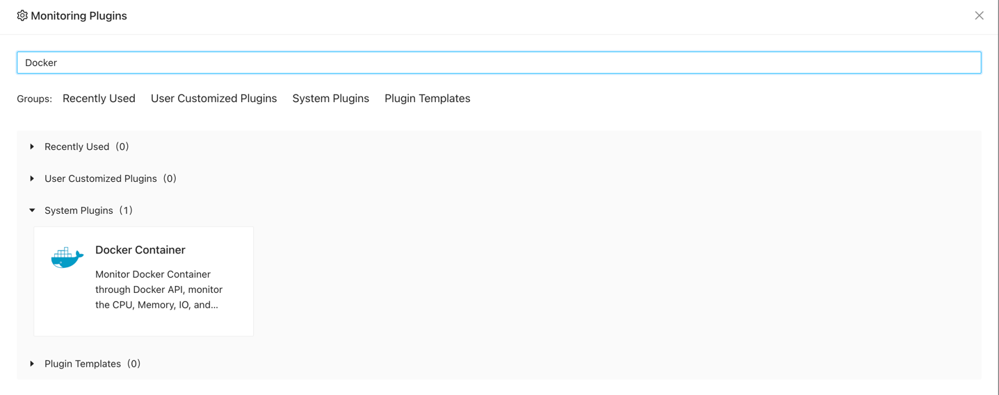
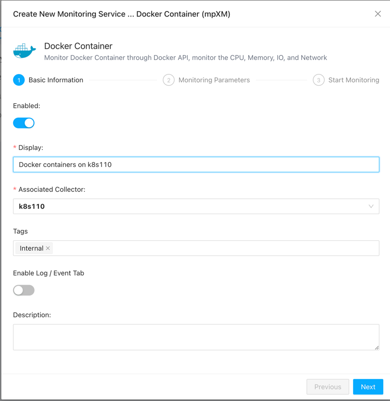
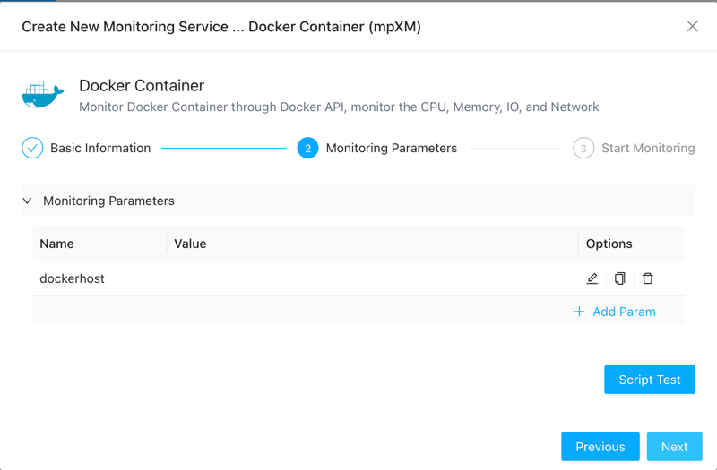
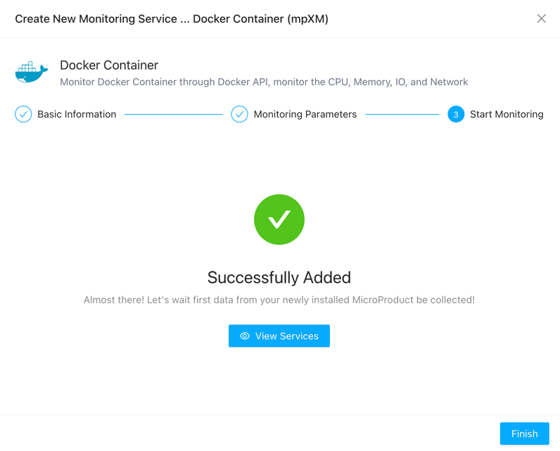
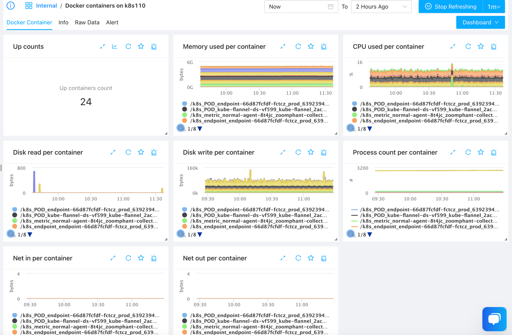

# Docker Container Monitoring
{: .no_toc .header }

Docker Container Monitoring utilizes the Docker API to monitor the status of Docker containers. It provides insights into CPU usage, memory usage, IO usage, and network traffic for each container.

## Adding Docker Container to Monitoring Services

1. Navigate to the Monitoring Services section by clicking on the left sidebar.
2. Click the "Add" button in the top left corner of the page.
3. Select "Single addition" under "Application Or Services".
4. Locate "Docker Container" and click "Add".

5. Choose a collector that can access the Docker service you want to monitor, and proceed to fill in the required details.
6. Once filled, click "Next".

7. If the Zoomphant Collector is installed on the Docker host you want to monitor, no additional configuration is needed. Otherwise, specify the Docker host as `tcp://<IP or Hostname>:2376`.

8. Click the "Test" button to ensure successful connection, then proceed to click "Next".

## Viewing Monitoring Results

You can now view the added service on the monitoring services page.

