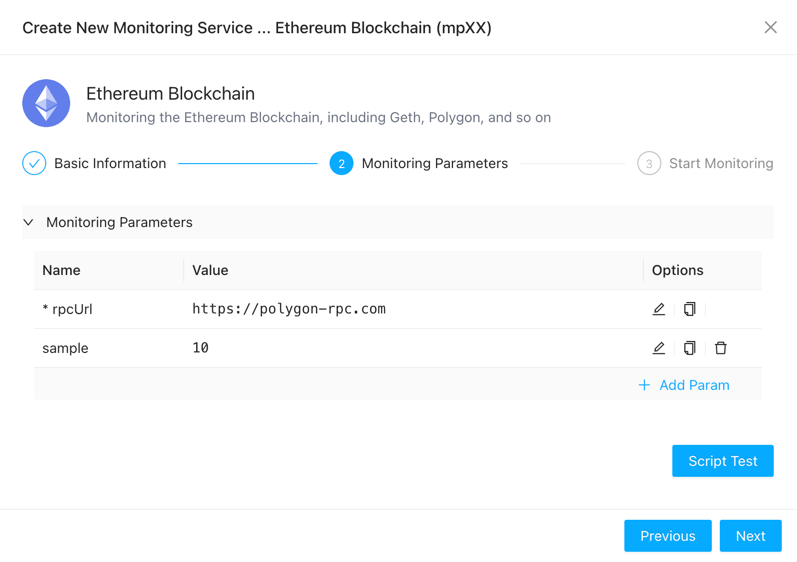

# Ethereum Blockchain Monitoring
{: .no_toc .header }

Ethereum Blockchain Monitoring can monitor the Ethereum Blockchain, including Geth, Polygon, Parity Ethereum / OpenEthereum, Besu, Nethermind, Trinity, and so on. 

## Adding Ethereum Blockchain to Monitoring Services

1. Navigate to the Monitoring Services section by clicking on the left sidebar.
2. Click the "Add" button in the top left corner of the page.
3. Select "Single addition" under "Applications".
4. Locate "Ethereum Blockchain" and click "Add".

5. Choose a collector that can access the Ethereum Blockchain you want to monitor, and proceed to fill in the required details.
6. Once filled, click "Next".

7. There are two params in this step. 
   1. rpcUrl: The RPC URL specifies the blockchain address you want to monitor. For example, if you want to monitor the Polygon network, you should fill in the RPC URL as follows: https://polygon-rpc.com. 
   2. sample: The sample parameter specifies how many transaction data points you want to collect for calculating gas prices and other metrics. Due to limitations imposed by public blockchain networks, you cannot set this value too high. However, if you are monitoring your local private chain, you can set a larger value to ensure accurate data retrieval.

8. Click the "Test" button to ensure successful connection, then proceed to click "Next".

## Viewing Monitoring Results

You can now view the added service on the monitoring services page.

