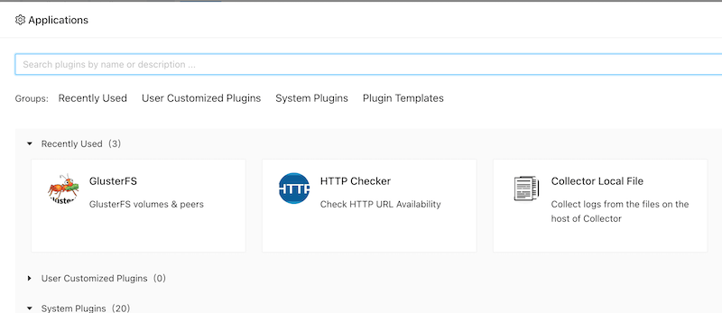
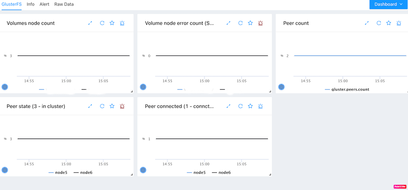

# GlusterFS monitoring
{: .no_toc .header }

----
[Gluster](https://www.gluster.org/) is a free and open source software scalable network filesystem. ZoomPhant provides an openbox monitoring for glusterfs system.

## Creating GlusterFS Monitoring

In order to use this plugin, please make sure all nodes in gluster are installed a [Linux Data Collector](../../02_collector/). To start monitor a glusterfs system, you can choose the **GlusterFS** plugin as shown in  [Add Monitor Service](../../01_service/) and provide following necessary parameters to create a monitoring service:

* gluster.cmd.path: optional. this can be used to set the linux command `gluster` file path. 

With the parameters provided and the monitoring service been created, you can wait few seconds and see the diagrams for the monitored device.

## Understanding GlusterFS Data

GlusterFS monitoring data are presented in straigtforward ways as shown below:

It provides below metrics:

- Volumes node count: shows the node count for each volume.

- Volume node error count: show the error nodes count for each volume. This should be zero for a normal gluster cluster.

- Peer count: show the peer count for current node.

- Peer connected: show whether the peer is conncted or not. (1 - conncted).

- Peer state: show the peer state  for current node. The state value mapping:

  | Value | Descrption      |
  | ----- | --------------- |
  | 1     | Connected       |
  | 2     | Disconnected    |
  | 3     | Peer in cluster |
  | 4     | Peer rejected   |
  | 5     | Accepted Peer   |
  | 6     | Self-Connected  |

  
