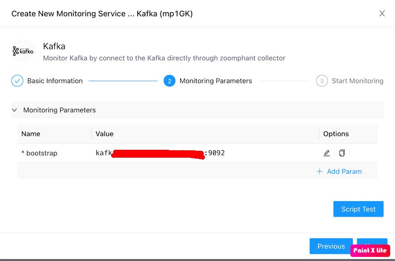
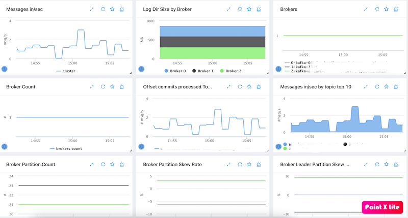
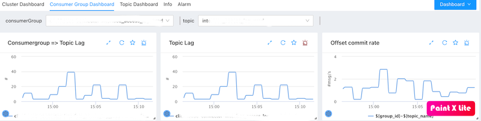
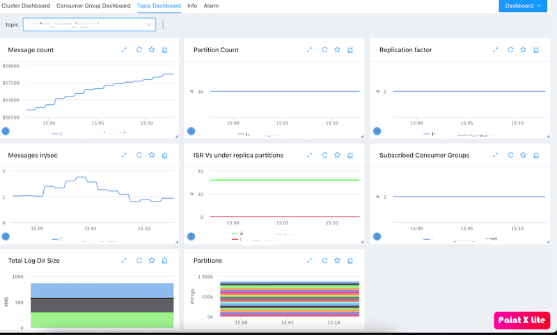

# Kafka Monitoring
{: .no_toc .header }

----
ZoomPhant provides an easy way for you to monitor one or more kafka cluster using **Kafka** plugin.

## Creating Kafka Monitoring

To start monitor a  kafka cluster, you can choose the **Kafka** plugin as shown in  [Add Monitor Service](../../01_service/) and provide following necessary parameters to create a monitoring service:

* bootstrap: the bootstrap urls for a kafka cluster. 

With the parameters provided and the monitoring service been created, you can wait few seconds and see the diagrams for the monitored device.

## Understanding Kafka Data

Kafka monitoring data are presented in straigtforward ways as shown below:

### Cluster dashboard	

It contains below metrics:

- Messages in per cluster level
- Log directory size per broker
- Broker status & broker count
- Offsets committed rate top 10
- Messages in by topic top 10
- Broker partitions count 
- Broker partition skew rate. The partitions per broker divides the avg partitions count
- Broker leader partition skew rate 

### Consumer group dashboard

It contains below metrics:

- consumer group level topic lag
- offset commit rate per consumer group

### Topic dashboard

It contains below metrics:

- messages count for a topic
- partition count for a topic
- replication factor for a topic
- messages in per topic
- In sync replicas (ISR) and Under replica partitions (URP, which partition doesn't have enough replica)
- Subscribed consumer groups count
- Log directory size for this topic in brokers
- Partitions messages offset for topic

## Monitoring Multiple Kafka Clusters

You can monitor multiple kafka clusters by adding more services.
