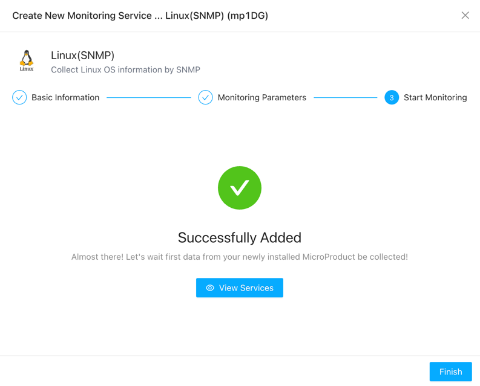

# Linux Monitoring
{: .no_toc .header }

Linux monitoring entails a suite of tools designed to monitor the health and performance of Linux servers. We offer two modes for monitoring Linux servers:

- [Deep monitoring by installing collectors on Linux.](../../10_infrastructures/linux)
- [Monitoring Linux via SNMP. ](.)


## Monitoring Linux via SNMP

First, ensure that the SNMP service is enabled. Below is an example for enabling SNMP service on CentOS:

```bash
# Install SNMP service
yum install -y net-snmp net-snmp-utils
# Configure SNMP service
vi /etc/snmp/snmpd.conf
# Modify the following configuration to .1.3.6.1 to obtain more system information
view    systemview    included   .1.3.6.1
# Restart SNMP service
systemctl restart snmpd.service
# Add SNMP service to startup
systemctl enable snmpd.service
```

### Adding SNMP Monitoring in the Monitoring Services

Navigate to the "Monitoring Services" section in the sidebar to access the Service page. Click the "add" button at the top-left corner. In the pop-up window, select "Single addition" under "Applications Or Services".


Next, choose the "Linux(SNMP)" option. You can also search for "linux" in the search bar.


Begin by providing a name for the monitoring task. It's essential to differentiate between monitoring tasks for ease of management, especially during alarm occurrences, which aids in quick identification. You need to select a collector that can access the server being monitored, as SNMP uses the UDP protocol, so it's preferable for the collector and the monitored server to be in the same LAN.


Fill in the IP address of the server being monitored and SNMP protocol version, authentication information, etc.


If you're concerned about whether the parameters are filled in correctly, you can click the "Test" button to perform a test.


Once confirmed, click "Next" to successfully add the service monitoring.



Now, you can view the added service on the service page.

