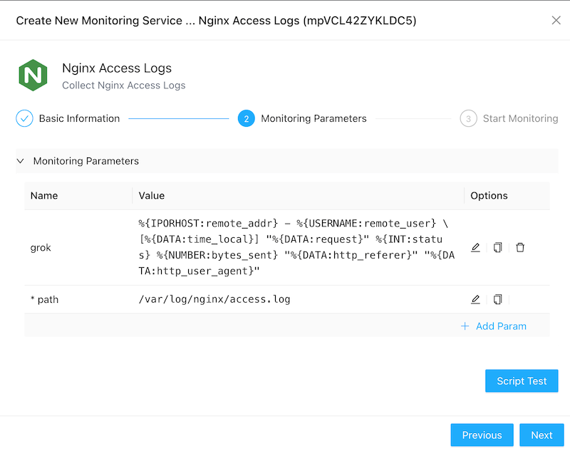
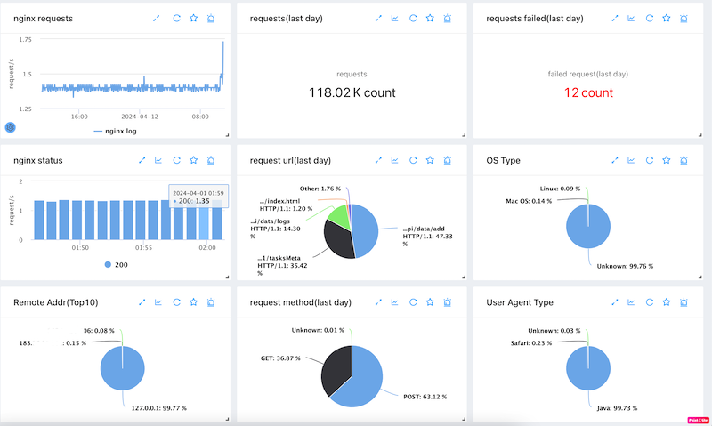
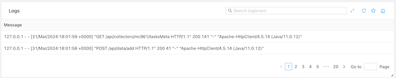

# Nginx Monitoring
{: .no_toc .header }

----
ZoomPhant can monitor and extract a lot of useful metrics from the nginx access log.

## Creating Nginx Monitoring

To start monitor a nginx access log, you can choose the **Nginx Access Logs** plugin as shown in  [Add Monitor Service](../../01_service/) and provide following necessary parameters to create a monitoring service:

* path: the [nginx log file path](https://docs.nginx.com/nginx/admin-guide/monitoring/logging/#setting-up-the-access-log) . (This requires the choosen [collector](../../02_collector/)  can access the nginx log by the path provided.)
* grok: the grok pattern for the log file content. The **cloud version Zoomphant** provides AI ability to extract the pattern. 

With the parameters provided and the monitoring service been created, you can wait few seconds and see the diagrams for the monitored nginx service.

## Understanding Nginx Data

Nginx monitoring data are presented in straigtforward ways as shown below:

It contains below metrics for a nginx server:

- Requests rate
- Last 24 hours request count
- Last 24 hours failure request count
- The requests count and the http status code stats
- The request url distribution in last 24 hours 
- The os distribution
- The remote address distribution
- The request method distribution
- The user agent distribution

and the raw logs tab:

