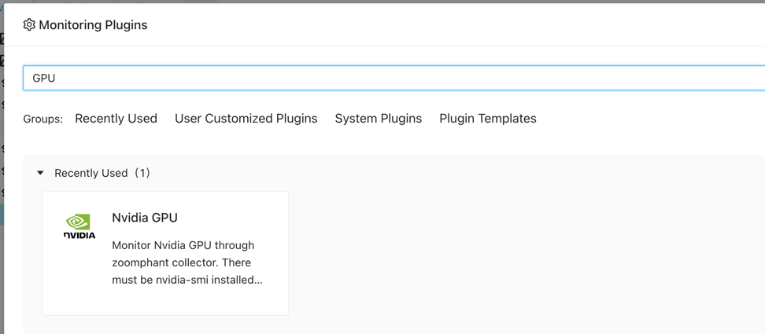
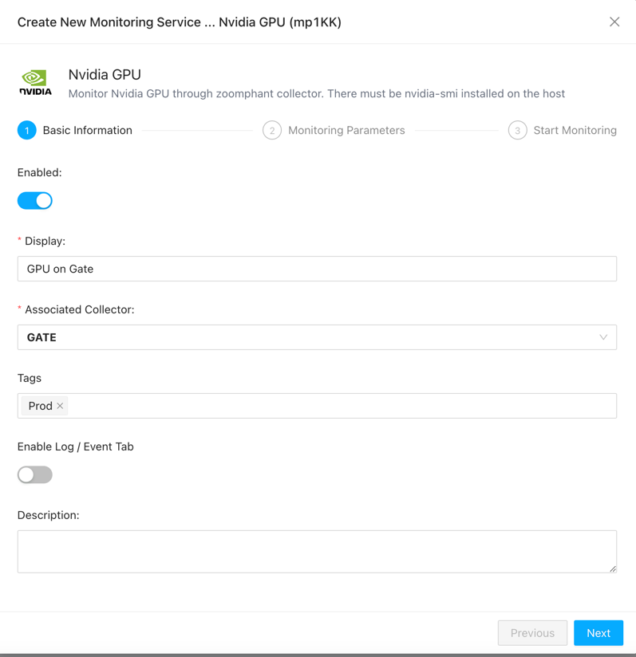
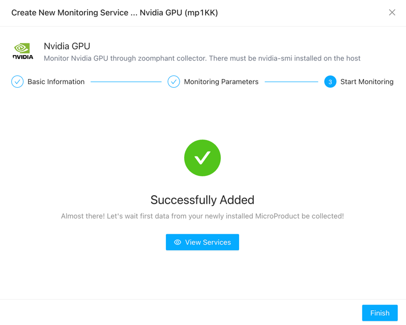
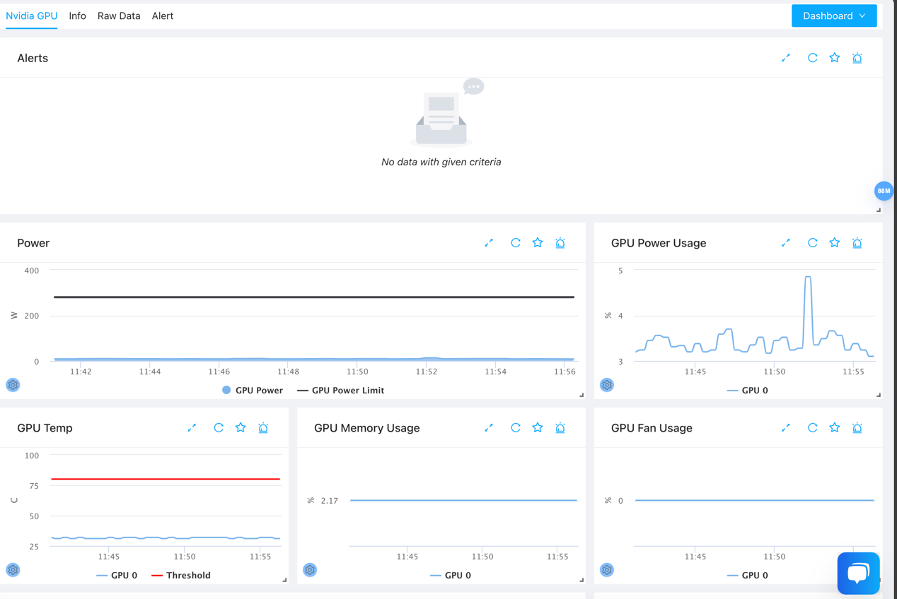

# Ethereum Blockchain Monitoring
{: .no_toc .header }

Nvidia GPU Monitoring utilizes the nvidia-smi command installed on the local machine to monitor various parameters of the graphics card, such as power consumption, temperature, fan speed, and more.

## Adding Ethereum Blockchain to Monitoring Services

1. Navigate to the Monitoring Services section by clicking on the left sidebar.
2. Click the "Add" button in the top left corner of the page.
3. Select "Single addition" under "Applications".
4. Locate "Nvidia GPU" and click "Add".

5. Choose the collector that installed on the GPU host.
6. Once filled, click "Next".

7. There no param needed in this step for the collector must be on the GPU host. 
   

8. Click the "Test" button to ensure successful connection, then proceed to click "Next".

## Viewing Monitoring Results

You can now view the added service on the monitoring services page.

