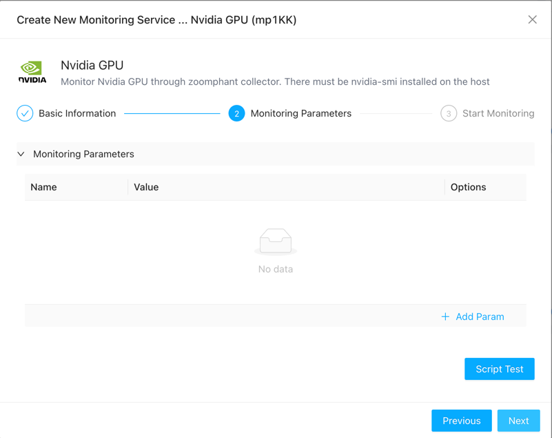

# Nvidia GPU Monitoring
{: .no_toc .header }

Nvidia GPU Monitoring utilizes the nvidia-smi command installed on the local machine to monitor various parameters of the graphics card, such as power consumption, temperature, fan speed, and more.

As AI continues to advance, particularly with the increasing prevalence of localized language models like LLMs, the demand for GPU monitoring is on the rise. Monitoring GPU usage goes beyond simply tracking utilization; it involves keeping tabs on fan speeds, temperatures, and other factors to prevent GPU wear and tear.

In addition to usage metrics, we've observed instances of GPUs inexplicably going offline during heavy usage. Despite programs running smoothly, sudden drops in GPU utilization raise concerns. This underscores the importance of continuous monitoring to identify and address such issues promptly.

Effective GPU utilization relies on understanding usage patterns through long-term monitoring. Only by analyzing our usage habits over time can we ensure efficient and reliable GPU performance.

## Adding Nvidia GPU Monitoring to Monitoring Services

1. Navigate to the Monitoring Services section by clicking on the left sidebar.
2. Click the "Add" button in the top left corner of the page.
3. Select "Single addition" under "Applications".
4. Locate "Nvidia GPU" and click "Add".

5. Choose the collector that installed on the GPU host.
6. Once filled, click "Next".

7. There no param needed in this step for the collector must be on the GPU host. 
   

8. Click the "Test" button to ensure successful connection, then proceed to click "Next".

## Viewing Monitoring Results

You can now view the added service on the monitoring services page.

