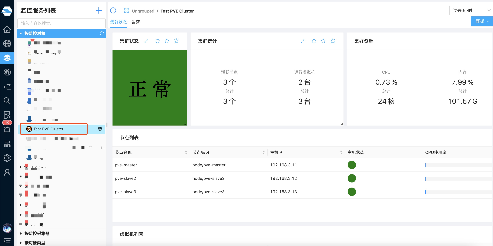
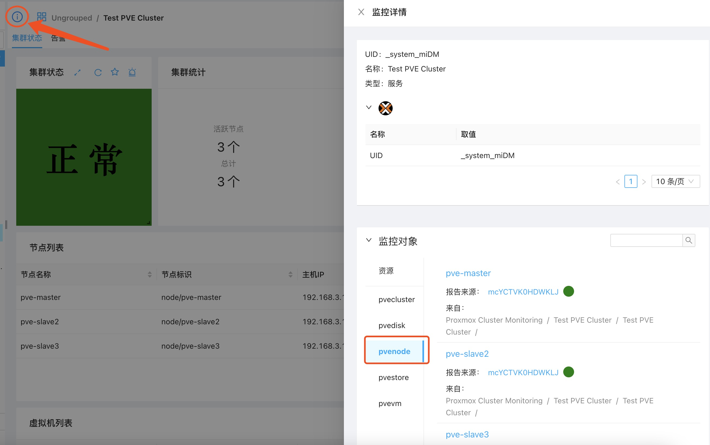
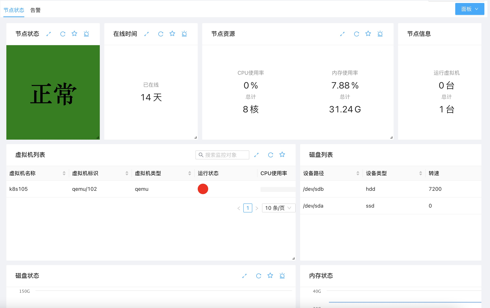
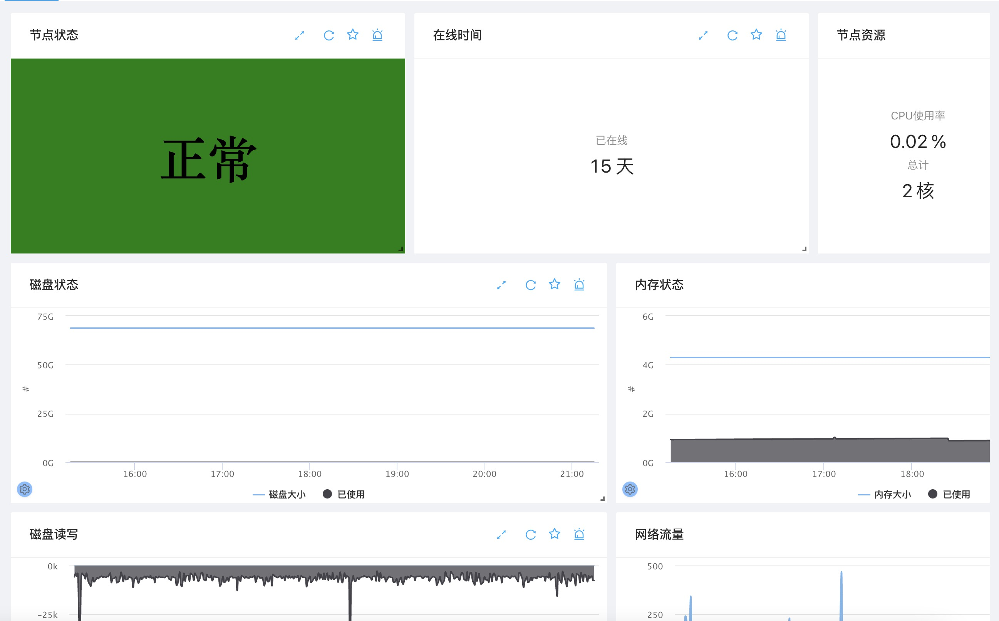

完成添加后，你可以查看集群中各种信息，包括
1. 集群状态和集群资源状态
2. 集群节点状态和节点资源状态
3. 集群中特定虚拟机状态和资源使用情况
4. 其它信息

## 集群及资源状态

在监控服务中选中你添加的Proxmox VE集群，即可看到当前集群状态

这儿你可以看到
1. 集群的统计信息，如节点数，虚拟机数量等
2. 集群资源状态，如CPU，内存和存储的使用情况
3. 集群节点列表及简要信息，如节点状态，CPU和内存使用情况等
4. 集群虚拟机列表及简要信息

## 集群节点信息

在上图集群节点列表中点击相应节点行，即可跳入该节点状态查看页面。亦可在左上部点击信息节点，选择pvenode并点击相应节点名称进入对应节点状态查看页面：

节点状态查看页面如下：

在这个页面可以看到节点的详细状态如
1. 节点运行时间
2. 节点资源使用情况
3. 运行在该节点的虚拟机及状况
4. 节点的磁盘使用
以及其他信息

## 虚拟机信息

在集群状态或集群节点状态中点击虚拟机列表中的指定行即可进入特定虚拟机的详细监控页面。亦可通过点击左上信息节点，选择pvevm后查看特定虚拟机详情页面，如下所示：

在该详情页面，你可以看到虚拟机的详细信息如
1. 虚拟机运行时间和状态
2. 虚拟机内存使用状态
3. 虚拟机磁盘使用状态
4. 虚拟机网络使用状态
等详细信息