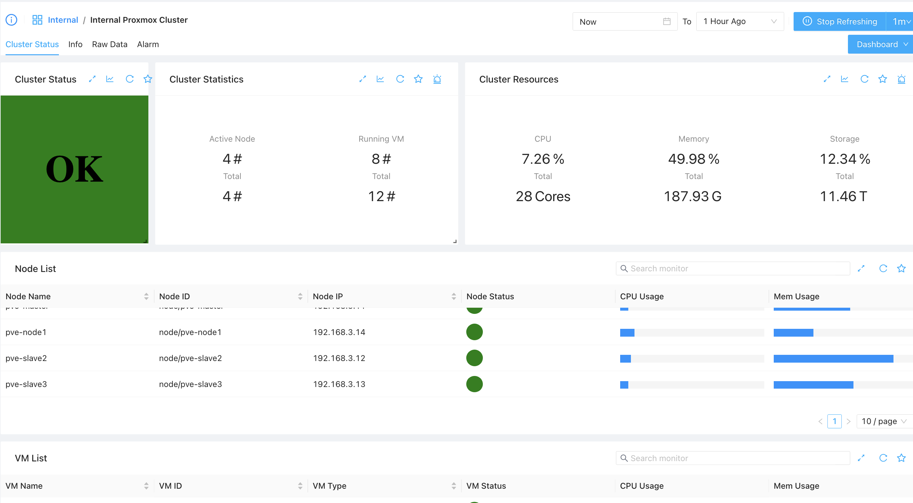
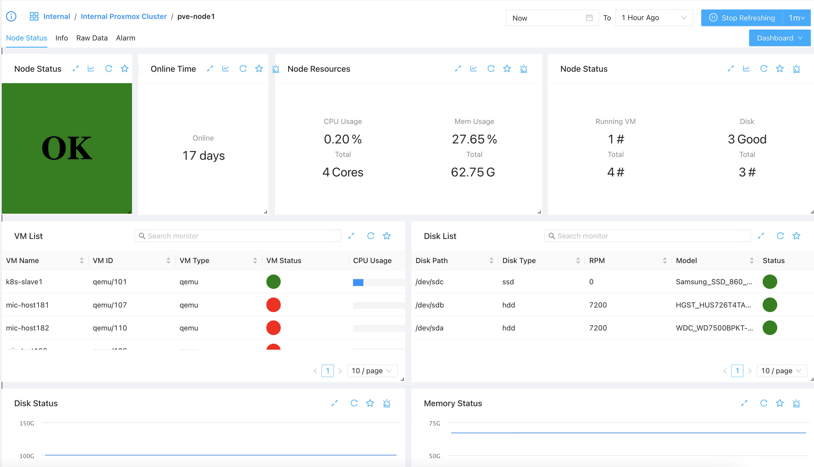
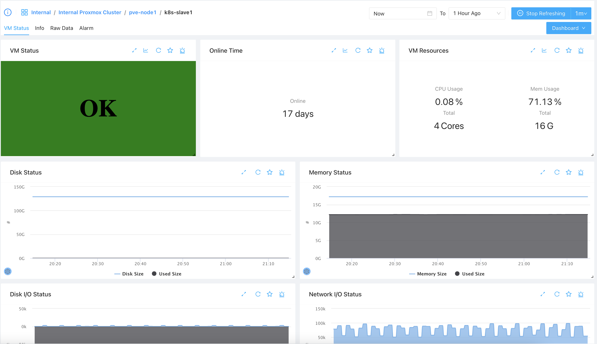

Proxmox VE (PVE) is the most commonly used opensource virtulization platform, like monitoring ESX, ZoomPhant can also monitor Proxmox VE.

For more information about PVE, please visit its offical website at:

https://www.proxmox.com/en/proxmox-ve)

### Creating PVE Monitoring Service

Before creating a monitoring service for your PVE, please collect following information to ensure you can access your PVE cluster:

1. Cluster access endpoint. It should be the URL you use to access your PVE cluster in browser, like: https://192.168.1.1:8006.
2. Cluster access username. You should create a username for monitoring purpose, like *monitor* or *zervice*. Please also collect the domain of the user (by default it should be **pam**)
3. The access password or token for the monitoring user. If you decide to use token, please be aware that in ZoomPhant we would request you to prepend with your tokenId in format of ***tokenId**=**token***. For example, you could have created a token with token ID ***monitoring***, the corresponding token value is "***a267354d-bc9f-426a-828c-5174382b3e00***", then the token you provided to ZoomPhant should be "***monitoring=a267354d-bc9f-426a-828c-5174382b3e00***"

With above information ready, you can know start adding your PVE monitoring service. Please follow the steps in [Add Monitor Service](../../01_service/) and choose **Proxmox** monitoring plugin :

In the parameter step, you shall provide following parameters using above information:

Here:

1. url: you can just input host port like ***192.168.1.1:8006*** or you can just paste the url in like https://192.168.1.1:8006/
2. username: The account name like ***monitor*** or ***zervice***
3. password: If you use passwords, input the password here, or you can keep it blank and fill in token field
4. token: If you use token, fill in token (in format of ***tokenId=token***), otherwise you shall have password set and keep this blank

Now finish adding your monitoring service and wait few seconds, you'll soon be able to see the data coming.

### Understanding Proxmox Data

Once you have added the PVE monitoring service, you shall be able see the dashboards for your added monitoring service. You will be able to see
1. The status of the cluster
2. The status of a node in the cluster
3. The status of a VM in the cluster
4. Other information

## Cluster Dashboard

The default dashboard would be the cluster status dashboard:

Here you will be able to see
1. The cluster statistics like the node number, VM number etc.
2. The resource usage status of the cluster, like CPU usage, memory usage and storage usage.
3. List of nodes and a simple overall status of each node
4. List of VM and a simple overall status of each VM

The node list and VM list are clickable, if you click a row you'll be navigate to a sub-dashboard of corresponding node or VM.

## Node Dashboard

if you click a node in above node list, you'll be navigate to node dashboard of that node, as shown below:

On this dashboard, you'll be able to view information like:

1. Node running time
2. Node resource status
3. VMs running on the node and their simple overall status
4. Node disk and other information

Like in the cluster status, the VM List is clickable, by clicking one VM you'll be navigate to the VM sub-dashboard.

## VM Dashboard

Once you click a VM in Cluster Dashboard or a Node Dashboard, you will be presented the VM Dashboard:

In VM dashboard, you'll see information about the VM like
1. VM status and running time
2. VM resource usage
3. VM Disk I/O and Netowrk I/O Status
4. Other informations
