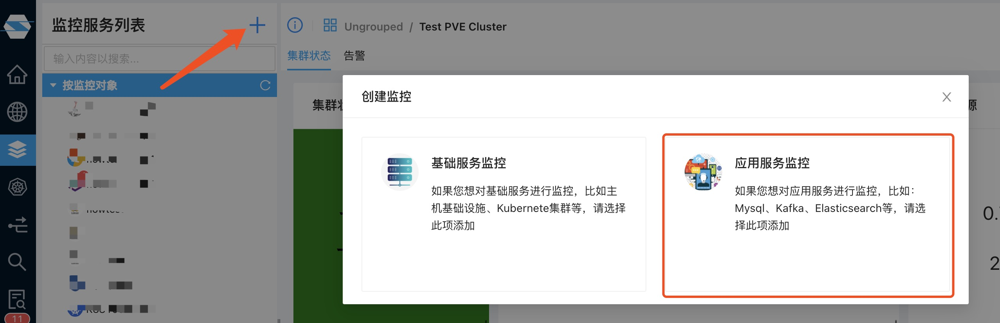
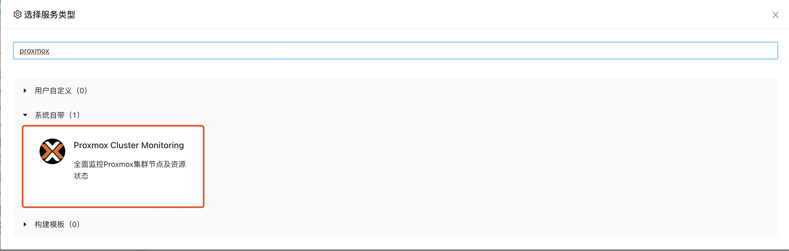
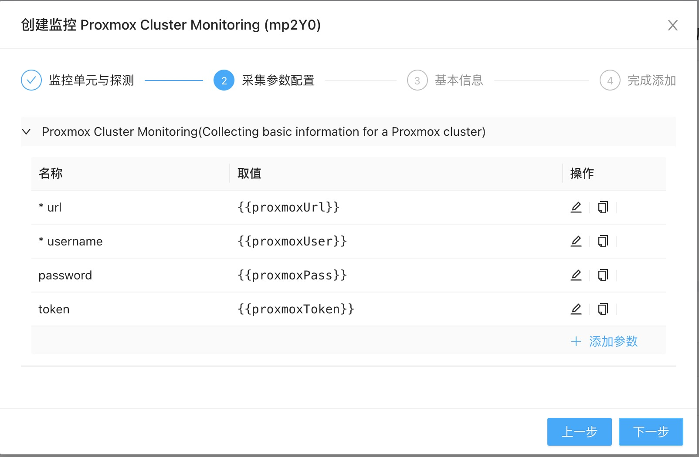
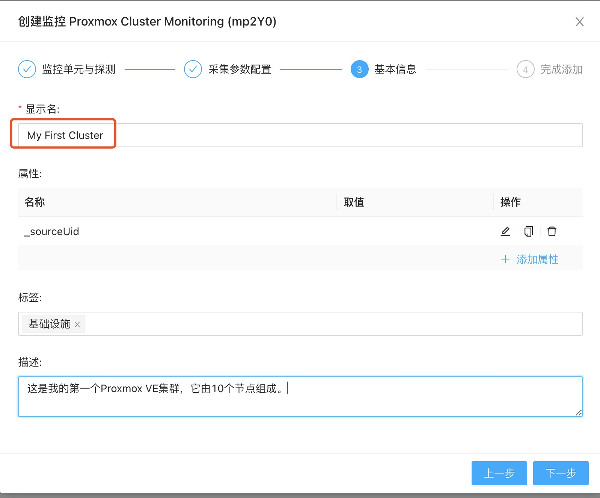

在开始监控之前，请确保你能访问你的Proxmox VE集群并准备以下信息
1. 集群访问入口，及集群主节点的IP和管理访问端口。亦可直接通过浏览器访问其管理门户并记录该访问地址（如：https://192.168.1.1:8006)
2. 集群访问用户名。通常建议你创建一个用于监控的用户，如monitor或zervice并记录下该用户所在的作用域（缺省为pam）
3. 对应的访问密码或Token。如果是Token，请注意Token格式应该为tokenId=token的形式，如你如果创建的token ID 为monitoring，对应的token为"a267354d-bc9f-426a-828c-5174382b3e00"，则你记录的Token应该为"monitoring=a267354d-bc9f-426a-828c-5174382b3e00"

有了以上信息后，你就可以开始监控你的Proxmox VE集群了

首先请到监控服务页面，点击添加按钮，并选择”应用服务监控“：

在弹出的对话框顶部输入promox，过滤监控插件：

点击过滤出来的Proxmox Cluster Monitoring插件，进入监控服务添加向导，选择合适的采集器后点击下一步进入参数设置界面：

在该对话框中，你需要提供以下信息
1. url：必填，上面准备的主机地址和端口，如192.168.1.1:8006或直接贴入浏览器中访问管理端口的地址，如https://192.168.1.1:8006/
2. username: 必填，用于获取监控数据的用户名，如提前创建好的monitor或zervice账户
3. password：选填，可以填入上述用户的密码或不填入任何信息
4. token：选填，如果password空白，则此处应填入上面准备好的token信息（格式为tokenId=token）

确保所有信息正确后即可点击下一步，输入合适的监控显示名称并点击下一步完成添加：

至此你的Proxmox VE集群监控已经添加，几分钟后你就可以开始查看你的集群监控状态和数据。