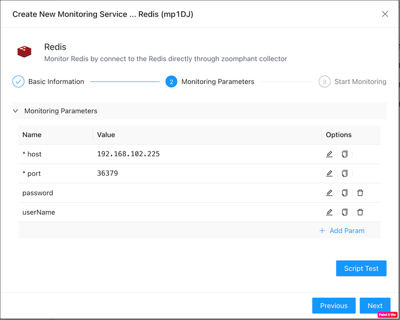
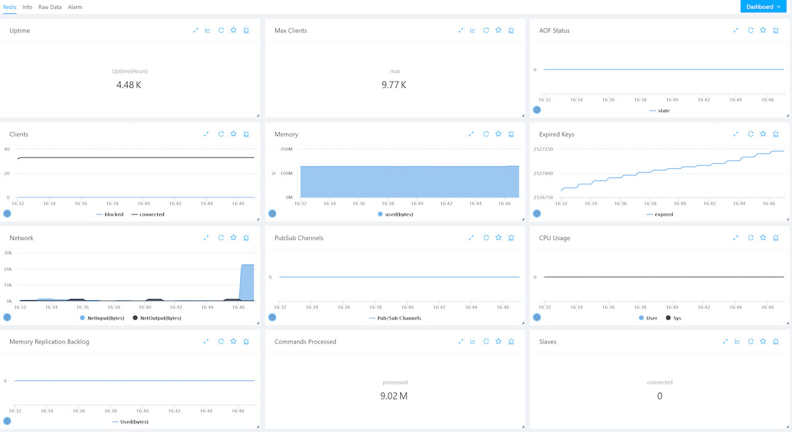

# Redis Monitoring
{: .no_toc .header }

----
ZoomPhant provides an easy way for you to monitor redis servers or clusters using **Redis** plugin.

## Creating Redis Monitoring

To start monitor a redis server, you can choose the **Redis** plugin as shown in  [Add Monitor Service](../../01_service/) and provide following necessary parameters to create a monitoring service:

* host: the host for a redis server.
* port: the port for a redis server. eg: 6379
* password: optional, the password for a redis server.
* userName: optional, the userName for a redis server.

With the parameters provided and the monitoring service been created, you can wait few seconds and see the diagrams for the monitored redis service.

## Understanding Redis Data

Redis monitoring data are presented in straigtforward ways as shown below:

It contains below metrics for a redis server:

- Uptime in hours
- Max clients 
- AOF (Append only file) feature status ()
- Connected and blocked clients
- Memory used 
- Expired keys count
- Input and output network bytes in seconds
- Pub and subscribed channels
- User and sys cpu usage
- Memory replication backlog
- Commands processed
- Connected slaves