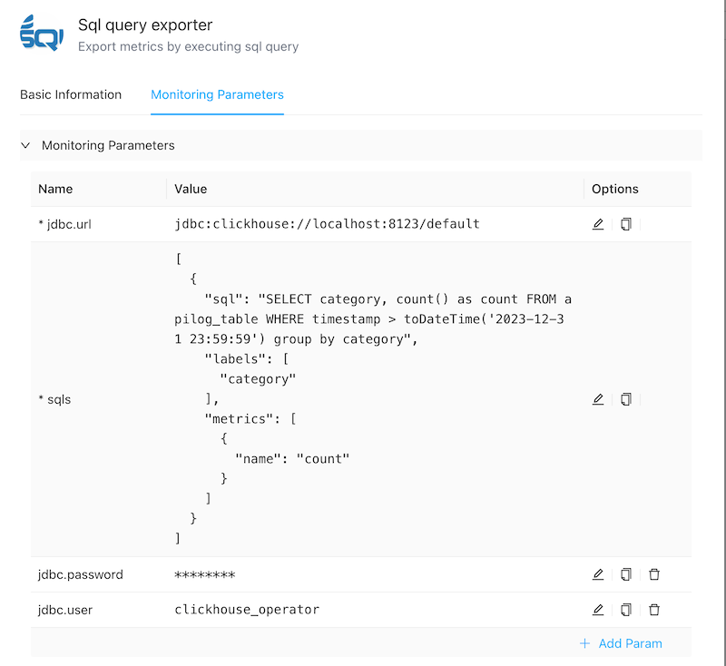
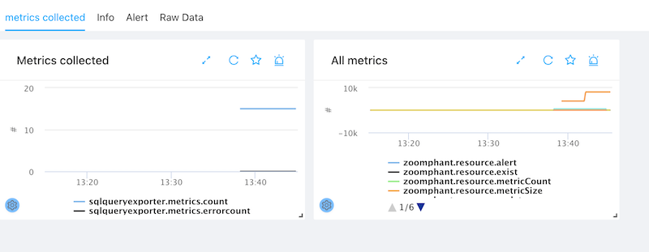

# Sql query exporter
{: .no_toc .header }

----
ZoomPhant provides an easy way for you to do a sql query to export metrics. For now, we support below databases to generate metrics:
-   Microsoft SQL Server
-   Oracle
-   MySQL
-   PostgreSQL
-   ClickHouse

## Creating SQL query exporter monitoring

To do a sql query to extract metrics, you can choose the **Sql query exporter** plugin as shown in  [Add Monitor Service](../../01_service/) and provide following necessary parameters to create a monitoring service:



* **jdbc.url**: required. the jdbc url. below are some examples:

  | Database type | jdbc.url example                                             |
  | ------------- | ------------------------------------------------------------ |
  | SQL Server    | jdbc:sqlserver://localhost:1433;databaseName=mydatabase;user=myuser;password=mypassword |
  | MySQL         | jdbc:mysql://localhost:3306/mydatabase                       |
  | Postgres SQL  | jdbc:postgresql://localhost:5432/mydatabase                  |
  | Oracle        | jdbc:oracle:thin:@//localhost:1521/XE                        |
  | Clickhouse    | jdbc:clickhouse://localhost:8123/default                     |

  

* **sqls**: required. a json array to describe the metrics definition. we support a list of sqls to generate multiple metrics to improve performance. Here are the example:

  ```json
  [{
  	"sql": "the sql to query",
  	"labels": ["label1", "label2"],
  	"metrics": [{
  		"name": "metric1"
  	}, {
  		"name": "metric2"
  	}]
  }]
  ```

  The `sql` describe the sql to generate metric. you can define multiple query to get different metrics. the `labels` indicates the column names in sql which will be treat as labels. An example :

  ```json
  [{
  	"sql": "SELECT category, count() as count FROM apilog_table WHERE timestamp > toDateTime('2023-12-31 23:59:59') group by category",
  	"labels": ["category"],
  	"metrics": [{
  		"name": "count"
  	}]
  }]
  ```

  

* jdbc.user: optional. the jdbc user.

* jdbc.password: optional. the jdbc password.

Note: we will run the sql query in **READONLY** mode to keep your data secure.


## Understanding sql query exporter data

By default, there are two default graphs:

- Metrics Collected graph: show how many metrics are reported from the sql query.
- All metrics graph: show all the metrics reported.



## Add custom dashboard

You can add custom dashboard following the manual [Dashboards](../../../concepts/dashboards#Understanding Widgets in ZoomPhant Dashboards) to get more details.

