# Create Windows Monitoring Account

{: .no_toc .header }

----

This document helps you to create a Windows account on your target Windows machine for monitoring purpose. For more detailed and official information, you can visit here [Windows Management Instrumentation - Win32 apps | Microsoft Learn](https://learn.microsoft.com/en-us/windows/win32/wmisdk/wmi-start-page).

The first step to monitoring a Windows host is to make sure you have an account on the target machine with necessary permissions been set, you can follow steps below to create the account you want.

### 1. Create Account

You can go to the Control Panel / User Accounts to add a new account, here we assume you would create an account called **zpmon**

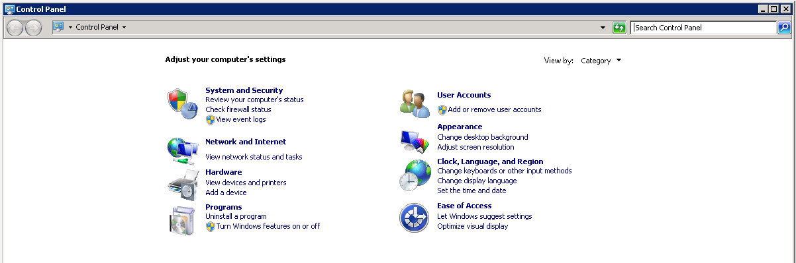

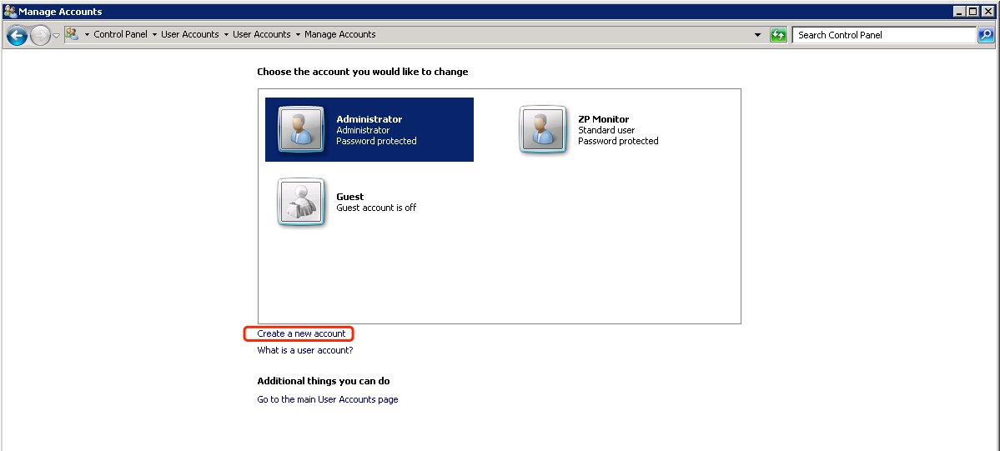

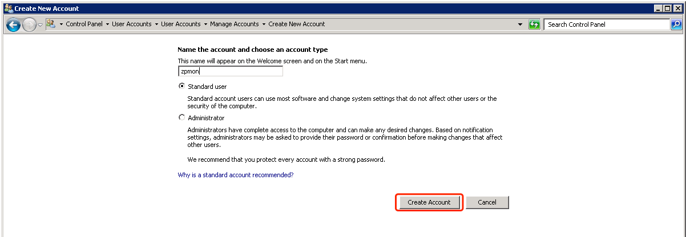

After the account created, go to Manage Account page again and select the created account to set a password for it (we would need the password when creating Windows WMI monitoring service)

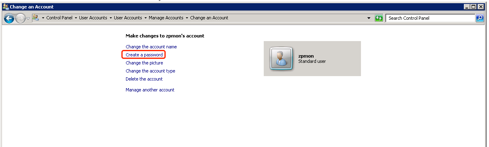

### Add Account To Correct Groups

The newly created account shall be added to following groups

* Distributed COM Users
* Performance Log Users
* Performance Monitor Users
* Remote Management Users

*Note: In different version of Windows, some of the groups above may not exists, just find out the groups as follows and add in the user you just created*

To do this, you need to goto **Administrator Tools** > **Computer Management** and then select **Local Users and Groups** / **Groups** and click the group you want to add the user and add the user

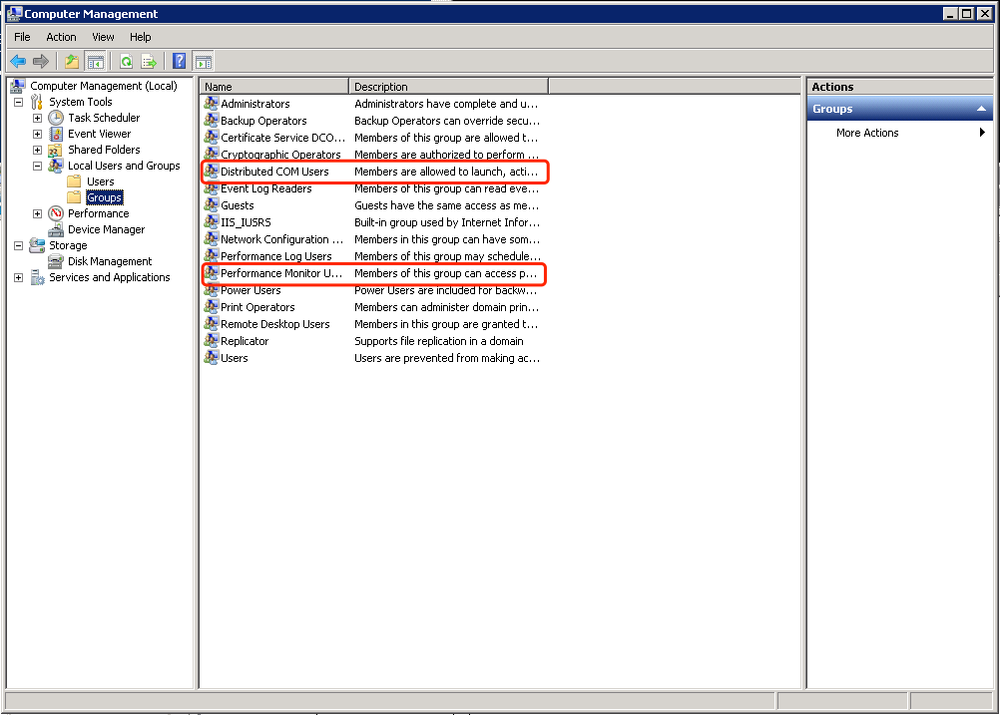

Double click the group name you will be able to add the user into the group in popped up dialog:

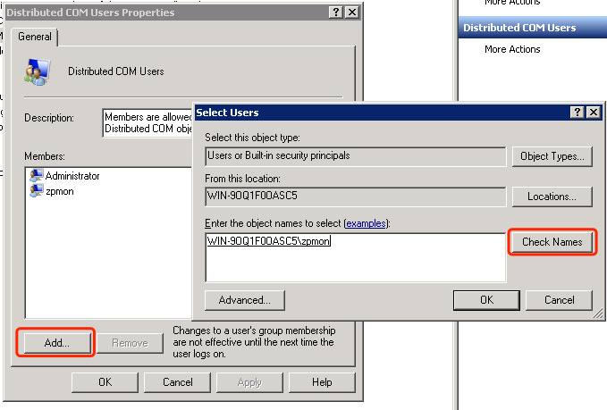

### Grant Permissions

There are few places you need to visit to grant the permissions.

#### WMI Permission

The first permision is the WMI permissions. In **Computer Management**, expanding **Services and Applications**, you shall see **WMI Control**, right click to and select **Properties**.

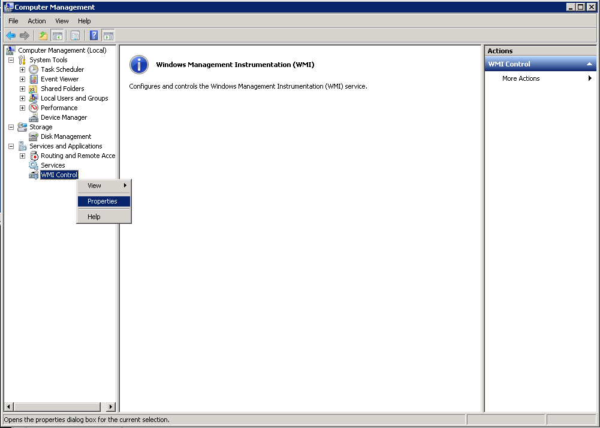

In the coming dialog, select **Security** tab and you shall see the namesaces with a "**Security**" button in the bottom.

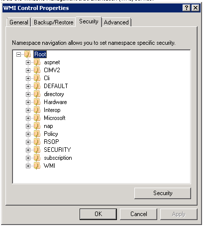

Click the **Security** button and in the coming dialog you shall enable the permissions as shown in below diagram:

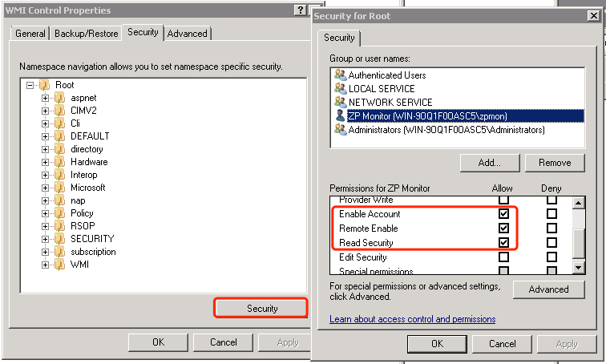

#### DCOM Permission

WMI relies on DCOM (Distributed Component Object Model) for remote communication. You may need to configure DCOM permissions to allow remote access to WMI.

To configure DCOM permissions, you can use the `Component Services` MMC snap-in (`dcomcnfg`) on the target machine. 

First navigate to `Component Services` > `Computers` > `My Computer.` Here right click on **My Computer** and select **Properties**, you shall switch to **COM Security** tab in shown dialog, click "**Edit Limits ...**" in **Launch and Activation Permissions** to make following changes:

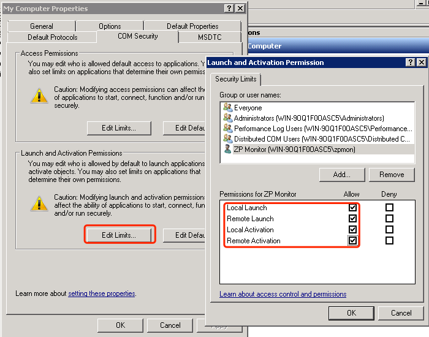

*Note:  here you can just modify one of the group the user is in to have above permissions*

Then navigate to `DCOM Config`, find `Windows Management and Instrumentation`, and configure the permissions to allow remote access.

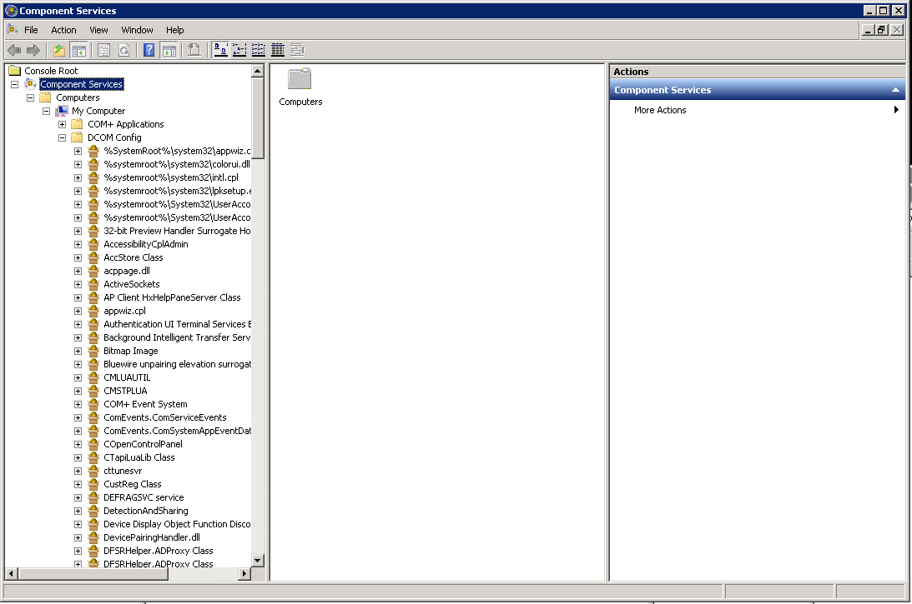

Right click on **Windows Management and Instrumentation** and select **Properties**, goto the Security tab to make sure you have customized the **Launch and Activation Permissions** and **Access Permissions** to give the account all permissions.

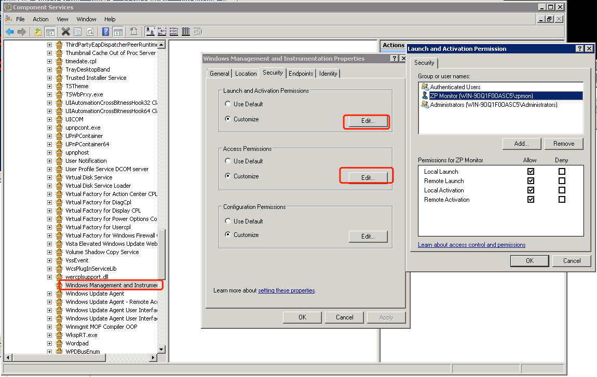

### Firewall Settings

The final step is to make sure you have make changes to Windows firewall to allow the traffic. You shall at least allow below two rules be allowed:

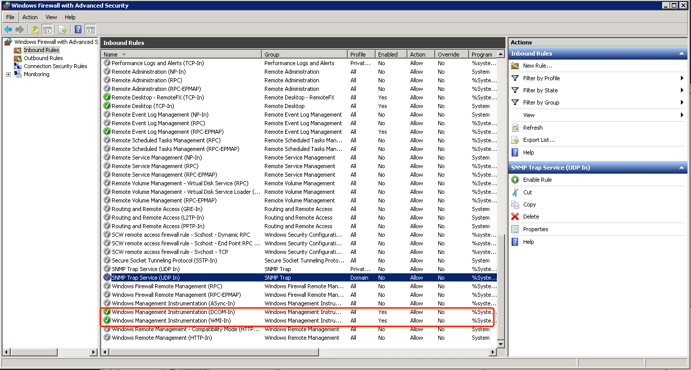

For testing purpose, you may temporarily disable the Windows firewall on target Windows servers to use wbemtest or wmic tools to make sure the account created could successfully make connections from the collector host to the target servers.

