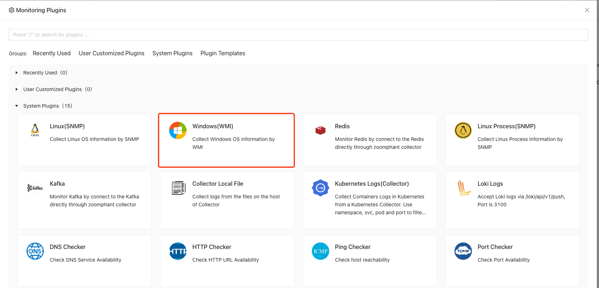
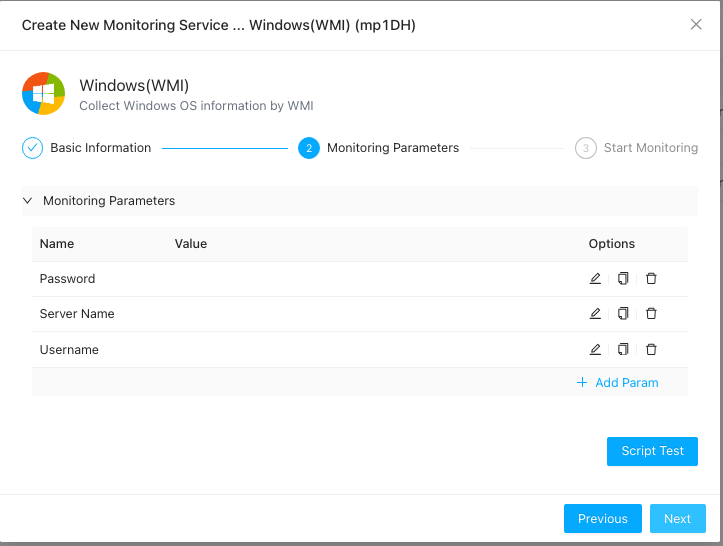
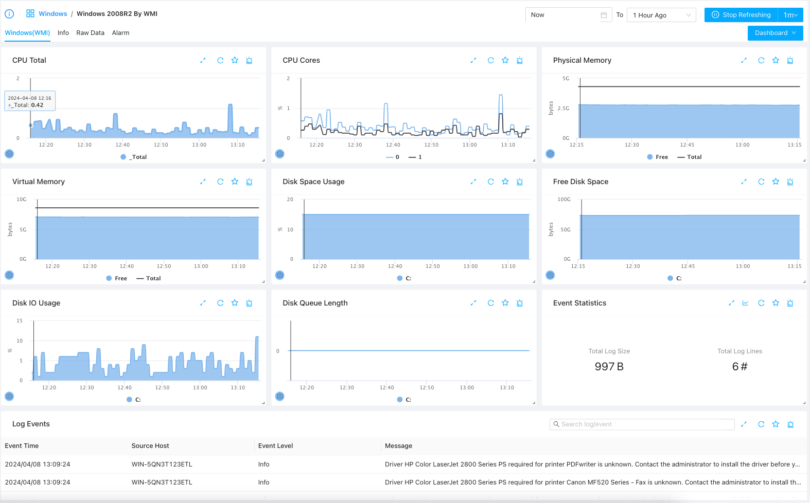

# Windows WMI Monitoring

{: .no_toc .header }

----

Sometimes, we want to remotely monitoring Windows servers using WMI, we can do this by using **Windows WMI Monitoring** plugin.

## Creating Windows WMI Monitoring

To start monitor a Windows server, you first need to make sure you have installed a Windows collector, if not please follow instructions to  [add a Windows collector](../../10_infrastructures/windows/) first.

Once you have the Windows collector, you can follow steps in  [Add Monitor Service](../service/) by selecting **Windows (WMI)** monitoring plugin:

*Note: Make sure to select a **Windows** collector in the collector selection page*

You'll need to create provide the Windows host / domain information along with the username and password to complete adding the service:

Here, the following parameters would be required:

1. Server Name: You can fill in the remote host name or IP address
2. Username: the username or account on remote host used to collecting WMI data
3. Password: corresponding password used

Please make sure your have the correct permissions settings on the account. You can refer to here on [How to create a WMI monitroing account](./account) 

### Understanding Windows Data

After few seconds adding the monitoring service, you can click the added monitored service and view a dashboard like belows:

Here you can see the basic status of the server as well as the major event logs generated in the given time range.