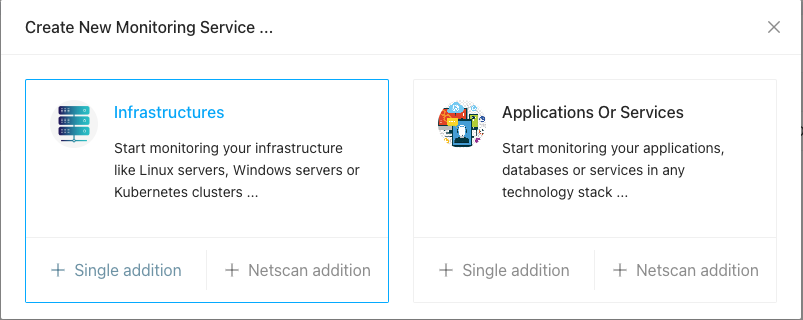
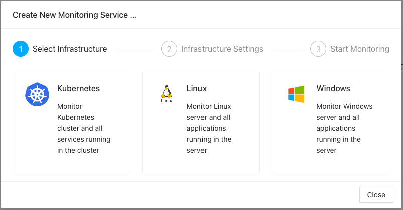
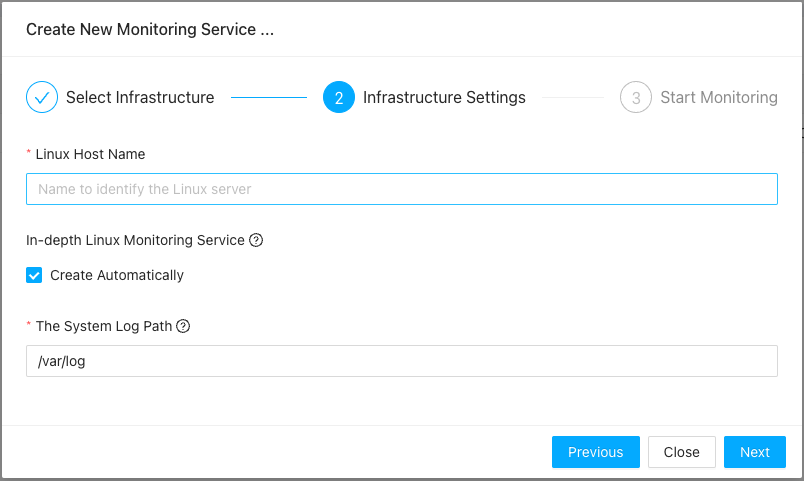
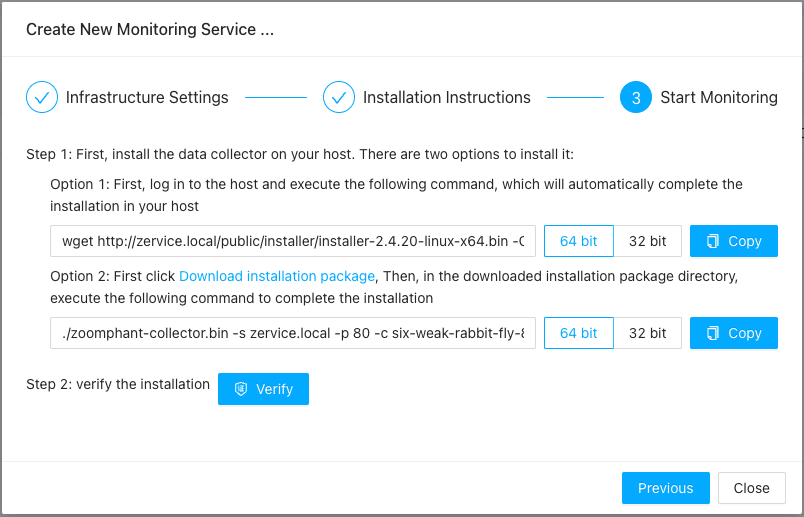

# Data Collecting Agents

{: .no_toc .header }

----

Data collecting is one of the important functions one monitoring solution shall have and ZoomPhant provides this part of function using **Data Collecting Agents** or simply **Collectors**. 

In ZoomPhant all-in-one installation, a pre-installed docker-based collector has been installed already, so you can start your monitoring immediately. But still you may need to install additional collectors for special in-depth infrastructure monitoring or to meet other business demands, you shall follow the instructions below to install your other collectors.

# Installing Collectors

Collector is a separate package running on user provided infrastructures. By installing a collector, you need to download corresponding collector package and execute the installation command with provided parameter so the collector could connect and register to server.

After the collector is installed and running on the infrastructure, the infrastructure is also get monitored, in this respective, we would say that we have created a special infrastructure montiroing service.

## Collector Infrastructure Selection

The first step to install a collector is to decide what kind of collectors you want to install. You need to chose the collector based on the underlying infrastructure you are using.

ZoomPhant supports different collecors running on different infrastructures

* Linux Infrastructure Collector: For linux or unix-like systems, you need to install the Linux Infrastructure Collectors. It can perform various tasks based on common protocols or linux utilities. For more details please refer to  [Linux Collector](../linux/) 
* Windows Infrustructure Collector: Since Windows has special requirements, we provide this type of collector to complete Windows specific data collecting tasks besides the other common tasks. You shall install this type of collector on a Windows system only. For more details please refer to  [Windows Collector](../windows/) 
* Kubernetes Infrastructure Collector: As the name suggests, this type of collectors need be installed in a Kubernetes cluster and it can collect data using Kubernetes specific mechanisms. You can find more information at  [Kubernetes Collector](../kubernetes/) 

*Note: Besides above types of collectors, we also support a general type of collector, the docker-based collector, which simply requires you to have docker enironment installed.*

First you need to click the **Add Monitoring Service** button as described in  [Monitoring Service](../service/) by choosing Infrastructures as shown below

Once you click "Single addition" you shall be brought to the collector installation wizard.

Here, you just click the type of the infrastructure you want to monitor and you will be brought to the wizard for adding infrastructure-based collector wizard. The wizard would have three steps, for you to give basic information of the collector, getting installation instructions and to wait for collector connecting up. Here we would suppose you have chosen **Linux** collector to complete this document.

## Collector Installation Wizard ##

As said above, when creating a collector, a special monitoring service will be created in the system to get the underlying infrastructure be monitored, this means the process to adding a collector is the same as creating a (*special*) monitoring service. With this in mind, adding a collector would be almost the same as adding a monitoring service, and you'll have to finish following three steps

1. Select infrastructure
2. Provide infrastructure information (parameters for the corresponding monitoring service)
3. Install and verify the installation

In this documents we'll go through the overall process, for detailed infrastructure-based collectors, you can visit corresponding documents for more information:

* For Linux Infrastructure, [Linux Collector](../linux/) 
* For Windows Infrastructure, [Windows Collector](../windows/) 
* For Kubernetes Infrastructue, [Kubernetes Collector](../kubernetes/) 

### Select Infrastructure

The first step will ask you to select one of the three types of infrastructures ZoomPhant supports:

Here, as an example, you can just click the Linux to go to next step.

### Infrastructure Information & Settings

After the infrastructure running the collector is selected, you'll got the second step to provide necessary information like

1. the infrastructure name, which will also be used to identify the collector
2. if you want to make in-depth monitoring of the infrastructure. If you choose yes (which is default), the collector may take extra resource to make in-depth monitoring of the infrastructure

Below diagrams show the step for a Linux collector.

### Finish Installation

The last step will help you to finish the installation by providing you detailed installation instructions and a way to checking if the installation is successful or not:

As shown in above dialog, for Linux collector, you can have two ways to download and install the collector

1. If your infrastructure has direct Internet access, just copy the full installation command as shown in above **Option 1**
2. Otherwise, you can download it first and save it as **zoomphant-collector.bin** and use the command shown in above **Option 2**

*Note: before copying the command, make sure you have correctly select the possible OS architecture (or bitness).*

Once you have successfully executed the command, you can click the "**Verify**" button, the server will try to wait the collector to connect and register and report a success message if everything is OK:

### 

