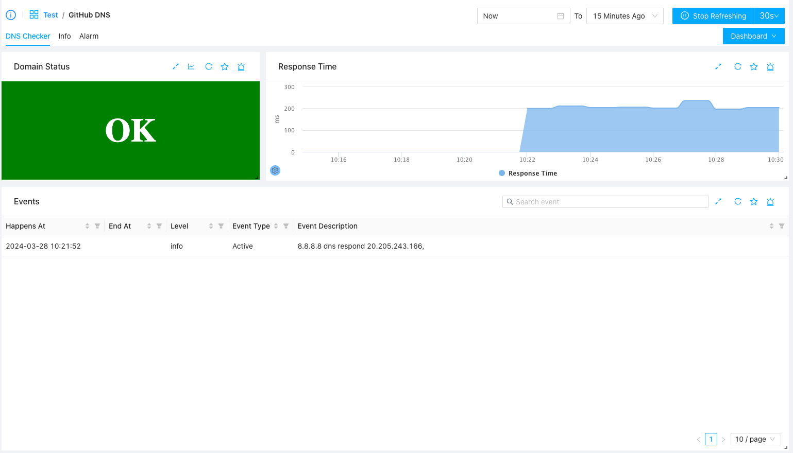

# DNS Monitoring
{: .no_toc .header }

----
DNS is one of the most underlying infrastructure of the Internet but which is usu. get neglected by people. ZoomPhant DNS montioring provides you a simple but very useful insights on how your DNS works.

## Create DNS Monitoring

Suppose you want to monitor your domain like github.com, you simply choose the **DNS Checker** plugin from our plugin library to create a monitoring, you will be asked to provide following parameters

1. server: the DNS server to use to do the check. You can usu. choose a known DNS server like 8.8.8.8 or 1.1.1.1 or simply leaving it empty, in which case the agent will choose the default system DNS server to service the request
2. port: the DNS server port to contact with. Just keep 53 which is the default DNS service port
3. host: this is required and should be the domain name you want to check. In this example, just fill in www.github.com which means we would try to check the DNS information for the github official site.
4. timeout: the default checking timeout in seconds. Usu. DNS resolvation would be finished very quick (in tens of milliseconds), so you can just leave it as 5 seconds which is the default.

Once you have fill in correct params, you can do the testing to make sure everything works and then add the monitoring service.

## Understanding the DNS Checker Data

Once you have add the DNS monitoring service, wait few seconds for data to come and you can then click the service on the left side service list to view the DNS status, you will see something like this

Here you will see three important informations

1. The overall domain status. If everything works correctly you'll see OK as shown in above diagram, otherwise you will see an short description of what kind of error happens (like domain not existing, etc.)
2. The response time or the DNS resolving time. How long it takes for the given server to respond the DNS queries. You'll see the response times be shown in a line so you can see the jitters if any for the server to service queries for your domain.
3. The important events associated with your domain. Here it will show the resolved IP addresses for your domain. This will help you to check if your DNS configuration is correct or not or if your DNS name has been polluted or not.
