# Linux Monitoring
{: .no_toc .header }

Linux monitoring entails a suite of tools designed to monitor the health and performance of Linux servers. We offer two modes for monitoring Linux servers:

- Deep monitoring by installing collectors on Linux.
- Monitoring Linux via SNMP.

## Deep Monitoring by Installing Collectors on Linux

Navigate to the "Monitoring Services" section in the sidebar to access the Service page. Click the "add" button at the top-left corner.

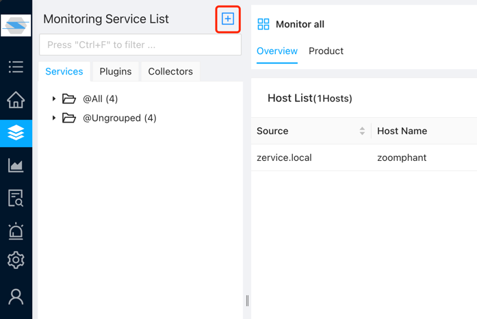

In the pop-up window, select "Single addition" under "Infrastructures".

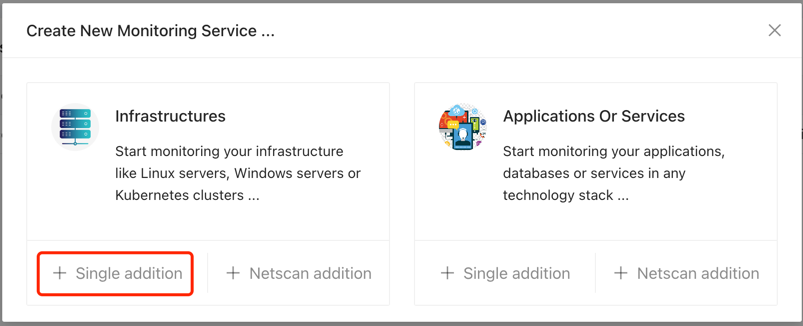

Next, choose the "Linux" option.

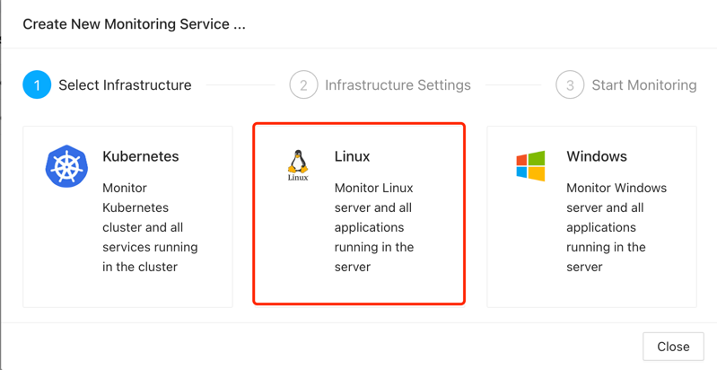

Begin by providing a name for the monitoring task. It's essential to differentiate between monitoring tasks for ease of management, especially during alarm occurrences, which aids in quick identification.

In-depth monitoring refers to comprehensive monitoring of Linux servers, encompassing CPU, processes, memory, disk, network, and even security logs. We offer monitoring data at a 1-minute granularity, which is highly recommended in cloud environments like AWS to optimize CloudWatch costs.

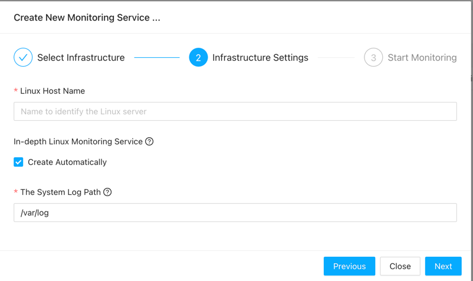

Click "next" to proceed. Here, you'll need to copy the script and execute it on the Linux server to be monitored. Please note that executing the script requires root privileges.


Upon successful script execution, you'll see the following prompt. If the collector fails to download, please verify the External Host configuration in accordance with the Quick Start guide to ensure the Collector Server is enabled. For script execution failures, kindly contact our support team.


After successful collector installation, click the "validate" button. Successful validation indicates that the collector has been installed and successfully connected to the server.

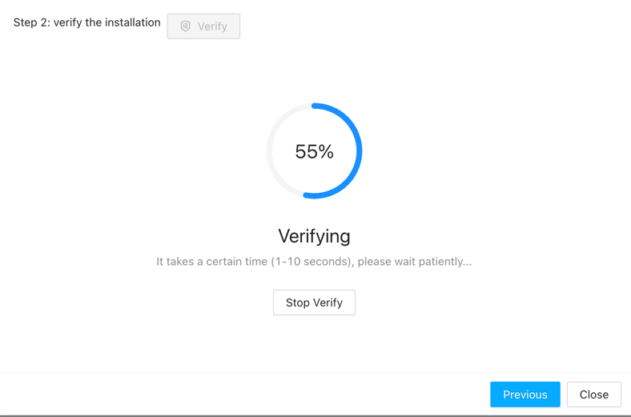

At this point, you can view the successfully added collector in the Service page.

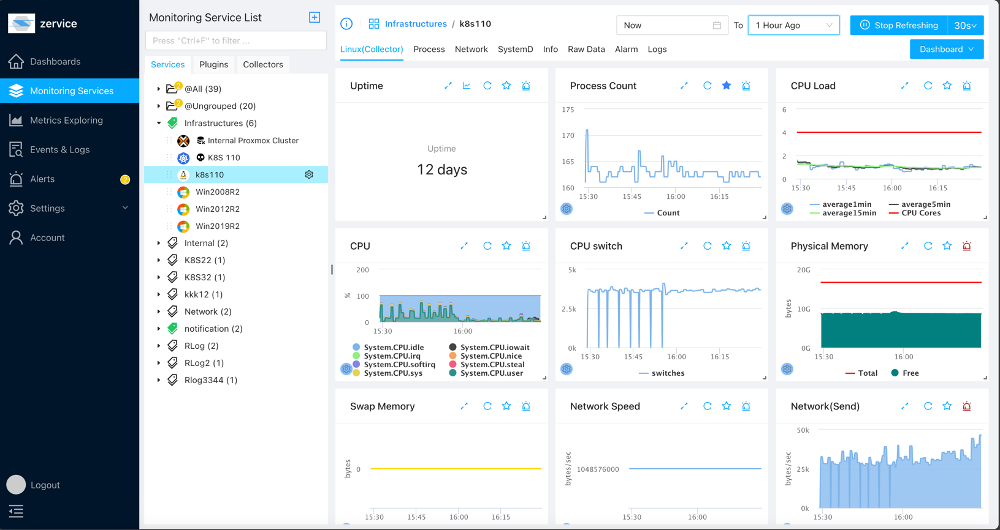

## Monitoring Linux via SNMP

First, ensure that the SNMP service is enabled. Below is an example for enabling SNMP service on CentOS:

```bash
# Install SNMP service
yum install -y net-snmp net-snmp-utils
# Configure SNMP service
vi /etc/snmp/snmpd.conf
# Modify the following configuration to .1.3.6.1 to obtain more system information
view    systemview    included   .1.3.6.1
# Restart SNMP service
systemctl restart snmpd.service
# Add SNMP service to startup
systemctl enable snmpd.service
```

### Adding SNMP Monitoring in the Monitoring Services

Navigate to the "Monitoring Services" section in the sidebar to access the Service page. Click the "add" button at the top-left corner. In the pop-up window, select "Single addition" under "Applications Or Services".

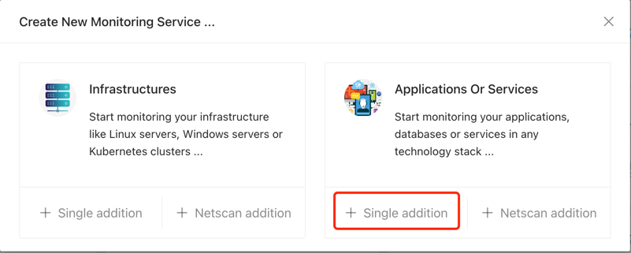

Next, choose the "Linux(SNMP)" option. You can also search for "linux" in the search bar.


Begin by providing a name for the monitoring task. It's essential to differentiate between monitoring tasks for ease of management, especially during alarm occurrences, which aids in quick identification. You need to select a collector that can access the server being monitored, as SNMP uses the UDP protocol, so it's preferable for the collector and the monitored server to be in the same LAN.

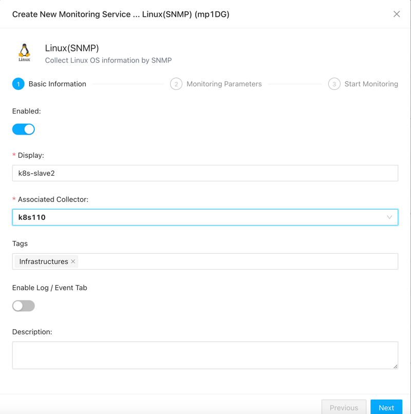

Fill in the IP address of the server being monitored and SNMP protocol version, authentication information, etc.

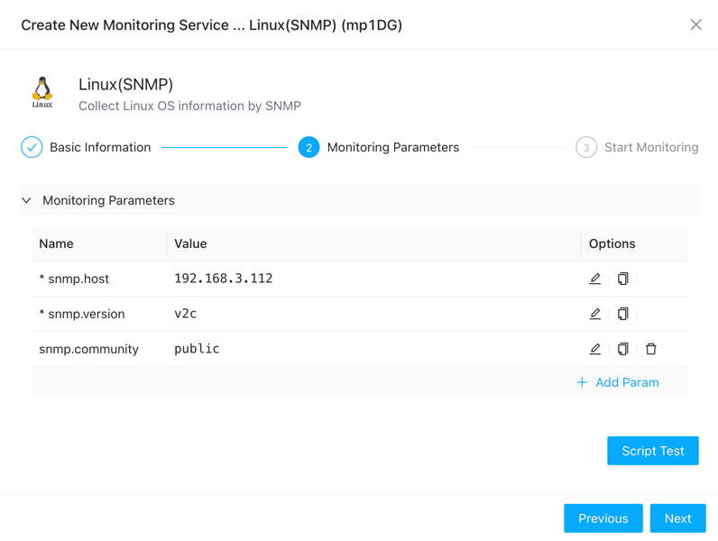

If you're concerned about whether the parameters are filled in correctly, you can click the "Test" button to perform a test.

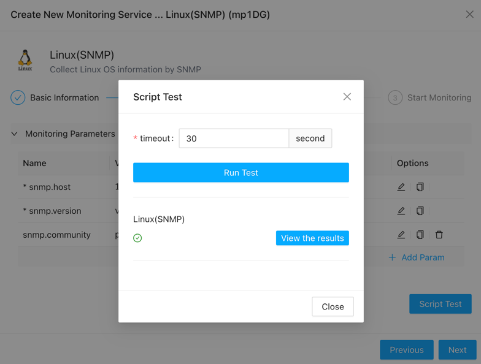

Once confirmed, click "Next" to successfully add the service monitoring.

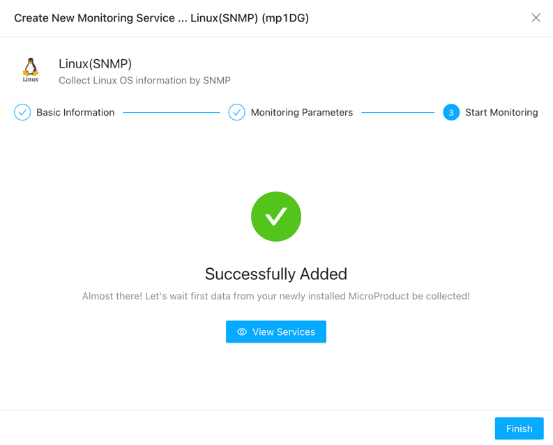

Now, you can view the added service on the service page.

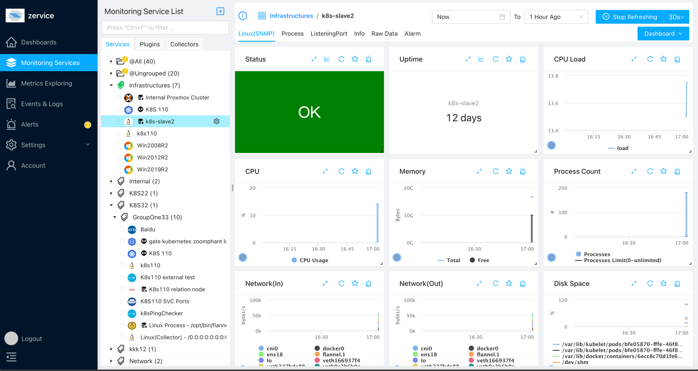

