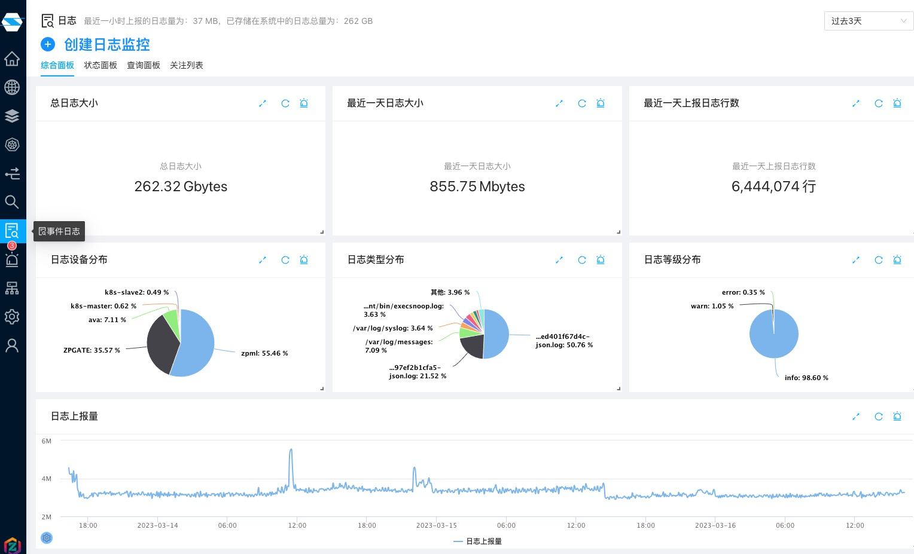
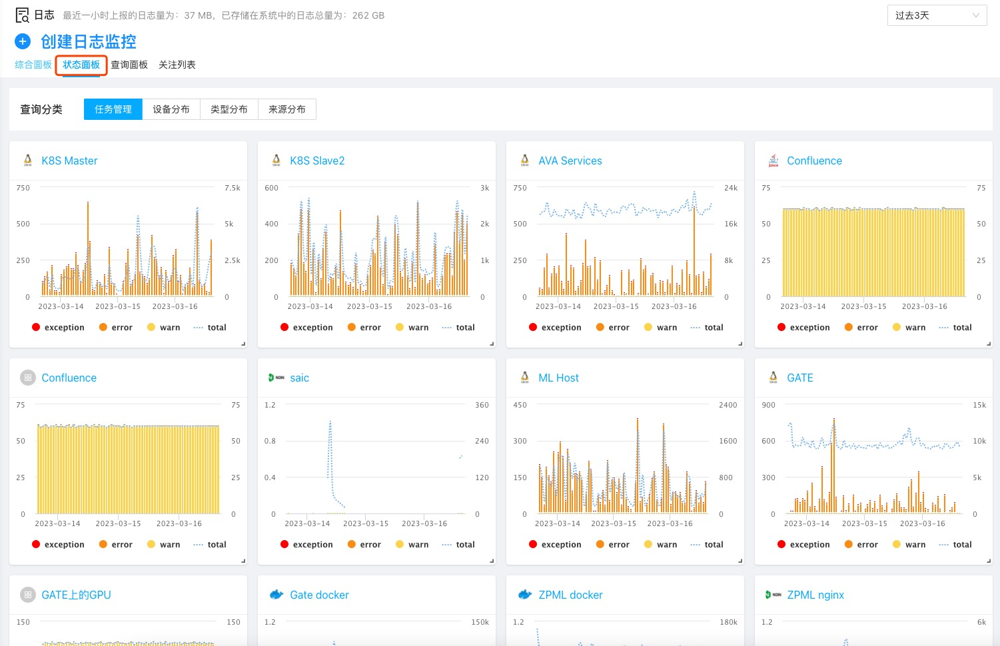
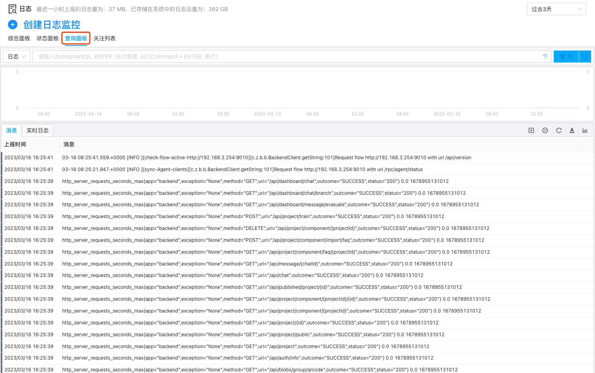
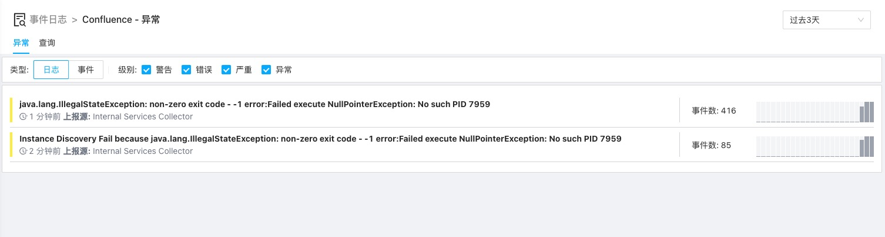
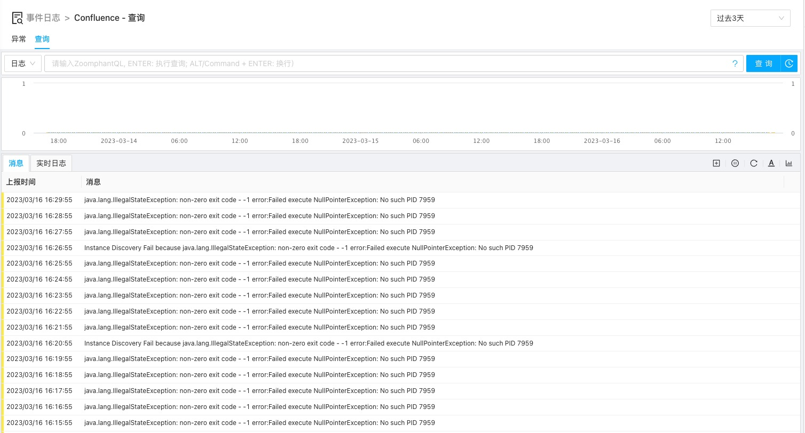

择维士数象云具有完整的日志监控功能，方便用户在监控时能快速与其它基于性能指标的监控能力进行整合。

使用择维士数象云日志监控功能，用户只需要安装择维士数象云数据采集器，然后根据自己的日志产生和存放方式选择一种合适的采集插件，即可开始使用功能完善的日志监控。

在日志采集后，用户可以登录自己的账户进行日志查询和分析处理。

用户在菜单中选择日志监控即可进入日志查询和分析页面：

在此页面，用户可以快捷的看到在自己账户中已经注入的日志总量和一些基本分类，此外，用户可通过点击”状态面板“查看按采集插件（或日志源）的更详细信息：

点击任何一个分类或直接点击顶部的”查询面板“，即可进入日志详情浏览并进行分析处理。如果通过点击”查询面板“，则可查看整个系统中所有的日志并进行分析处理：

如果在上面的状态面板中选中某个源，则可进入到该对应原的细分日志查看和分析处理页面：

此时首先看到的是在该细分类别中一些值得关注的日志和相关统计；可点击相关条目或直接点击查询进入日志查询和分析页面：

在此页面你可以是用择维士日志查询语法进行综合的日志查询、分析和其它处理。

