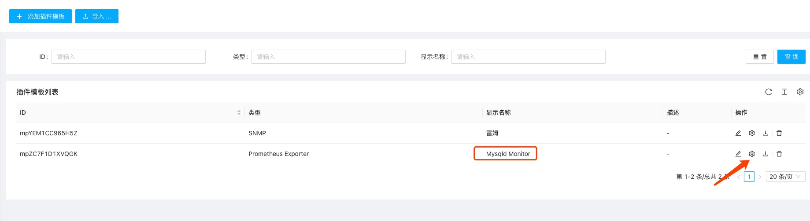
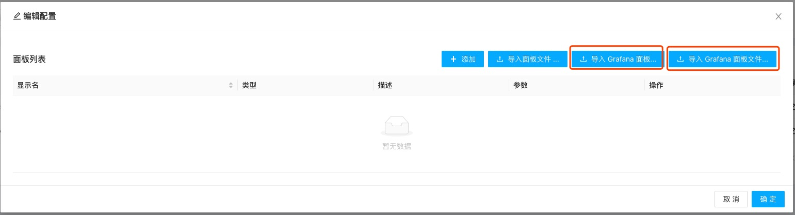
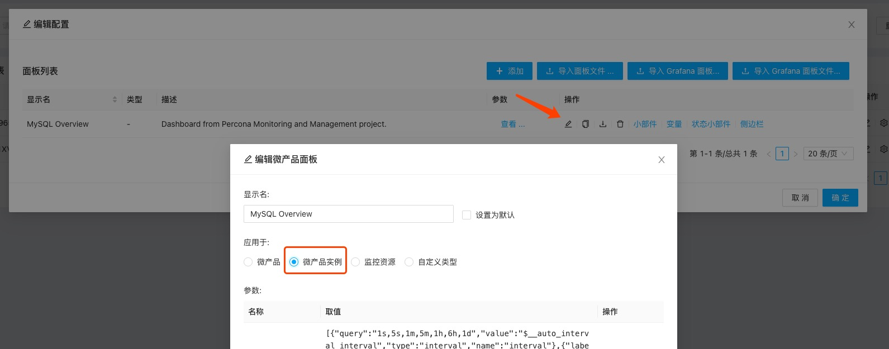

上一步中创建好Prometheus监控插件后，系统只是具备了从暴露Prometheus监控指标的Endpoint处采集数据的能力。要展示这些所采集的数据，我们需要找到对应的Grafana面板，并将它导入所创建的监控模板中。

首先在同一个监控模板管理页面中选中刚才创建的监控模板（此处，我们假设它名为“Mysqld Monitor"，并点击设置图标

在随后出现的对话框中选择"导入Grafana面板”或导入Grafana面板文件“，如果网络不受限，前者预期你输入一个面板文件的URL或Grafana ID，后者则假设你已经将面板文件（JSON格式）下载到本地，直接上传此文件（用于网络访问受限的环境）。

我们选择”导入Grafana面板“，并输入对应的Grafana 面板ID。（此处，我们输入7362，为一个常用Mysqld Overview面板的ID，详见：[https://grafana.com/grafana/dashboards/7362-mysql-overview/](https://grafana.com/grafana/dashboards/7362-mysql-overview/)）

等待数秒即可完成导入。此时需对其进行一个编辑，将该面板和监控微产品实例类型进行关联：

点击完成，则你已成功完成面板的创建。至此通过普通的应用服务监控添加就可以开始对你的服务和设备进行监控并查看相关图表！