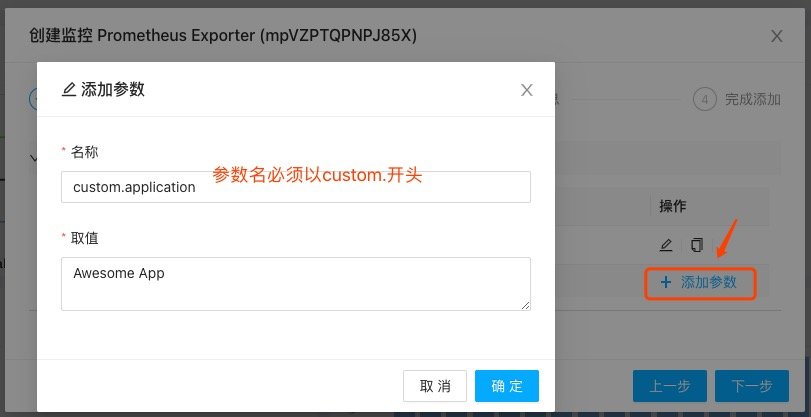
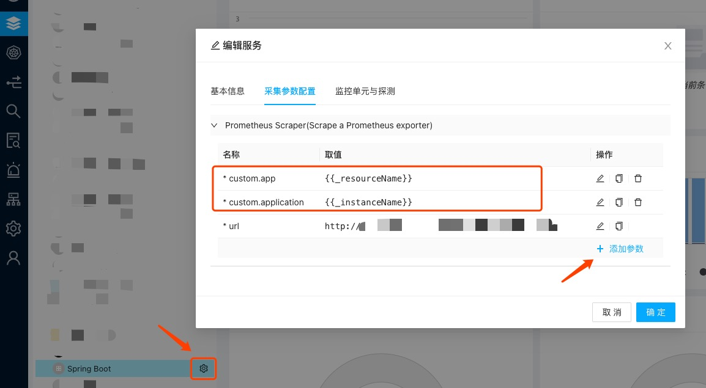

在一个Prometheus Scraper中，数据往往会具有一些特殊标签，这些标签在择维士数象云中不再适用或需要进行手工添加。

## 不适用的标签

Prometheus Scraper所产生的数据会包含以下两个标签
* job：取值为job_name所配置的值，用于代表数据来自哪个任务（job）
* instance：取值为targets中的__address__或url中的\<host\>:\<port\>，用来区分数字来自于哪个scrape源。

在择维士数象云中，由于数据采集是基于具体采集插件实例的，上述标签不再具备任何意义，因此在数据采集时不会再按Prometheus Scraper的行为进行采集，在导入Grafana面板时，上述标签也会被从query语句中去除，确保可正常进行数据查询。

## 自定义标签

Prometheus Scraper中往往会配置加入一些自定义标签，如：

    static_configs:
        - targets: ['app.mysite.com']
          labels:
            application: 'Awesome App'

在择维士数象云中，只需要在引入创建Prometheus插件监控实例是增加如下格式的参数，并为之填入一个适当的值，即可自动生成这些自定义标签

    custom.\<labelName\>

如下图所示：

如果你已经创建好监控实例，只需在监控服务中选择该监控实例，然后编辑即可修改或添加自定义标签：

### 自定义标签值

在添加自定义标签时，自定义标签值可以通过使用 的方式引用变量值。变量名可以为系统变量，也可以为任何定义在监控插件，监控插件实例上的属性名称。

系统变量包括

* _account: 当前用户的账户ID，一个ca开头的字符串
* _accountName：当前用户的账户名
* _agent：当前负责数据采集的采集器ID，一个mc开头的字符串
* _agentName：当前负责数据采集的采集器名称
* _product：当前监控插件ID，一个mp开头的字符串
* _productName：当前监控插件名称
* _instance：当前监控插件实例的ID，一个mi开头的字符串
* _instanceName：当前监控插件实例的名称，用户在添加监控时起的名称
* _resource：当前监控资源的ID，一个mr开头的字符串
* _resourceName：当前监控资源的名称