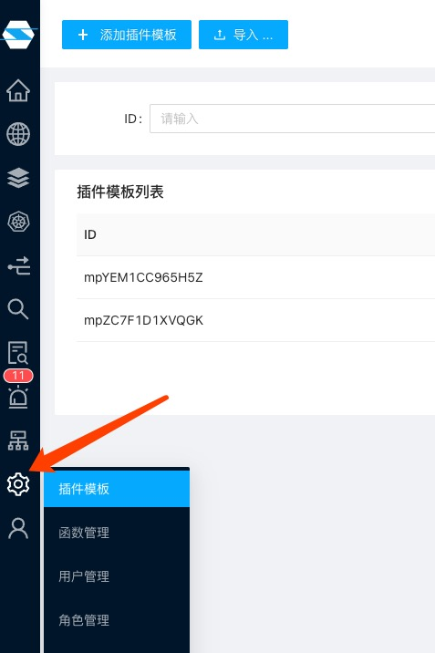
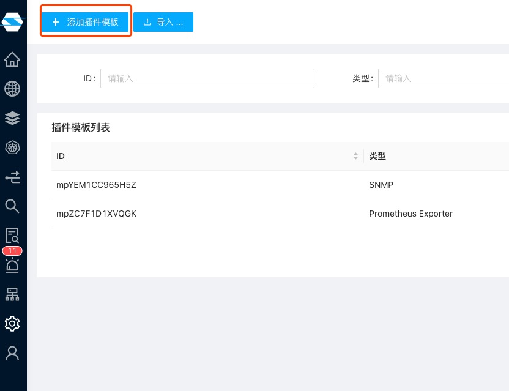
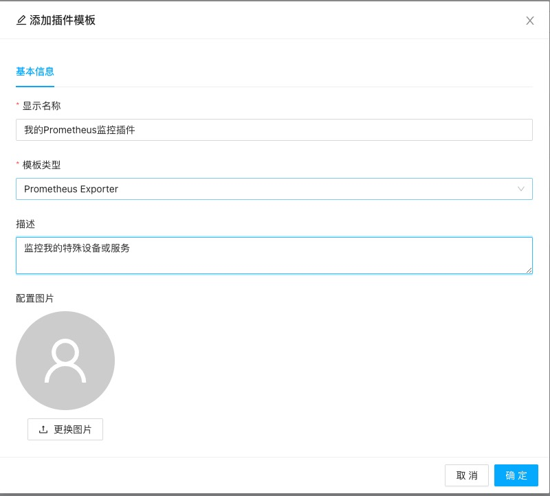

创建一个Prometheus 兼容的监控插件非常简单。

在数象云主菜单中，选择“设置|插件模板”

在随后出现的页面中点击“添加插件模板”

在出现的对话框中选择“Prometheus Exporter”

至此则已成功创建对应的Prometheus监控插件。其内置一个Prometheus 监控指标的Scraper，在随后添加监控服务时只需要填入该Scraper需要的url即可开始进行数据采集。
