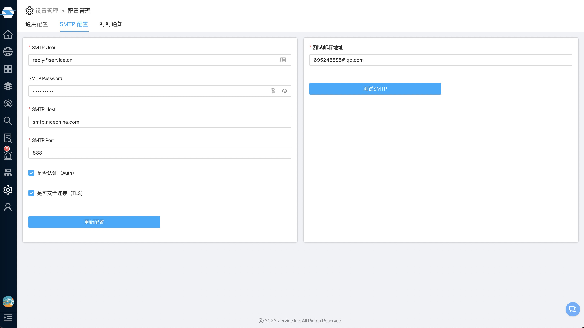

# SMTP配置
{:.header}
---

系统中很多地方需要邮件服务，比如告警通知，重置密码等，所以我们可以在这里配置邮箱服务

## 基本信息
- SMTP User：SMTP账号用户名，通常就是注册邮箱完整名称
- SMTP Password：SMTP账号密码
- SMTP Host：SMTP服务器，比如smtp.qq.com；smtp.sohu.com；smtp.sina.com等
- SMTP Port：SMTP服务器端口号
- 是否认证（Auth）：是否需要SMTP进行身份认证
- 是否安全连接（TLS）：是否需要SMTP进行安全连接

## 测试
可以通过填入一个"测试邮箱地址"，然后点击"测试SMTP"，就能验证该SMTP配置是否成功

继续阅读：
* [钉钉通知]({{ site.baseurl }})