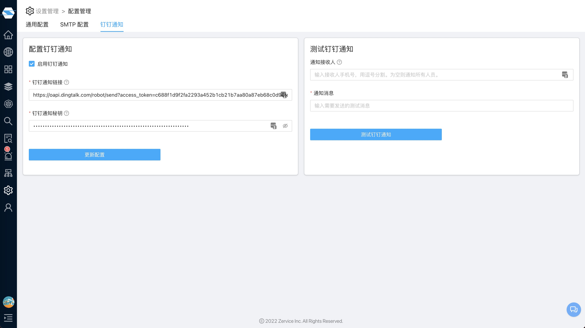

# 通用配置
{:.header}
---

系统中有些地方需要钉钉服务，目前而已，在告警通知功能中有一种告警渠道就是通过钉钉来通知，所以我们可以在这里配置钉钉通知服务

## 基本信息
- 钉钉通知链接：配置钉钉通知链接，可参考[设置钉钉机器人](https://help.aliyun.com/knowledge_detail/112831.html)
- 钉钉通知秘钥：配置钉钉通知秘钥，可参考[设置钉钉机器人](https://help.aliyun.com/knowledge_detail/112831.html)

## 测试
可以通过填入一个"通知接收人"和"通知消息"，然后点击"测试钉钉通知"，就能验证该钉钉配置是否成功
- 通知接收人：钉钉通知测试消息的接收人，输入接收人手机号码，以逗号分隔，为空则通知钉钉群内所有人，可参考[管理接收人](https://help.aliyun.com/document_detail/112385.html)
- 通知消息：发送的测试消息，即接受人收到消息内容，可参考[管理接收人](https://help.aliyun.com/document_detail/112385.html)