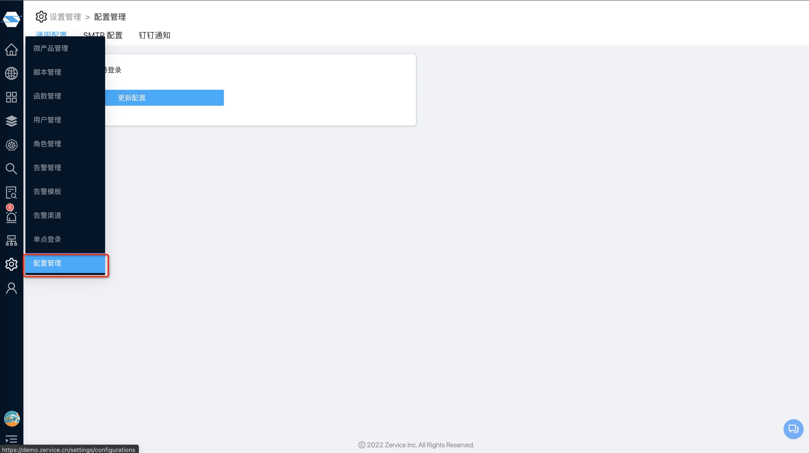
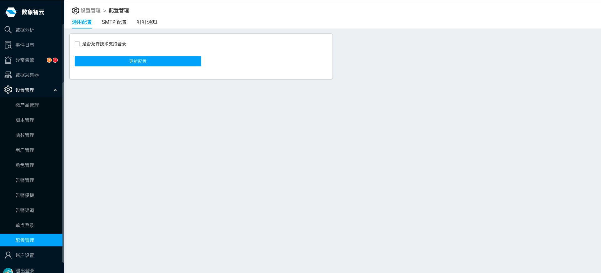

# 配置管理
{: .header}
---

## 关于配置管理
基本上所有的系统配置都可以在这里找到，然后根据需要进行相应的设置管理。点击左边菜单栏的”配置管理”进入配置管理页面。

## 配置管理的组成

这里先介绍下配置管理的界面总体情况，每个部分的具体细节在后续章节中会详细介绍：
- 通用配置：对系统的一些通用配置进行设置，详情可见后面的章节[通用配置]({{ site.baseurl }})
- SMTP配置：对SMTP邮件服务进行相应的配置，这样就可以发邮件通知了，详情可见后面的章节[SMTP配置]({{ site.baseurl }})
- 钉钉通知：对钉钉进行相应的配置，这样就可以发钉钉通知了，详情可见后面的章节[钉钉通知]({{ site.baseurl }})
