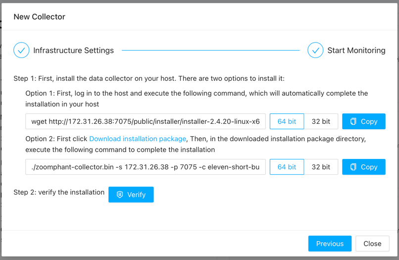

# Quick Start Guide

## Local Deployment

To deploy locally, ensure your environment has Docker 20+ installed. For stable performance, it's recommended to allocate 2 CPU cores and 8GB of free memory. Then, start with the following command:

```bash
docker run --hostname zoomphant -it -d -v /root/data:/data -p 8080:80 --name zoomphant zoomphant/pack:latest
```

- `-v /root/data:/data`: Specifies the persistent data storage directory. You can modify it as needed. Failure to configure this will result in data loss after container restart.
- `-p 8080:80`: Sets the external port. If external access is required, replace `8080` with the corresponding port number.
- Two image options are available: `zoomphant/pack:latest` and `zoomphant/aio:latest`. The former uses collectors directly from GitHub, while the latter integrates the latest collectors into the image, albeit with a larger size.

## Cloud Deployment

For cloud deployment using AWS ECS as an example, follow these steps:

1. Create a Task Definition in ECS and configure the Container:
    - Set the Image URI to `zoomphant/pack:latest`.
    - Map at least port 80 to facilitate UI access and collector data reporting.


2. Configure Volumes to map `/data` to an EBS volume to ensure data persistence.


3. Launch a Service in a Cluster using the Task Definition.

## Getting Started

Access the system via `http://<your_ip>:8080` in your browser. The default credentials are `admin@zervice.local/admin`. Upon initial login, remember to change the password.


Upon login, you'll enter the Wizard page by default. Follow the prompts to configure:

1. **System Configuration**: Configure the system domain name for subsequent alert URLs and new collector installations.
   1. **External Service Host and External Service Port**: Important settings that would be used when a new collector installed. You need to make sure the address can be accessible. If you are in AWS environment, we recommend to use the private IP of the EC2 instance. Then all the network traffic will not be charged. 
   2. **Enable Release Server**: Check it if you are using pack image.


2. **Alert Delivery**: Set up Alert Delivery to ensure timely notifications. 
   1. **Delivery Channel**: Configure the method like email, Slack, etc. to send an alert.
   2. **Delivery Chain**: Configure a set of sequential step to use different channels.


3. **Creating Monitors**: Utilize the built-in collector to create your first monitor. We use HTTP monitor as an example here for it just need to provide the URL to create the monitor.


4. **Infrastructure Monitoring**: If you want to monitor other infrastructure and find it too cumbersome to open SNMP or WMI, you can choose to install a collector. Not only can you monitor that device in more detail today, but you can also collect local log files. Select your desired server type (e.g., Linux) and execute the provided command on the target server to establish monitoring.
   1. You can see the Address in the command line, that's configured in the first step. So you need to make sure it's accessible.
   2. The command should be executed by root user.
   3. If there is no wget command, you can install it by download the installation package manually in the target server and run the option2 command.




5. **Log Monitoring**: Enable log monitoring by specifying the log file path, ensuring accessibility by the collector. You can use the nginx access log in our system by the built-in collector for a try
   1. We use grok to parse the log. You can change the grok if you changed the nginx log formation.


Upon completion, click "Finish Now" to exit the Wizard. You can access monitoring details and manage services from the left sidebar's Services page.


